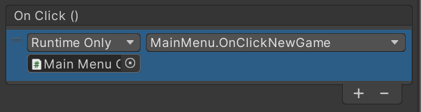

# 221210

## 1. 게임 시작 화면 제작

- User Interface: 플레이어에게 게임 내의 정보를 전달하는 매개체
  - Character User Interface(CUI): UI를 문자로 보여주고, 사용자도 문자를 입력해서 상호작용
  - Graphic User Interface(GUI): 이미지와 문자의 혼합된 형태로 보여주고, 마우스를 이용해 상호작용
  - 유니티 엔진에서 사용하는 GUI 시스템을 UGUI라고 함.
- Hierachy View에서 마우스 우클릭 → **UI 오브젝트**를 생성 가능


## 2. 화면 구성 (대략적)

### 1. Canvas 생성

- UI를 배치하기 위한 영역

- 모든 UI가 화면에 표시되려면, **Canvas 컴포넌트를 가진 오브젝트의 자식**이어야 한다. (Game View 확인!)

  

  


- Canvas는 **Render Mode**를 **[Screen Space - Overlay]**를 주로 사용 (**평면 UI**에서 주로 사용)
  - 게임 해상도로 표현되는 스크린 스페이스에, UI를 그리는 설정
  - UI가 그려지는 건 스크린 스페이스, 게임 오브젝트가 존재하는 건 월드 스페이스
  - 이 둘은 씬 뷰에서 함께 보이지만, 서로 다른 공간이다.
  - 일반적으로는 스크린 스페이스의 UI가 월드 스페이스의 카메라 앞에 있어도 카메라에 잡히지 않고, 월드 스페이스의 게임 오브젝트가 Canvas의 자식으로 있다고 해서 화면에 그려지지 않는다.

- Canvas의 해상도는 게임 뷰의 해상도를 따른다. (**1920 X 1080으로 설정**)

- 일반 게임 오브젝트는 Transform 컴포넌트로 씬 안에서의 위치를 표현하지만, UI 오브젝트는 Rect Transform 컴포넌트로 위치를 표현한다.


### 2. 배경 Image UI 추가

- 중심을 (0, 0), 해상도 1920 X 1080으로


### 3. Text Mesh Pro UI 추가

- UI → Text Mesh Pro

- 처음에 텍스트 입력해도 보이지 X → Import TMP Essentials

- 그럼 한글이 보이지 X → 한글이 지원되는 폰트를 다운받는다. (.ttf나 .otf)

  - https://we-always-fight-with-code.tistory.com/124
  - https://dwemdwem.tistory.com/1

- 폰트를 유니티 Asset에 추가 (위치는 상관 X)

  


- Window > TextMeshPro > **Font Asset Creator**로 이동한 후, 아래와 같이 설정하고, Generate Font Atlas 클릭

  

  - Source Font File: 만들고 싶은 폰트를 선택한다.

  - Sampling Point Size: Auto Sizing과 Custom Size가 있는데 원하는 크기의 폰트 사이즈를 선택하여 사용하면 된다.

  - Padding: Atlas를 생성할 때, 글자끼리의 패딩 값을 나타낸다.

  - Packing Method: Fast와 Optimum이 있다. 대부분 Fast로 설정 후 사용한다.

  - Atlas Resolution: 폰트 Atlas의 크기를 설정한다.

  - Character Set: Atlas에 넣을 폰트를 선택한다.

  - Render Mode: Atlas 텍스처의 품질을 선택한다. 고품질일수록 생성되는데 많은 시간이 소요된다.

  - Character Sequence

    ```
    32-126,44032-55203,12593-12643,8200-9900
    ```

    - 영어 범위 32-126

    - 한글 범위 44032-55203

    - 한글 자모음 12593-12643

    - 특수 문자 8200-9900


- 저장하면 이렇게 SDF가 생긴다!

  


- 그리고 Title 오브젝트에 추가하면 아주 잘 나온다!

  


### 4. Image UI 추가

- Assets 폴더 아래 Images 폴더를 생성하고, 사진을 아무거나 넣어준다.

  


- 이미지를 클릭해서 **Texture Type**을 **Sprite**로 변경해준다.

  


- Image UI를 추가한 후, **Source Image** 속성에 위 이미지를 넣어준다.

- 만약 이미지가 찌그러져 보인다면 `Set Native Size` 버튼을 눌러보자. 이미지의 실제 크기와 같아진다.

  


### 5. Button UI 추가

- UI → Button

- Button 아래에 Text가 있는데, 적절히 내용을 변경해준다.

  

- 유니티에서 어떤 UI가 더 위에 그려지느냐 하는 우선순위는, Hierachy 뷰에서의 순서로 결정된다.

- Hierachy 뷰의 상단에 있을수록, 씬 뷰에서 뒤에 그려지게 된다.


## 3. Button 기능 추가

### 1. MainMenu.cs

- MainMenu.cs 스크립트 생성

- MainMenu 클래스 안에 public으로 `OnClickNewGame`, `OnClickLoad`, `OnClickOption`, `OnClickQuit` 함수를 만든다.

  - public으로 설정해야, 버튼에서 이 함수를 불러와서 실행할 수 있다.

- 일단 간단하게 버튼이 눌렸다는 로그를 남긴다.

  ```csharp
  public class MainMenu : MonoBehaviour
  {
      // ...
  
      public void OnClickNewGame()
      {
          Debug.Log("새 게임");
      }
  
      public void OnClickLoad()
      {
          Debug.Log("불러오기");
      }
  
      public void OnClickOption()
      {
          Debug.Log("옵션");
      }
  
      public void OnClickQuit()
      {
          Debug.Log("종료");
  
  #if UNITY_EDITOR
          UnityEditor.EditorApplication.isPlaying = false;
  #else
          Application.Quit(); // 실행된 게임의 프로그램 종료
  #endif
  }
  ```

  - 종료 버튼을 누르면, 실행된 게임의 프로그램 종료하기 위해 `Application.Quit()` 함수를 호출한다.
    - 이 함수는 에디터에서는 동작하지 않기 때문에, `#if`라는 전처리기 지시문을 사용한다.
    - 유니티 에디터에서 실행 중일 때는 플레이 상태를 중단시킨다.


### 2. Canvas에 스크립트 적용

- 이 MainMenu 컴포넌트를 **Main Menu Canvas**에 추가해준다. (Add Component)


### 3. 버튼 컴포넌트에 On Click 항목

- MainMenu 컴포넌트를 Main Menu Canvas에 추가하면, 버튼 컴포넌트에 **On Click** 항목이 보이게 된다.

- 버튼을 클릭했을 때 호출할 함수를 지정할 수 있는 부분이다.

- 버튼마다 다음과 같이 호출할 함수를 지정해준다.

  - Main Menu Canvas 오브젝트를 끌어다 놓고
  - 함수를 지정한다.

  


- 실행 결과

  

  - 종료를 누르면 플레이 상태가 종료된다.


## 4. 다음에 할 일

- 버튼에 기능 추가하기
  - 씬 전환 등
