# 221217

- [START MENU in Unity - Brackeys](https://youtu.be/zc8ac_qUXQY)

- [SETTINGS MENU in Unity - Brackeys](https://youtu.be/YOaYQrN1oYQ)


## 1. 버튼 스타일 바꿔보기

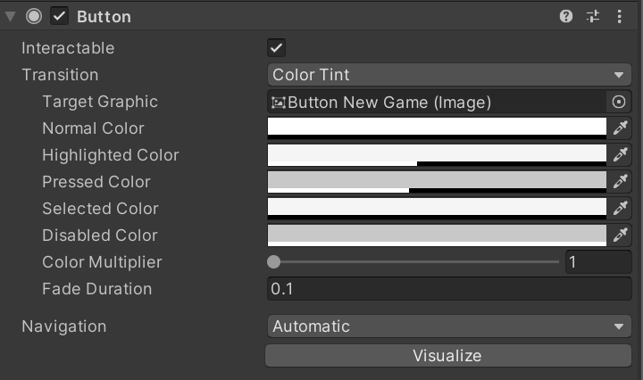

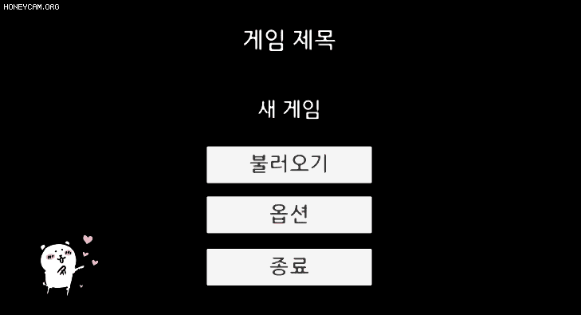

- '**새 게임**' 버튼의 스타일을 바꿔보았다.
- 버튼의 `Normal Color`의 투명도를 0으로 주어 흰 배경을 없애고,
- 버튼을 호버하면 색이 변하는 `Highlighted Color`의 투명도를 살짝 낮추었다.
- 버튼을 클릭하면 색이 변하는 `Pressed Color`의 투명도를 살짝 낮추었다.
- 버튼이 선택되면 색이 변하는 `Selected Color`의 투명도를 0으로 주었다.


## 2. 메인 메뉴 Hierachy View 수정

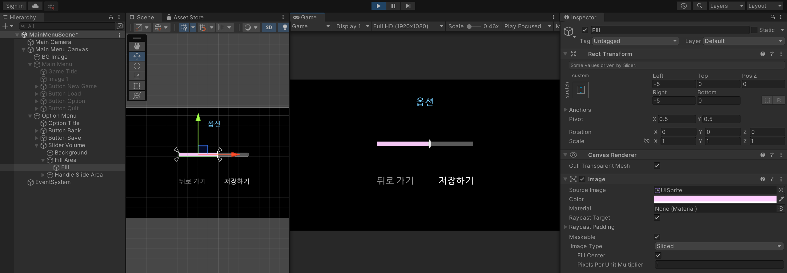

- `MainMenuScene`

- **옵션 메뉴**를 클릭 시 **볼륨 조정 요소**와, **뒤로가기 버튼**, **저장 버튼**이 나오도록 구성한다.

  <table>
      <tr>
      	<th>Before</th>
      	<th>After</th>
      </tr>
      <tr>
      	<td>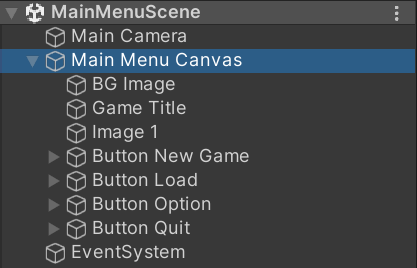
          <td>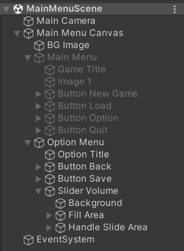
      </tr>
  </table>
  
  - **`Main Menu`**라는 이름의 빈 게임 오브젝트를 생성하여, 그 안에 기존의 `Game Title`, `Image 1`, `Button New Game`, `Button Load`, `Button Option`, `Button Quit` 오브젝트를 자식으로 넣어주었다.
  - **`Option Menu`**라는 이름의 빈 게임 오브젝트를 생성하여, 그 안에 `Option Title`, `Button Back`, `Button Save`, `Slider Volume` 오브젝트를 자식으로 넣어주었다.
  - Slider 오브젝트
    - UI → Slider
    - Background 색상과, Fill Area의 Fill 색상을 변경할 수 있다.


## 3. 버튼에 기능 추가 (새 게임, 옵션)

### 1. 새 게임 버튼을 눌러 씬 전환

- 새로운 씬 `GameScene`을 하나 만들어 준다.

  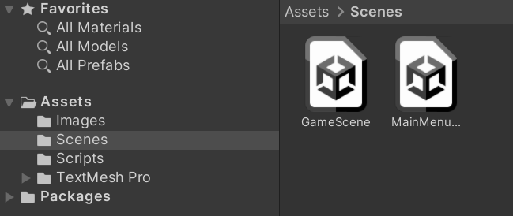


- 기존의 `MainMenu` 스크립트의 `OnClickNewGame()` 함수에 다음과 같이 작성한다.

  ```csharp
  using UnityEngine.SceneManagement;
  
  public void OnClickNewGame()
      {
          Debug.Log("새 게임");
          SceneManager.LoadScene(SceneManager.GetActiveScene().buildIndex + 1);   // GameScene으로 전환
      }
  ```

  

- 씬을 제대로 불러오기 위해서, **씬을 큐에 담아야** 한다.

  - File → Building Settings에, 우리가 빌드할 씬들을 차례로 추가해주면 된다.

    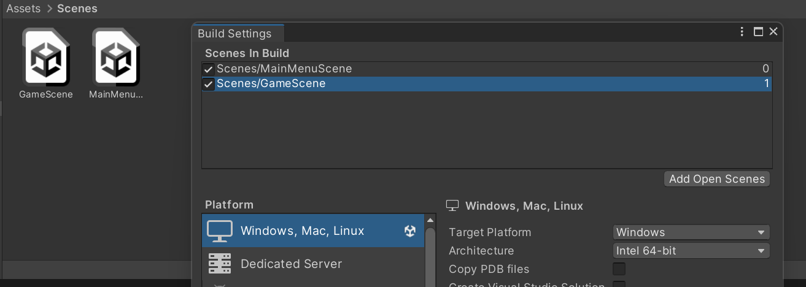

  - MainMenuScene의 인덱스는 0, GameScene의 인덱스는 1이 되었다.


- 실행 화면

  


### 2. 메인 메뉴 → 옵션 메뉴 간 전환

- 옵션 메뉴가 새로운 씬을 로드하거나 프로그램을 종료시키지 않고, 그냥 새로운 메뉴로 바뀌도록 한다. 이 방법은 사실상 프로그래밍 할 것이 없다.
- 열심히 만든 Option Menu는 일단 비활성화 해둔다. (Disabled)

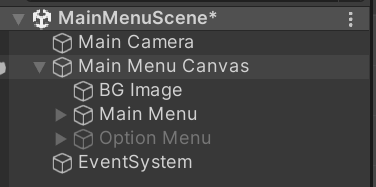


- `Main Menu` 오브젝트의 `Button Option` 오브젝트에 **OnClick Event를 추가**한다.

  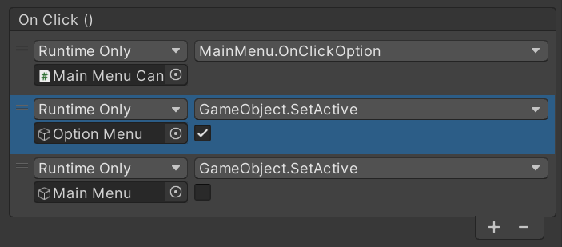

  - 유니티에는 `SetActive()` 함수가 내장되어 있어, 프로그래밍이 필요없다.
  - 옵션 버튼을 클릭하면, `Main Menu`가 비활성화되고 `Option Menu`가 활성화된다.


- 실행 화면

  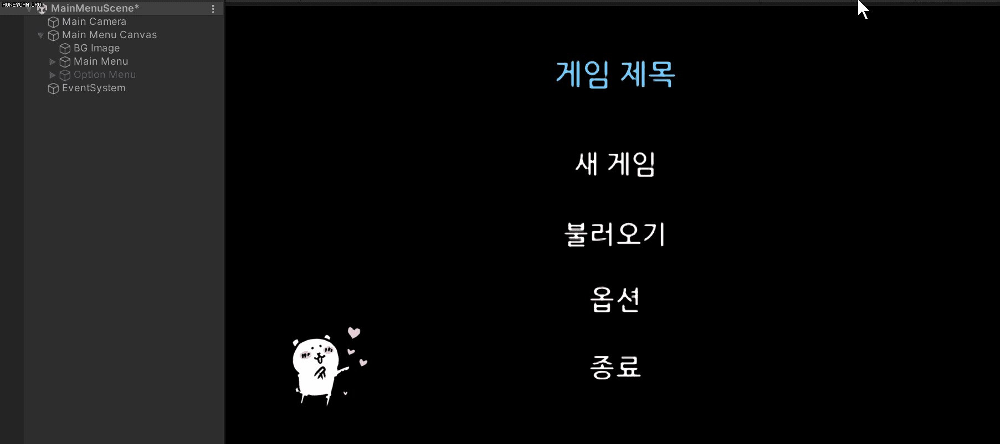


### 3. 옵션 메뉴 → 메인 메뉴 간 전환

- `Option Menu` 오브젝트의 `Button Back` 오브젝트에 **OnClick Event를 추가**한다.

  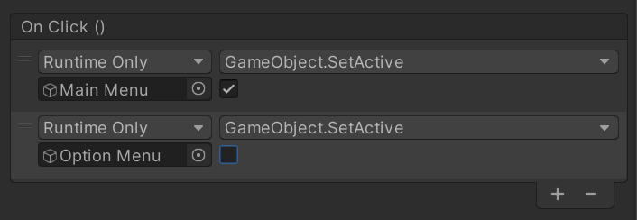

  - 뒤로가기 버튼을 클릭하면, 위와는 반대로 `Option Menu`가 비활성화되고 `Main Menu`가 활성화된다.


## 4. 옵션에 볼륨 Slider 추가

- `OptionMenu` 스크립트를 생성하여, 함수를 작성한다.

  - Public으로 설정하여, Slider 컴포넌트에서 조정할 수 있도록 한다.

  - 인자로 Slider의 값을 받아온다.

    - 우리가 Slider를 움직일 때마다 이 함수가 실행되고, 유니티는 동적으로 바뀌는 값을 가져온다.

    - 값을 확인하기 위해, 우선 다음과 같이 코드를 작성한다.

      ```csharp
      public void setVolume(float volume)
      {
          Debug.Log(volume);
      }
      ```

      

- `Main Menu Canvas` 오브젝트의 컴포넌트로 위 스크립트를 추가한다.

  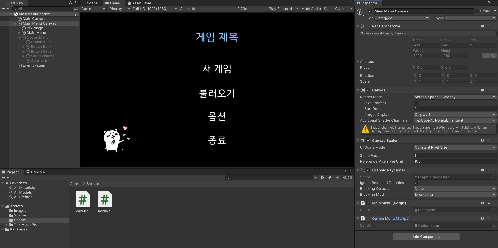


- `Slider Volume`의 **On Value Changed Event**에 다음과 같이 추가해준다.

  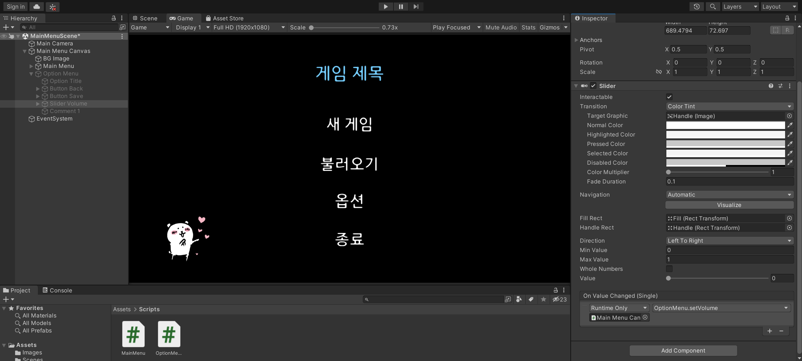

  

- OptionMenu 컴포넌트가 있는 **Main Menu Canvas**를 끌어다 놓고, **setVolume** 함수를 적용한다.

  - 이때 `setVolume` 함수가 2개 있는데, **Dynamic float**에 있는 setVolume 함수를 선택한다.

  - 우리가 입력한 input을 동적으로 가져올 수 있게 하도록 위함이다.

    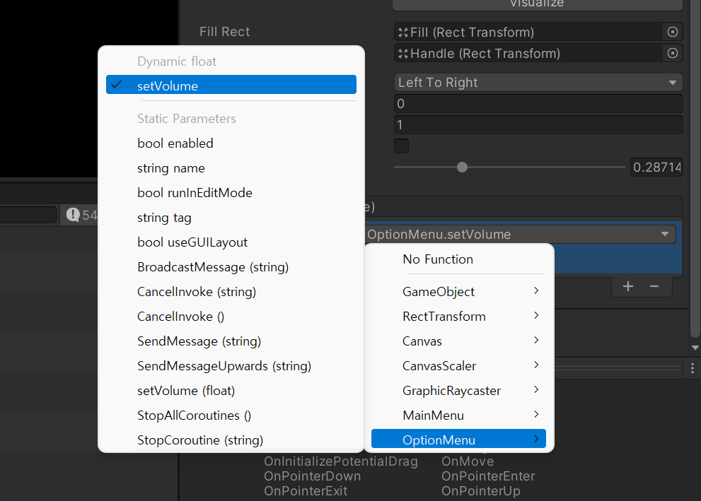


- 실행 화면

  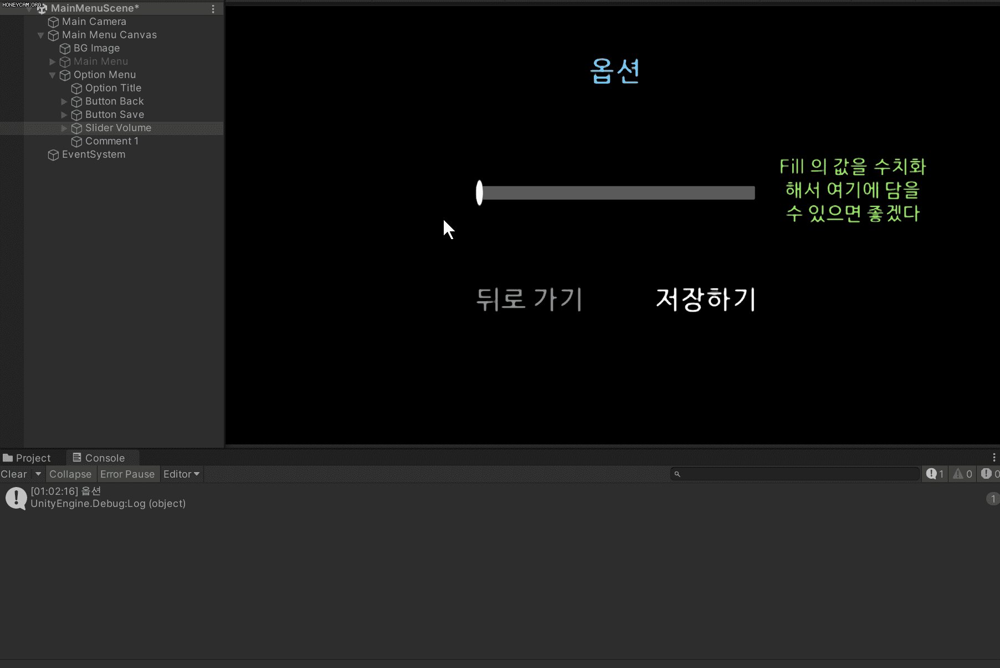


## 5. 앞으로의 과제

- 옵션 메뉴에서 뒤로가기 버튼을 클릭 시, 변경된 볼륨이 그대로 저장되는 현상
  - 저장하기 버튼을 클릭할 때만 변경사항이 저장되고, 뒤로가기 버튼을 클릭하면 기존 값을 유지시킬 수 없을까?
  - 옵션 변경 값 저장하는 법 찾기
- 옵션에 뭘 넣을지 생각하기
  - 해상도 (전체화면 / 창모드)
  - 볼륨 (마스터 볼륨, BGM, 효과음 등)
- 게임 씬 제작 시작하기


## 6. 오늘의 후기

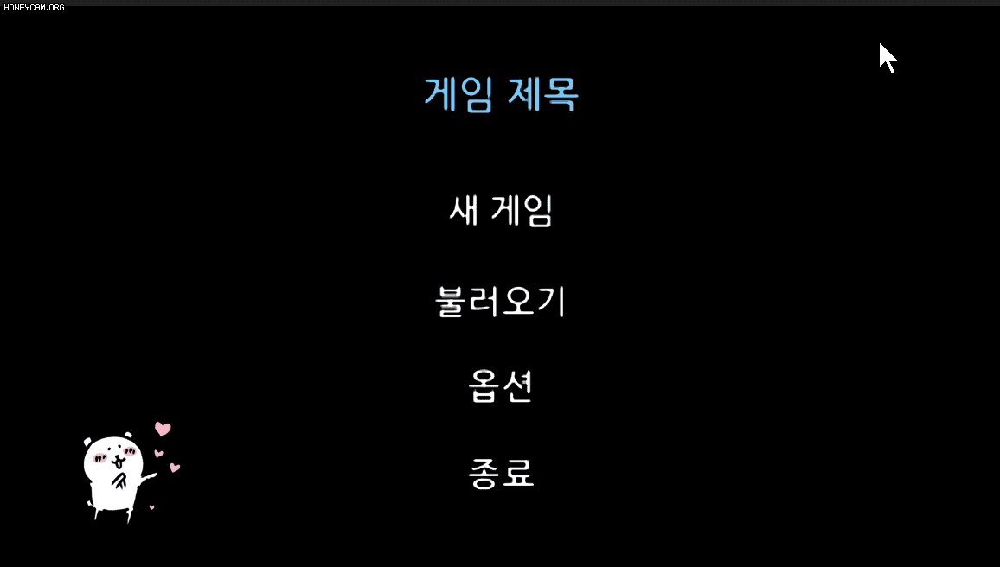

- 게임을 시작하자마자 나오는 화면 구성만 했는데 총 8시간이 걸리다니..
- 버튼의 On Click 이벤트, 슬라이더의 On Value Change 이벤트가 뭔가 웹이랑 비슷하다는 생각이 계속 든다.
  - 이벤트 주체인 버튼과 슬라이더는 HTML 요소이고,
  - 이벤트가 발생했을 때 매핑되는 함수는 JS로 작성하는 느낌? ㅎㅎ
- 아직 갈 길이 먼 것 같다. 앞으로 고민할 만한 걸 정리해보면..
  - 옵션 관련
    - `MainMenuScene`에서 옵션을 통해 볼륨 값을 저장하면, 씬이 변경되어도 그 값이 유지되도록 하는 방법
    - 볼륨 값이 변경되면, 후에 음악을 깔아도 변경하는 방법
    - 해상도 변경 기능을 제공한다면, 그에 맞추어 오브젝트를 배치하려면?
    - 게임 도중 옵션을 변경할 수 있게 하려면, 지금 방식과는 다르게 옵션 씬을 하나 따로 분리하는 것이 좋을까?
  - 게임 저장과 불러오기 기능, 자동 저장 기능
    - 세이브 슬롯을 제공해야 하는가?
  - 게임 관련
    - 오류 없이 구현하는 건 너무 당연하고
    - 사용자 편의성은 어떻게 제공할 것인가?
  - 기타
    - 유니티는 컨벤션을 어떻게 하는 게 좋을까?
      - [[Unity] C# 코딩 규칙](https://everyday-devup.tistory.com/21)
    - 게임 최적화는? 로딩 화면 구현?
- 개발하는 게임이 포인트 앤 클릭 게임이다 보니, 기능적으로는 단순한 것 같아서 조금 아쉽다.. 그래도 꼭 완성할 수 있기를..!!!