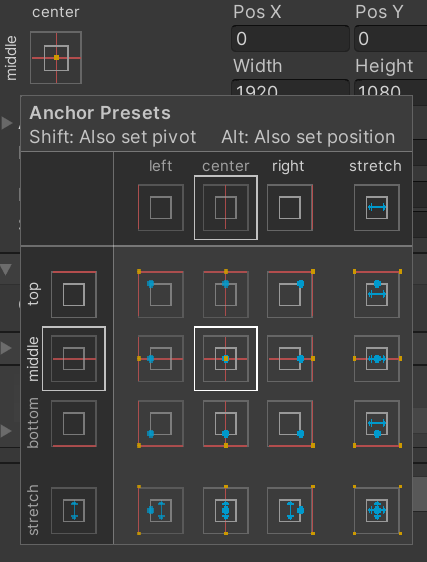
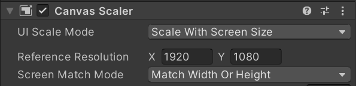
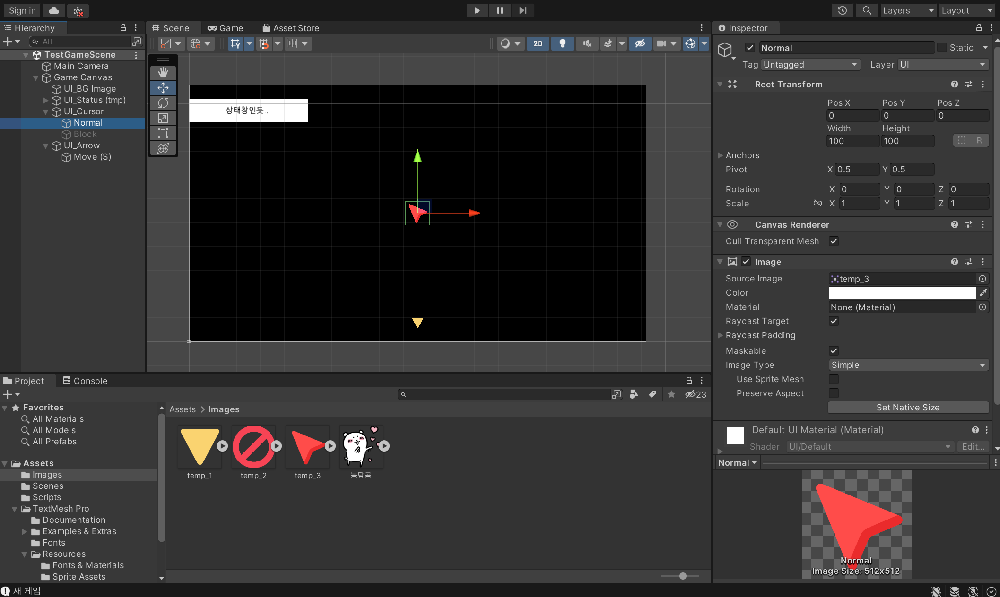
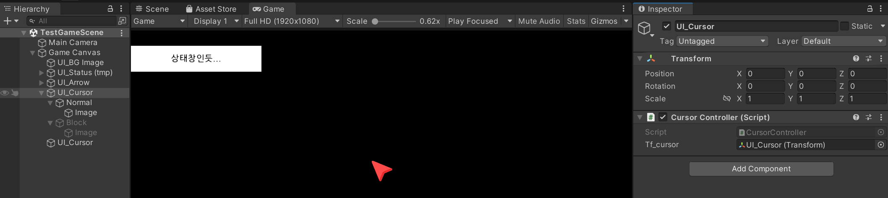
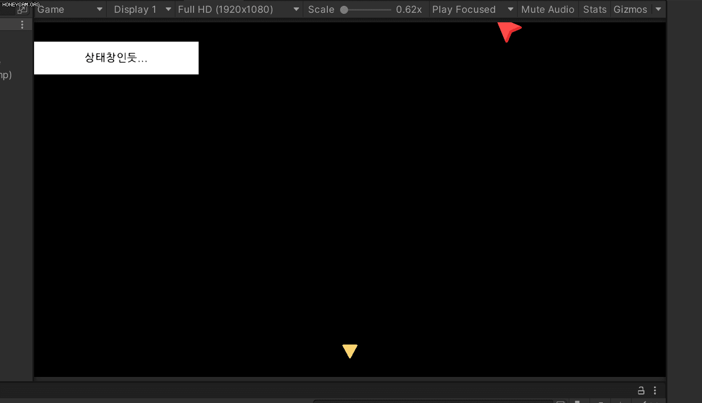

# 221226

- [유니티 강좌[3D 추리 비쥬얼 노벨] - 케이디](https://www.youtube.com/playlist?list=PLUZ5gNInsv_NG_UKZoua8goQbtseAo8Ow)
  - [[유니티 강좌] 단간론파를 유니티로 구현하기 Part 1 - 기본 무대 및 UI 세팅 (비쥬얼 노벨 추리)](https://youtu.be/Jgw079T1_lA)
  - [[유니티 강좌] 단간론파를 유니티로 구현하기 Part 2 - 1 크로스헤어 구현](https://youtu.be/OSbpXAkXjPo?list=PLUZ5gNInsv_NG_UKZoua8goQbtseAo8Ow)


## 1. 화면에 UI 배치하기 (상태창, 커서, 이동 버튼)

- UI를 배치하고 게임의 해상도를 변경하면, UI가 사라지거나 이상한 곳에 위치하게 될 수 있다.

  - 그래서 고정(Anchor)해야 한다.

  - 이걸 누르고 shift 키를 누르면 다음과 같이 파란 점이 표시된다.

  - 고정하고 싶은 위치를 선택한다. (ex. 좌측 상단의 상태창…)

  - 만약 상태창에 부모가 있다면, top - stretch를 해보자. (div에 class 주는 느낌이네)

    


- 이렇게 하면 이제 UI의 위치는 고정되는데, 화면 크기를 줄여도 UI 크기는 줄어들지 않을 수 있다.

  - Canvas Object의 **Canvas Scaler** 옵션을 조정해야 한다.

  - UI Scale Mode를 **Scale With Screen Size**로 변경

  - Reference Resolution은 해상도에 맞게 설정한다. (나의 경우는 Full HD 1920×1080)

    


- 대충 검은방 비슷한 느낌으로 커서와 뒤로 이동하는 화살표 버튼을 추가해 보았다. (이미지는 임시로 넣은 것)

  


## 2. 커서를 움직이는 스크립트 작성하기

### 1. 기본

- `CursorController.cs` 스크립트를 생성한다.

- 다음과 같이 작성한다.

  ```csharp
  [SerializeField] Transform tf_cursor;   // 커서의 현재 위치
      
  
  void Update()
  {
      CursorMoving();
  }
  
  void CursorMoving()
  {
      tf_cursor.localPosition = Input.mousePosition;  // 현재 마우스의 위치
  }
  ```

  - SerializeField
    - tf_cursor 변수는 현재 private이 생략된 상태이다.
    - SerializeField는 private한 변수도 inspector 창에 띄워주어, 그곳에서 조작할 수 있게 해준다.
    - 보호 수준은 유지되면서, public을 쓴 것과 동일한 효과를 얻을 수 있따.
  - localPosition
    - position은 절대좌표, localPosition은 상대좌표(부모 객체를 기준으로 한 좌표)
    - UI_Cursor의 위치를 바꾸고 싶은 것인데, UI_Cursor는 Game Canvas 오브젝트의 자식이므로, localPosition을 현재 마우스의 위치로 바꿔 준다.


- UI_Cursor 오브젝트에 컴포넌트로 위 스크립트를 넣어주고, tf_cursor에 UI_Cursor 오브젝트를 드래그하여 다음과 같이 넣어준다.

  


- 실행화면

  


### 2. 커서 위치 재조정

- 하지만 보이는 것과 같이, 실제 마우스의 위치와 맞지 않는다.

  - 우리가 설정한 커서의 위치에서, **화면의 가로/2, 세로/2 길이를 빼 주어야** 한다.

  - 기존의 `CursorController.cs`스크립트를 수정한다.

    ```csharp
    void CursorMoving()
    {
        float x = Input.mousePosition.x - (Screen.width / 2);
        float y = Input.mousePosition.y - (Screen.height / 2);
        tf_cursor.localPosition = new Vector2(x, y);
    }
    ```


- 실행화면

  


### 3. 마우스 가두기 구현

- 마우스가 게임 화면을 벗어나지 않도록 하기 위함.

- 기존의 `CursorController.cs`스크립트를 수정한다.

  ```csharp
  void CursorMoving()
      {
          // 마우스 이동
          float x = Input.mousePosition.x - (Screen.width / 2);
          float y = Input.mousePosition.y - (Screen.height / 2);
          tf_cursor.localPosition = new Vector2(x, y);
  
          // 마우스 가두기 (범위 지정)
          float tmp_cursorPosX = tf_cursor.localPosition.x;
          float tmp_cursorPosY = tf_cursor.localPosition.y;
  
          float min_width = -Screen.width / 2;
          float max_width = Screen.width / 2;
          float min_height = -Screen.height / 2;
          float max_height = Screen.height / 2;
          int padding = 20;	// 값은 자유
  
          tmp_cursorPosX = Mathf.Clamp(tmp_cursorPosX, min_width + padding, max_width - padding);
          tmp_cursorPosY = Mathf.Clamp(tmp_cursorPosY, min_height + padding, max_height - padding);
          
          tf_cursor.localPosition = new Vector2(tmp_cursorPosX, tmp_cursorPosY);
      }
  ```

  - Mathf의 Clamp 함수로 커서의 최대, 최소 범위를 지정해 줄 수 있다.
  - 범위를 지정하여, tf_cursor의 좌표 값을, 다시 새로운 벡터로 바꿔 준다.


- 실행화면

  


## 3. 다음에 할 일

- 상호작용 가능한 오브젝트에 커서를 옮기면, 이미지 바꿔보기
- 맵 이동 구현해보기
- 대사창 띄워보기


## 4. 앞으로의 과제

- 옵션 메뉴에서 뒤로가기 버튼을 클릭 시, 변경된 볼륨이 그대로 저장되는 현상
  - 저장하기 버튼을 클릭할 때만 변경사항이 저장되고, 뒤로가기 버튼을 클릭하면 기존 값을 유지시킬 수 없을까?
  - 옵션 변경 값 저장하는 법 찾기
- 옵션에 뭘 넣을지 생각하기
  - 해상도 (전체화면 / 창모드)
  - 볼륨 (마스터 볼륨, BGM, 효과음 등)


- 비주얼 노벨(인터렉티브 픽션, 텍스트 어드벤처)의 특징 & UI/UX
  - 동업자님과 회의해보기...
  - 스탠딩 일러스트가 있다면 → 캐릭터의 표정 스크립팅
  - 저장, 빨리 감기, 스킵, 로그 보기
  - 텍스트 표시 효과
  - 검은방... 미니맵과 목표, 아이템
  - txt나 엑셀 형식의 스크립트를 준비한 다음 유니티로 파싱...?
- 클릭 가능한 오브젝트에 따라 커서 변경
  - 만약 상호작용이 안 되는 물체를 클릭하면 어떻게 이펙트를 줄 것인가?
- 선택지와 엔딩 분기는 시스템 상으로 어떻게 구현할 것인가?
- 상호작용의 서순은 어떻게 구현할 수 있을까?
  - ex. 암호 힌트를 보기 전에는 암호 입력 불가능하도록


## 5. 참고할 만한 자료들 (아직 활용은 X)

- [[Unity] 엑셀 대화 정보들을 대화 이름으로 묶어서 가져오기](https://velog.io/@gkswh4860/Unity-%EC%97%91%EC%85%80-%EB%8C%80%ED%99%94-%EB%82%B4%EC%9A%A9%EC%9D%84-%EB%8C%80%ED%99%94-%EC%9D%B4%EB%A6%84%EC%9C%BC%EB%A1%9C-%EB%AC%B6%EC%96%B4%EC%84%9C-%EA%B0%80%EC%A0%B8%EC%98%A4%EA%B8%B0)
- [유니티로 미연시 만들기 졸업프로젝트](https://www.youtube.com/watch?v=eWT0TsknaiU&t=7s)
- [Unity 2D로 비주얼노벨 만들기(Flowchart)](https://m.blog.naver.com/liear1997/221292510685)


## 6. 오늘의 후기

- Clamp를 지금껏 3번 써봤나.. 사용법이 너무 어렵다.
- 게임의 세계는 넓고, 내가 만드는 건 제일 간단한 형태의 게임이고, 이걸 완성한다 하더라도 다른 유형의 게임에 도전할 수 있을지...
- 게임 회사 취직하고 싶다. 나도 수1배씨랑 일 해보고 싶다....
