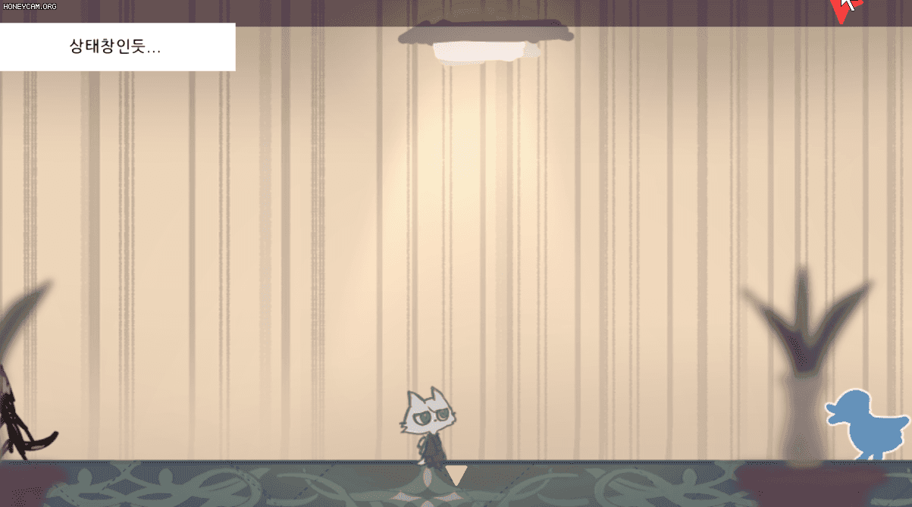

# 221227

- [유니티 강좌[3D 추리 비쥬얼 노벨] - 케이디](https://www.youtube.com/playlist?list=PLUZ5gNInsv_NG_UKZoua8goQbtseAo8Ow)
  - [[유니티 강좌] 단간론파를 유니티로 구현하기 Part 2 - 2 뷰 회전 (크로스헤어)](https://youtu.be/XrYfIhAhfvU?list=PLUZ5gNInsv_NG_UKZoua8goQbtseAo8Ow)
- [유니티 - 드래그로 카메라 이동(Drag and Move Camera)](https://bloodstrawberry.tistory.com/686)


## 1. 드래그로 카메라 좌우 이동하기

- 배경 오브젝트를 하나 추가해주었다.

- 기존 `CursorController.cs` 스크립트 수정

  - 전역 변수 선언

    ```csharp
    [SerializeField] float dragSpeed = 10.0f;   // 화면 움직임 속도
    private float firstClickPointX;
    ```
  
  - Update() 함수
  
    ```csharp
    void Update()
    {
        // ...
        ViewMoving();
    }
    ```
  
  - ViewMoving() 함수
  
    ```csharp
    void ViewMoving()
    {
        // 마우스 최초 클릭 시의 위치 기억
        if (Input.GetMouseButtonDown(0))
        {
            firstClickPointX = tf_cursor.localPosition.x;
        }
    
        if (Input.GetMouseButton(0))
        {
            // (현재 마우스 위치 - 최초 위치)의 음의 방향으로 카메라 이동
            Vector2 position = Camera.main.ScreenToViewportPoint(- new Vector3(tf_cursor.localPosition.x - firstClickPointX, 0, 0));
            Vector2 move = position * (Time.deltaTime * dragSpeed);
    
            Camera.main.transform.Translate(move);
        }
    }
    ```
  
    - 마우스 클릭 관련 함수
  
      - [[유니티] Input.GetMouseButtonDown()과 OnMouseDown() 차이점](https://sunghojang.tistory.com/25)
  
      - `Input.GetMouseButtonDown()`: 마우스 버튼을 누른 순간
  
      - `Input.GetMouseButtonUp()`: 마우스 버튼을 누르고 땐 순간
  
      - `Input.GetMouseButton()`: 마우스 버튼을 누르는 동안
  
      - 괄호 안 인자에 0, 1, 2는 각각 좌클릭, 우클릭, 휠클릭
  
    
  
    - 드래그를 시작할 때, 최초의 위치의 **X좌표**를 `firstClickPointX` 변수에 저장한다.
    - 마우스를 누르는 동안
      - position에 현재 마우스 위치와 최초 위치의 차이를 저장한다.
        - 이때 메인 카메라의 ScreenToViewportPoint를 이용한다.
        - `ScreenToViewportPoint`
          - [유니티 각개격파\_015\_스크린(Screen) 좌표와 World(월드) 좌표](https://fiftiesstudy.tistory.com/254)
          - 카메라에 상대적
          - 전체 화면의 크기를 정규화(normalize)하여, 범위를 0 ~ 1 사이로 잡는다.
          - 즉, 카메라에서 객체의 위치를 0에서 1 사이의 값으로 표현한 것
        - y나 z축 방향으로는 카메라가 이동하지 않도록 한다.
      - 메인 카메라의 위치를 변경한다.
        - position * dragSpeed
        - 단, 성능에 상관없이 같은 속도로 움직이도록 Time.deltaTime을 추가로 곱한다.
        - [[유니티 기초] Time.deltaTime](https://itmining.tistory.com/46)


- 실행화면

  


## 2. 다음에 할 일

- 카메라 이동 범위 제한하기
- 커서 이미지 & 포인트 매치시키기
- 상호작용 가능한 오브젝트에 커서를 옮기면, 이미지 바꿔보기
- 맵 이동 구현해보기
- 대사창 띄워보기
- **상호작용 아이템과 드래그 해서 화면 전환하는 걸 어떻게 구분할 수 있을지**
- 오브젝트 클로즈업(하면서 화면 이동)하기??


## 3. 앞으로의 과제

- 옵션 메뉴에서 뒤로가기 버튼을 클릭 시, 변경된 볼륨이 그대로 저장되는 현상
  - 저장하기 버튼을 클릭할 때만 변경사항이 저장되고, 뒤로가기 버튼을 클릭하면 기존 값을 유지시킬 수 없을까?
  - 옵션 변경 값 저장하는 법 찾기
- 옵션에 뭘 넣을지 생각하기
  - 해상도 (전체화면 / 창모드)
  - 볼륨 (마스터 볼륨, BGM, 효과음 등)


- 비주얼 노벨(인터렉티브 픽션, 텍스트 어드벤처)의 특징 & UI/UX
  - 동업자님과 회의해보기...
  - 스탠딩 일러스트가 있다면 → 캐릭터의 표정 스크립팅
  - 저장, 빨리 감기, 스킵, 로그 보기
    - 일정 구간 스킵
    - 한 번 본 스크립트만 스킵할 수 있도록?
  - 텍스트 표시 효과
  - 검은방... 미니맵과 목표, 아이템
  - txt나 엑셀 형식의 스크립트를 준비한 다음 유니티로 파싱...?
- 클릭 가능한 오브젝트에 따라 커서 변경
  - 만약 상호작용이 안 되는 물체를 클릭하면 어떻게 이펙트를 줄 것인가?
- 선택지와 엔딩 분기는 시스템 상으로 어떻게 구현할 것인가?
- 상호작용의 서순은 어떻게 구현할 수 있을까?
  - ex. 암호 힌트를 보기 전에는 암호 입력 불가능하도록


## 4. 참고할 만한 자료들 (아직 활용은 X)

- [[Unity] 엑셀 대화 정보들을 대화 이름으로 묶어서 가져오기](https://velog.io/@gkswh4860/Unity-%EC%97%91%EC%85%80-%EB%8C%80%ED%99%94-%EB%82%B4%EC%9A%A9%EC%9D%84-%EB%8C%80%ED%99%94-%EC%9D%B4%EB%A6%84%EC%9C%BC%EB%A1%9C-%EB%AC%B6%EC%96%B4%EC%84%9C-%EA%B0%80%EC%A0%B8%EC%98%A4%EA%B8%B0)
- [유니티로 미연시 만들기 졸업프로젝트](https://www.youtube.com/watch?v=eWT0TsknaiU&t=7s)
- [Unity 2D로 비주얼노벨 만들기(Flowchart)](https://m.blog.naver.com/liear1997/221292510685)


- [[Unity] 2D 카메라 범위 제한하기](https://velog.io/@cedongne/Unity-2D-%EC%B9%B4%EB%A9%94%EB%9D%BC-%EB%B2%94%EC%9C%84-%EC%A0%9C%ED%95%9C%ED%95%98%EA%B8%B0)

- [[유니티에서 게임 오브젝트 폭, 높이 구하는 방법](https://dreamaz.tistory.com/1118)](https://dreamaz.tistory.com/1118)


## 5. 오늘의 후기

- 처음엔 알트를 눌렀을 때만 드래그 되도록 했었는데, 테스트 하려고 드래그 했는데 position 값이 출력이 안 되길래 이거 왜 이래? 했는데 알고 보니 알트를 안 눌러서... (이 짓을 4번)
- 카메라 가두기가 너무 어렵다... 2시간 걸렸는데도 미완이라 일지에서는 뺐다. 다음 시간에 꼭 완성할 것!
