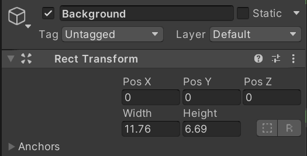
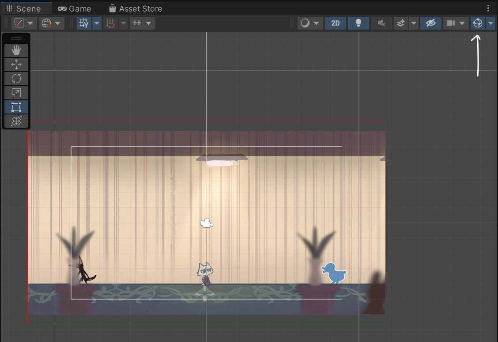

# 230101

- [[Unity] 2D 카메라 범위 제한하기](https://velog.io/@cedongne/Unity-2D-%EC%B9%B4%EB%A9%94%EB%9D%BC-%EB%B2%94%EC%9C%84-%EC%A0%9C%ED%95%9C%ED%95%98%EA%B8%B0)


## 1. 드래그 시 카메라 이동 범위 제한하기

- Background 오브젝트에 **`Rect Transform`** 컴포넌트를 추가한다.

  


- 기존의 `CursorController.cs`를 수정한다.

- 다음과 같이 변수를 선언한다.

  ```csharp
  private float camWidth, camHeight;	// 카메라 너비/2, 높이/2
  [SerializeField] Vector2 center;    // 0, 0
  [SerializeField] Vector2 mapSize;   // 배경 너비, 높이
  private RectTransform tf_background;    // 배경 너비, 높이를 가져오기 위한 변수
  ```
  
  - center는 카메라의 최대 이동 범위를 제한할 때, 이동하는 축을 지정하기 위함. 일단 배경과 카메라의 중심이 모두 (0, 0)으로 되어있다.
  - mapSize는 배경의 너비와 높이를 각각 x와 y로 가지게 된다.
  - 배경의 너비와 높이를 가져와 mapSize에 저장할 수 있도록 RectTransform 변수를 하나 만들어 주었다.


- Start() 함수에서 camWdith, camHeight, mapSize를 초기화한다.

  ```csharp
  void start()
  {
      camHeight = Camera.main.orthographicSize;	// 카메라의 높이 / 2
      camWidth = camHeight * Screen.width / Screen.height;	// 카메라의 너비 / 2
  
      tf_background = GameObject.Find("Background").GetComponent<RectTransform>();
  
      mapSize.x = tf_background.rect.width;	// 배경의 너비
      mapSize.y = tf_background.rect.height;	// 배경의 높이
  }
  ```


- ViewMoving() 함수에서, 기존의 카메라 이동 코드 밑에, 카메라 범위를 제한하는 코드를 작성한다.

  ```csharp
  // 카메라 범위 제한
  float dx = mapSize.x - camWidth;
  float clampX = Mathf.Clamp(Camera.main.transform.position.x, -dx + center.x, dx + center.x);
  
  float dy = mapSize.y - camHeight;
  float clampY = Mathf.Clamp(Camera.main.transform.position.y, -dy + center.y, dy + center.y);
  
  Camera.main.transform.position = new Vector3(clampX, clampY, Camera.main.transform.position.z);
  ```

  - `dx`: 배경의 전체 너비 - 카메라 전체 너비 → 카메라를 제외한 나머지 너비
  - `clampX`
    - 첫 번째 인자: 어떤 좌표를 제한할 것인지 (메인 카메라의 x 좌표)
    - 두 번째 인자: x 좌표의 최솟값 (`-dx`)
    - 세 번째 인자: x 좌표의 최댓값 (`dx`)
  - 카메라의 위치를 제한된 범위 안으로 옮겨준다.

 

- 전체 코드 

  ```csharp
  void ViewMoving()
  {
      // 마우스 최초 클릭 시의 위치 기억
      if (Input.GetMouseButtonDown(0))
      {
          firstClickPointX = tf_cursor.localPosition.x;
      }
  
      if (Input.GetMouseButton(0))
      {
          // 현재 마우스 위치 - 최초 위치 의 음의 방향으로 카메라 이동
          Vector2 position = Camera.main.ScreenToViewportPoint(- new Vector3(tf_cursor.localPosition.x - firstClickPointX, 0, 0));
          Vector2 move = position * (Time.deltaTime * dragSpeed);
  
          Camera.main.transform.Translate(move);
  
          // 카메라 범위 제한
          float dx = mapSize.x - camWidth;
          float clampX = Mathf.Clamp(Camera.main.transform.position.x, -dx + center.x, dx + center.x);
  
          float dy = mapSize.y - camHeight;
          float clampY = Mathf.Clamp(Camera.main.transform.position.y, -dy + center.y, dy + center.y);
  
          Camera.main.transform.position = new Vector3(clampX, clampY, Camera.main.transform.position.z);
      }
  }
  ```


- 실행 결과

  


## 2. (번외) Gizmo 그려보기

- `OnDrawGizmos()` 함수

  - 맵 영역을 Scene 뷰에서 시각적으로 표현해보기

  - Scene 뷰의 탭 중 Gizmos를 활성화하면, `OnDrawGizmos()` 함수가 호출되고, 중앙 지점으로부터 `mapSize` 크기의 빨간색 사각형 기즈모를 그린다.

    


- 코드

  ```csharp
  private void OnDrawGizmos()
  {
      Gizmos.color = Color.red;
      Gizmos.DrawWireCube(center, mapSize * 2);
  }
  ```


## 3. 다음에 할 일

- ~~카메라 이동 범위 제한하기~~
- 커서 이미지 & 포인트 매치시키기
- 상호작용 가능한 오브젝트에 커서를 옮기면, 이미지 바꿔보기
- 맵 이동 구현해보기
- 대사창 띄워보기
- **상호작용 아이템과 드래그 해서 화면 전환하는 걸 어떻게 구분할 수 있을지**
- 오브젝트 클로즈업(하면서 화면 이동)하기??


## 4. 앞으로의 과제

- 옵션 메뉴에서 뒤로가기 버튼을 클릭 시, 변경된 볼륨이 그대로 저장되는 현상
  - 저장하기 버튼을 클릭할 때만 변경사항이 저장되고, 뒤로가기 버튼을 클릭하면 기존 값을 유지시킬 수 없을까?
  - 옵션 변경 값 저장하는 법 찾기
- 옵션에 뭘 넣을지 생각하기
  - 해상도 (전체화면 / 창모드)
  - 볼륨 (마스터 볼륨, BGM, 효과음 등)


- 비주얼 노벨(인터렉티브 픽션, 텍스트 어드벤처)의 특징 & UI/UX
  - 동업자님과 회의해보기...
  - 스탠딩 일러스트가 있다면 → 캐릭터의 표정 스크립팅
  - 저장, 빨리 감기, 스킵, 로그 보기
    - 일정 구간 스킵
    - 한 번 본 스크립트만 스킵할 수 있도록?
  - 텍스트 표시 효과
  - 검은방... 미니맵과 목표, 아이템
  - txt나 엑셀 형식의 스크립트를 준비한 다음 유니티로 파싱...?
- 클릭 가능한 오브젝트에 따라 커서 변경
  - 만약 상호작용이 안 되는 물체를 클릭하면 어떻게 이펙트를 줄 것인가?
- 선택지와 엔딩 분기는 시스템 상으로 어떻게 구현할 것인가?
- 상호작용의 서순은 어떻게 구현할 수 있을까?
  - ex. 암호 힌트를 보기 전에는 암호 입력 불가능하도록


## 5. 참고할 만한 자료들 (아직 활용은 X)

- [[Unity] 엑셀 대화 정보들을 대화 이름으로 묶어서 가져오기](https://velog.io/@gkswh4860/Unity-%EC%97%91%EC%85%80-%EB%8C%80%ED%99%94-%EB%82%B4%EC%9A%A9%EC%9D%84-%EB%8C%80%ED%99%94-%EC%9D%B4%EB%A6%84%EC%9C%BC%EB%A1%9C-%EB%AC%B6%EC%96%B4%EC%84%9C-%EA%B0%80%EC%A0%B8%EC%98%A4%EA%B8%B0)
- [유니티로 미연시 만들기 졸업프로젝트](https://www.youtube.com/watch?v=eWT0TsknaiU&t=7s)
- [Unity 2D로 비주얼노벨 만들기(Flowchart)](https://m.blog.naver.com/liear1997/221292510685)


- [[Unity] 2D 카메라 범위 제한하기](https://velog.io/@cedongne/Unity-2D-%EC%B9%B4%EB%A9%94%EB%9D%BC-%EB%B2%94%EC%9C%84-%EC%A0%9C%ED%95%9C%ED%95%98%EA%B8%B0)

- [[유니티에서 게임 오브젝트 폭, 높이 구하는 방법](https://dreamaz.tistory.com/1118)](https://dreamaz.tistory.com/1118)


## 6. 오늘의 후기

- 근데 나는 왜 기즈모를 그릴 때 mapSize * 2를 해도 딱 맞는 걸까? 나는 딱히 절반 길이를 준 적이 없는데..
- 그리고 높이는 왜 붕 뜨는 걸까? background의 높이를 그대로 줬는데...
- Rect Transform을 써서 그런지도 모르겠다...
- 어차피 드래그해서 맵 이동하는 건 없애기로 했으니, 좋은 연습이었다고 생각한다.