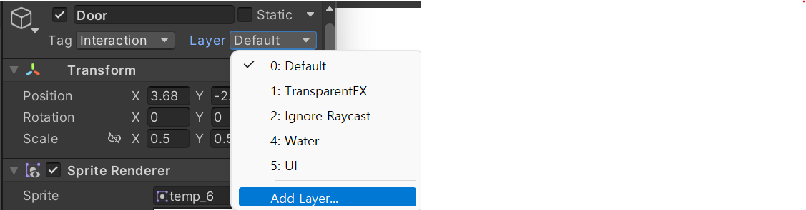
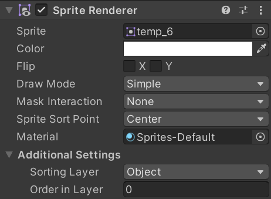

# 230106

- [유니티 강좌[3D 추리 비쥬얼 노벨] - 케이디](https://www.youtube.com/playlist?list=PLUZ5gNInsv_NG_UKZoua8goQbtseAo8Ow)
  - [[유니티 강좌] 단간론파를 유니티로 구현하기 Part 3 - 1 상호작용](https://youtu.be/N0gdrvraaiU?list=PLUZ5gNInsv_NG_UKZoua8goQbtseAo8Ow)
- [Camera.ScreenPointToRay](https://funfunhanblog.tistory.com/24)
- [유니티 각개격파\_015_스크린(Screen) 좌표와 World(월드) 좌표](https://fiftiesstudy.tistory.com/254)
- [유니티 레이캐스트2D Raycast2D 총정리 / ScreenPointToRay / ScreenToWorldPoint](https://chameleonstudio.tistory.com/65)
- [유니티 - Raycast 로 오브젝트 선택 하기. 2D, 3D 버젼](https://blog.naver.com/ateliersera/220439790504)


## 1. Game 뷰에서, Canvas의 흰 선이 보이는 현상


- 마우스 커서가 있는 쪽을 보면, Canvas의 흰색 선이 일부 보인다.
- 이건 Game 뷰 오른쪽 상단의 Gizmos를 해제하면 보이지 않게 된다..^^


## 2. 마우스 포인터와 커서 이미지의 끝 부분 맞추기

- 뭔 소린가 하면, 아래의 사진을 보면, 실제 마우스(흰색)로 클릭하는 부분과, 게임의 커서(빨간색)로 클릭하는 부분이 맞지 않는다.

  


- `UI_Cursor`의 자식 오브젝트 중, `Normal`의 위치를 아래로, 오른쪽으로 살짝 이동시킨다.

- 현재 이미지의 기준으로는 x 36, y -35가 적절했다. (추후 이미지 바뀔 가능성 100%)

  


- 결과

  


## 3. 상호작용 가능한 객체 만들기

### 1. 상호작용 할 GameObject 생성

- 문과 상호작용 할 수 있도록, `Door` 오브젝트를 하나 생성하여, 크기 조절을 한 후 적절히 배치해 주었다.

  


### 2. Tag 생성 및 적용

- `Door` 오브젝트를 상호작용 가능하도록 변경해주기 위해, Tag를 하나 생성해준다.

- Inspector 창의 맨 위에, Tag를 클릭해서 **Add Tag**

  


- Add Tag를 클릭하면 다음과 같이, **Interaction**이라는 이름으로 태그를 하나 생성해준다.

  


- 그리고, 다시 `Door` 객체에 **Interaction 태그**를 적용해 준다.

  


- **Interaction 태그**가 적용된 객체는, 상호작용이 가능한 객체로 만들어 줄 것이다.


### 3. 상호작용 객체에 Hover 시, 해당 객체 이름 출력 (1)

- 우선 UI_Cursor의 자식으로, `Interactable` 오브젝트를 만들어 준다.

- 이미지는 상호작용 가능한 객체에 마우스를 가져다 댔을 때 변경할 이미지로 설정해 준다.

  


- `InteractionController.cs` 스크립트를 생성한다.

  - 변수

    ```csharp
    [SerializeField] Camera cam;    // 우리가 보고 있는 카메라
    RaycastHit hitInfo; // 레이저를 쏴서 맞춘 오브젝트 정보를 저장
    ```

  

  - CheckObject() 함수

    ```csharp
    void CheckObject()
    {
        Vector3 t_mousePos = new Vector3(Input.mousePosition.x, Input.mousePosition.y, 0);  // 마우스의 위치
    
        // 마우스 위치에서 레이저를 쏘기
        if (Physics.Raycast(cam.ScreenPointToRay(t_mousePos), out hitInfo, 100))
        {
            Debug.Log(hitInfo.transform.name);	// 어느 오브젝트에 맞았는지 테스트
        }
    }
    ```

    - `t_mousePos`: 마우스의 위치
    - `Physics.Raycast(param1, param2, param3)`
      - 마우스 위치에서 레이저를 쏘기
      - `Physics` 클래스에 레이저를 쏘는 기능인 `Raycast`가 있다.
      - **첫 번째 인자:** 레이저를 발사할 위치
        - 카메라에는 2D 화면 좌표를 3D로 치환하는 기능이 있다.
        - 바로 `ScreenPointToRay`.
        - 즉, 게임 상 마우스의 2D 좌표를, 카메라를 기준으로 하여 3D로 치환해서, 알아서 레이저를 발사하는 기능이다.
        - 그래서 마우스의 좌표 값만 알면, 알아서 치환해 준다. → `ScreenPointToRay(t_mousePos)`
        - [Camera.ScreenPointToRay](https://funfunhanblog.tistory.com/24)
      - **두 번째 인자:** 레이저를 발사해서 충돌한 객체의 정보를 `hitInfo` 변수에 저장해 주어야 한다.
        - 그것을 위한 키워드 `out`. 레이저를 쏴서 맞춘 결과를 내보내는 것.
        - 그 결과를 `hitInfo`에 저장
      - **세 번째 인자:** 레이저를 얼만큼 발사할 지에 대한 거리


- 스크립트를 UI_Cursor의 컴포넌트로 추가해 준다.

  - (영상에서는 플레이어에게 주었지만...)

  - cam 자리에 `Main Camera` 오브젝트를 넣어준다.

    


- 레이저를 쏴서 맞추려면, 맞추려는 오브젝트에도 충돌 영역이 있어야 한다.

  - `Door` 오브젝트에, **Box Collider 2D 컴포넌트**를 추가해 준다.

    

    

- 갑자기 `Door` 오브젝트가 보이지 않아서, 그냥 Sorting Layer를 조정해 주기로 했다.

  - Layer → Add Layer 선택

    

    

  - Sorting Layer에 다음과 같이 설정

    

    

  - `Background` 오브젝트와 `Door` 오브젝트 Sprite Renderer의 Sorting Layer를 다음과 같이 설정

    <table>
        <tr>
        	<td></td>
            <td></td>
        </tr>
    </table>


- 테스트 해봤는데, 출력이 되지 않아!! 왜일까?
  - RaycastHit2D와 Physics2D를 활용해야 했기 때문에...
  - 그것은 바로 아래에서 설명하도록 하겠다.


### 4. 상호작용 객체에 Hover 시, 해당 객체 이름 출력 (2)

- 위에서 상호작용 객체의 이름이 콘솔에 뜨지 않았던 이유는 RaycastHit2D와 Physics2D를 사용하지 않았기 때문이다.
- 3D와 2D의 사용법이 다르다고 한다.


- 변수

  ```csharp
  [SerializeField] Camera cam;    // 우리가 보고 있는 카메라
  RaycastHit2D hit; // 레이저를 쏴서 맞춘 오브젝트 정보를 저장
  ```

  - RaycastHit → **RaycastHit2D**로 변경


- CheckObject() 함수

  ```csharp
  void CheckObject()
  {
      Vector2 pos = cam.ScreenToWorldPoint(Input.mousePosition);
      hit = Physics2D.Raycast(pos, Vector2.zero, 0f); // 마우스 위치에서 레이저를 쏘기
      
      Debug.DrawRay(pos, transform.forward, Color.red, 0.3f);	// 레이저 그리기
      
      if (hit)
      {
          Debug.Log(hit.transform.name);
      }
  }
  ```

  - cam.ScreenPointToRay(t_mousePos) → **cam.ScreenToWorldPoint(Input.mousePosition)**로 변경
    - ScreenToWorldPoint: 화면 좌표를 월드 좌표로 변경해 준다.
    - 즉, UI들의 좌표를 게임오브젝트들이 있는 좌표로 치환
    - [유니티 각개격파\_015_스크린(Screen) 좌표와 World(월드) 좌표](https://fiftiesstudy.tistory.com/254)

  - Physics.Raycast(cam.ScreenPointToRay(t_mousePos), out hitInfo, 100) → **Physics2D.Raycast(pos, Vector2.zero, 0f)**로 변경
    - pos: 마우스의 위치
    - Vector2.zero: (0, 0) 벡터, 레이저의 방향을 의미
    - 0f: 레이저의 길이를 의미
  - 레이저를 그려서 볼 수도 있다.
    - **Debug.DrawRay(pos, transform.forward, Color.red, 0.3f)**
      - 위치, 방향, 색, 지속시간
    - [유니티 레이캐스트2D Raycast2D 총정리 / ScreenPointToRay / ScreenToWorldPoint](https://chameleonstudio.tistory.com/65)


- 실행 결과

  


## 4. 다음에 할 일

- ~~카메라 이동 범위 제한하기~~
- ~~커서 이미지 & 포인트 매치시키기~~
- 상호작용 가능한 오브젝트에 커서를 옮기면, 이미지 바꿔보기
- 맵 이동 구현해보기
- 대사창 띄워보기
- **상호작용 아이템과 드래그 해서 화면 전환하는 걸 어떻게 구분할 수 있을지**
- 오브젝트 클로즈업(하면서 화면 이동)하기??
- 마우스 커서에 애니메이션? 넣기


## 5. 참고할 만한 자료들 (아직 활용은 X)

- [[Unity] 엑셀 대화 정보들을 대화 이름으로 묶어서 가져오기](https://velog.io/@gkswh4860/Unity-%EC%97%91%EC%85%80-%EB%8C%80%ED%99%94-%EB%82%B4%EC%9A%A9%EC%9D%84-%EB%8C%80%ED%99%94-%EC%9D%B4%EB%A6%84%EC%9C%BC%EB%A1%9C-%EB%AC%B6%EC%96%B4%EC%84%9C-%EA%B0%80%EC%A0%B8%EC%98%A4%EA%B8%B0)
- [유니티로 미연시 만들기 졸업프로젝트](https://www.youtube.com/watch?v=eWT0TsknaiU&t=7s)
- [Unity 2D로 비주얼노벨 만들기(Flowchart)](https://m.blog.naver.com/liear1997/221292510685)


## 6. 오늘의 후기

- `Door` 오브젝트 잘만 보이다가 갑자기 사라졌는데, 어느 시점에서 왜 사라졌는지 모르겠다... 가려지는 문제는 항상 나를 괴롭혀... 레이어를 관리하는 팁이 있을까?
- `Raycast`가 2D와 3D 사용법이 다를 줄은 몰랐다. 그래도 삽질을 많이 안 해서 다행이었던 것 같다.
- `ScreenPointToRay`와 `ScreenToWorldPoint`의 차이를 한 번 정리해 봐야겠다.

- 그래도 메트로바니아 만들 때보단 진전이 있는 것 같다..