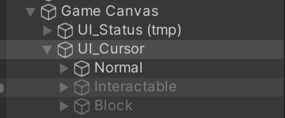
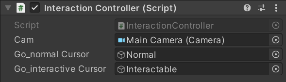
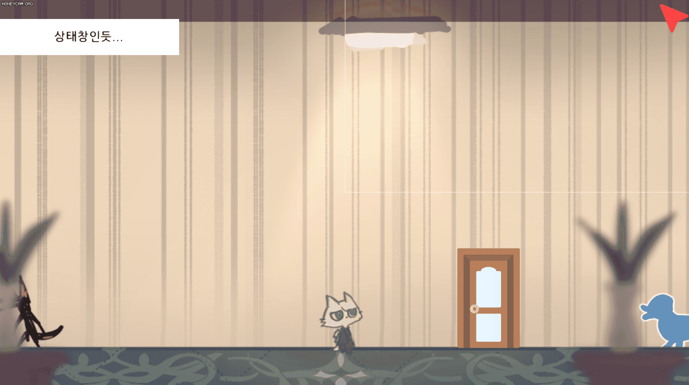

# 230107

- [유니티 강좌[3D 추리 비쥬얼 노벨] - 케이디](https://www.youtube.com/playlist?list=PLUZ5gNInsv_NG_UKZoua8goQbtseAo8Ow)
  - [[유니티 강좌] 단간론파를 유니티로 구현하기 Part 3 - 1 상호작용](https://youtu.be/N0gdrvraaiU?list=PLUZ5gNInsv_NG_UKZoua8goQbtseAo8Ow)


## 1. 상호작용 가능한 오브젝트 위에서 커서 이미지 변경하기

- `InteractionController.cs` 수정하기

- 변수 추가

  ```csharp
  [SerializeField] GameObject go_normalCursor;   // 일반 커서
  [SerializeField] GameObject go_interactiveCursor;  // 상호작용 커서
  ```

  

- `CheckObject()` 함수 내부를 다음과 같이 변경

  ```csharp
  void CheckObject()
  {
  	// ...
  
      if (hit)
      {
          Contact();
      }
  
      else
      {
          NotContact();
      }   
  }
  ```


- `Contact()` 함수 작성

  ```csharp
  // 레이저에 오브젝트가 맞았을 때 실행
  void Contact()
  {
      // 상호작용 가능한 오브젝트에 커서를 이동했을 때 실행
      if (hit.transform.CompareTag("Interaction"))
      {
          go_interactiveCursor.SetActive(true);
          go_normalCursor.SetActive(false);
      }
  
      else
      {
          NotContact();
      }
  }
  ```

  - 마우스에서 쏜 레이저가 오브젝트에 맞았을 때, 그 물체가 상호작용 가능한 오브젝트면 커서 이미지를 바꾼다.
    - interactive cursor 이미지로 바꾸고,
    - 기존의 normal cursor 이미지는 없앤다.
  - 만약 상호작용 가능한 오브젝트가 아니면
    - 아래의 `NotContact()` 함수를 실행한다.


- `NotContact()` 함수 작성

  ```csharp
  // 레이저에 오브젝트가 맞지 않았을 때 실행
  void NotContact()
  {
      go_interactiveCursor.SetActive(false);
      go_normalCursor.SetActive(true);
  }
  ```

  - 마우스에서 쏜 레이저가 오브젝트에 맞지 않았을 때, 기본 커서 이미지로 바꾼다.
    - normal cursor 이미지로 바꾸고,
    - 기존의 interactive cursor 이미지는 없앤다.


- `UI_Cursor` 오브젝트의 `Interaction Controller` 컴포넌트에, `Normal` 오브젝트와 `Interactable` 오브젝트를 각각 `Go_normal Cursor`와 `Go_interactive Cursor`에 끌어다 놓는다.

  

  


- 실행 결과

  


## 2. 코드 최적화하기

- `Contact()`와 `NotContact()` 함수에 지금은 두 줄밖에 없지만, 길어지면 긴 코드가 매 프레임마다 커서 이미지를 바꾸는 코드가 실행되게 된다.
- 따라서 코드의 중복 실행을 막을 필요가 있다.


- 변수

  ```csharp
  bool isContact = false; // 상호작용 가능 오브젝트에 접촉하는 최초의 순간에 true로 변경
  ```


- `Contact()` 함수

  ```csharp
  void Contact()
  {
      // 상호작용 가능한 물체에 커서를 이동했을 때 실행
      if (hit.transform.CompareTag("Interaction"))
      {
          // isContact == false일 때만 실행
          if (!isContact)
          {
              isContact = true;
              go_interactiveCursor.SetActive(true);
              go_normalCursor.SetActive(false);
          }
      }
      
      // ...
  }
  ```

  - 마우스 커서를 상호작용 가능한 오브젝트에 옮기면,
  - 처음에는 `isContact`가 false이기 때문에 if문 내부가 실행된다.
    - 그러면 `isContact`의 값을 true로 바꾸어, 다음 프레임에서는 if문 내부가 실행되지 않도록 한다.
    - 커서 이미지가 상호작용 가능함을 알려 주는 이미지로 바뀌게 된다.


- `NotContact()` 함수

  ```csharp
  void NotContact()
  {
      if (isContact)
      {
          isContact = false;
          go_interactiveCursor.SetActive(false);
          go_normalCursor.SetActive(true);
      }
  }
  ```

  - 마우스 커서를 상호작용이 불가능한 오브젝트에 옮기면,
  - 처음에는 `isContact`가 true이기 때문에 if문 내부가 실행된다.
    - 그러면 `isContact`의 값을 false로 바꾸어, 다음 프레임에서는 if문 내부가 실행되지 않도록 한다.
    - 커서 이미지가 기본 이미지로 바뀌게 된다.


- `isContact` 변수는 추후 다른 곳에서도 이용될 예정(이라고 한다.)


## 3. 다음에 할 일

- ~~카메라 이동 범위 제한하기~~
- ~~커서 이미지 & 포인트 매치시키기~~
- ~~상호작용 가능한 오브젝트에 커서를 옮기면, 이미지 바꿔보기~~
- 상호작용 & 이동 상호작용 분리하기
- 맵 이동 구현해보기
- 대사창 띄워보기
- **상호작용 아이템과 드래그 해서 화면 전환하는 걸 어떻게 구분할 수 있을지**
- 오브젝트 클로즈업(하면서 화면 이동)하기??
- 마우스 커서에 애니메이션? 넣기


## 4. 참고할 만한 자료들 (아직 활용은 X)

- [[Unity] 엑셀 대화 정보들을 대화 이름으로 묶어서 가져오기](https://velog.io/@gkswh4860/Unity-%EC%97%91%EC%85%80-%EB%8C%80%ED%99%94-%EB%82%B4%EC%9A%A9%EC%9D%84-%EB%8C%80%ED%99%94-%EC%9D%B4%EB%A6%84%EC%9C%BC%EB%A1%9C-%EB%AC%B6%EC%96%B4%EC%84%9C-%EA%B0%80%EC%A0%B8%EC%98%A4%EA%B8%B0)
- [유니티로 미연시 만들기 졸업프로젝트](https://www.youtube.com/watch?v=eWT0TsknaiU&t=7s)
- [Unity 2D로 비주얼노벨 만들기(Flowchart)](https://m.blog.naver.com/liear1997/221292510685)


## 5. 오늘의 후기

- 최적화... 어떡하지