# 230109

- [모바일 앱 및 게임 엔진용으로 애니메이션 내보내기](https://helpx.adobe.com/kr/animate/using/create-sprite-sheet.html)
- [유니티에서 스프라이트 시트(sprite sheet)를 사용한 2D 애니메이션](https://learnandcreate.tistory.com/941)
- [[유니티] 스프라이트 시트 만드는 프로그램 | 만드는 법](https://defineall.tistory.com/551)


## 1. 스프라이트 시트 제작 & 커서 이미지 변경하기

### 1. 스프라이트 시트 제작

- 동업자분이 커서 이미지 세트를 만들어 주셨다!!! 어떻게 5분만에 뚝딱 제작할 수가 있지.. 아무튼 그걸로 커서를 바꿔보려 한다.

- 커서 이미지들

  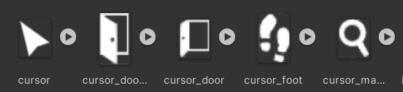


- 하지만 게임의 최적화를 위해서, 비슷한 이미지끼리는 **스프라이트 시트**로 묶는 것이 좋다고 한다.
  - [모바일 앱 및 게임 엔진용으로 애니메이션 내보내기](https://helpx.adobe.com/kr/animate/using/create-sprite-sheet.html)
  - [유니티에서 스프라이트 시트(sprite sheet)를 사용한 2D 애니메이션](https://learnandcreate.tistory.com/941)


- 우선 이미지 비율이 다 제각각이라서, 미리캔버스에서 1080 × 1080으로 만들어준 후, 64 × 64 크기로 리사이징했다.

- [[유니티] 스프라이트 시트 만드는 프로그램 | 만드는 법](https://defineall.tistory.com/551)

- 그리고, 위 글을 참고해서 스프라이트 시트를 제작했다.

  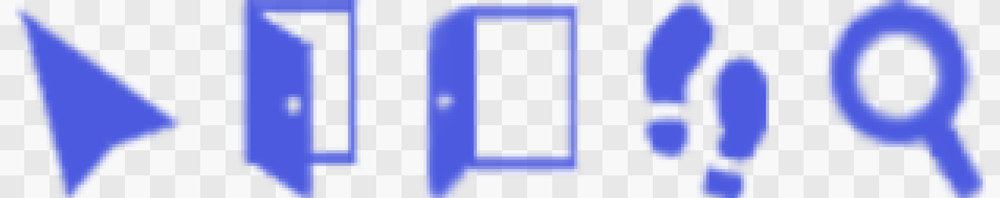


### 2. 스프라이트 시트 그리드 나누기

- 방금 제작한 스프라이트 시트를 Asset에 추가해서 보면, 다음과 같이 되어있는 것을 볼 수 있다.

  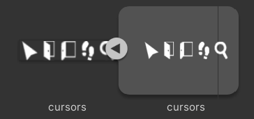


- 위 시트를 클릭해서 Inspector 창을 연다.

  - Texture Type을 **Sprite(2D and UI)**로 변경한다.

  - Sprite Mode를 **Multiple**로 변경한다.

    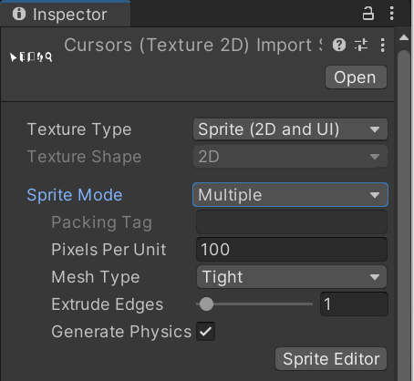


- 오른쪽 아래의 **Sprite Editor**를 클릭해서, **Grid By Cell Size**를 선택한다.

  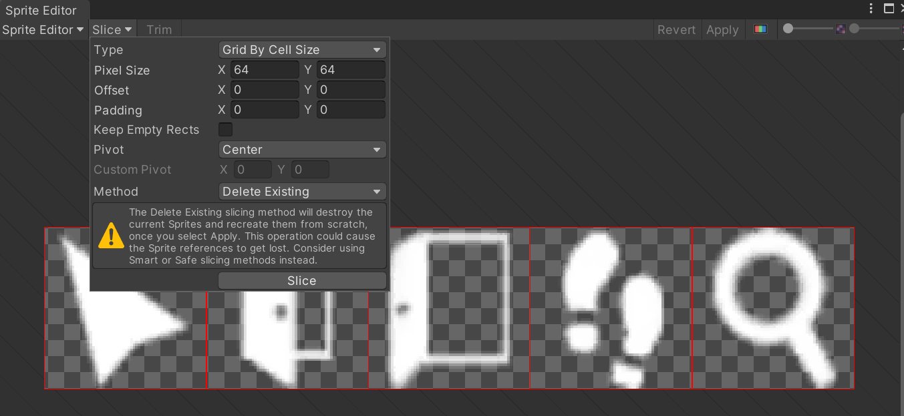


- 그 후 **Slice**를 하고 우측 위의 **Apply**를 해주면, 다음과 같이 5등분이 된 것을 확인할 수 있다.

  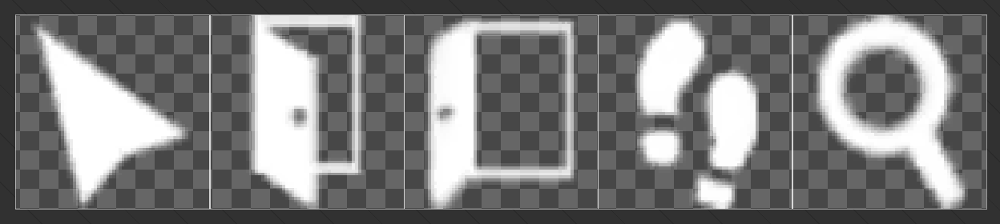

  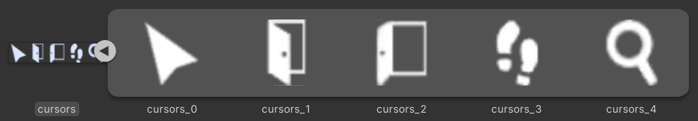


### 3. 커서 이미지 변경

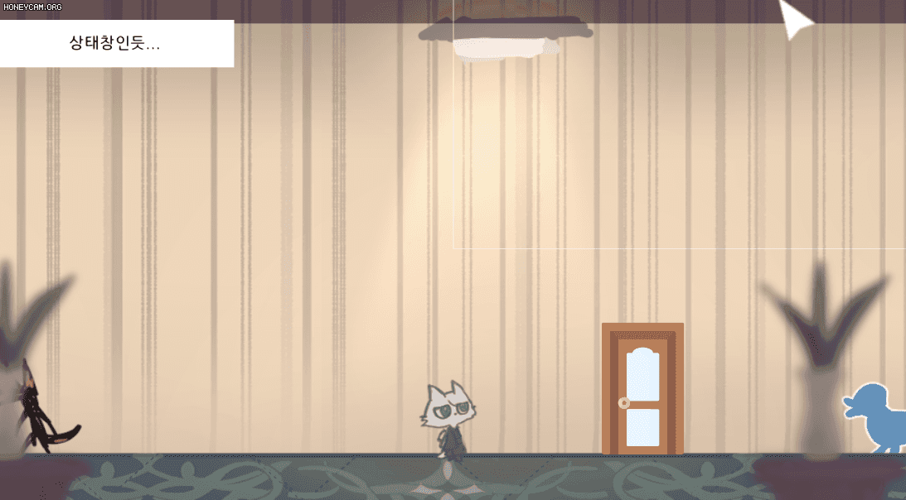

- 어두운 배경이 될 것 같지만 좀 더 잘 보이도록 수정해야 할 것 같다.


## 2. 상호작용 & 이동 상호작용 분리하기

### 1. 새 오브젝트 생성 & 기존 문 오브젝트 태그 변경

- `Door`를 이동 상호작용 오브젝트로 설정하고, 그것과 비교하기 위해, `Crowbar` 오브젝트를 하나 생성해 주었다. (자고로 방탈출에 빠루는 필수 아이템이라 할 수 있다...)

  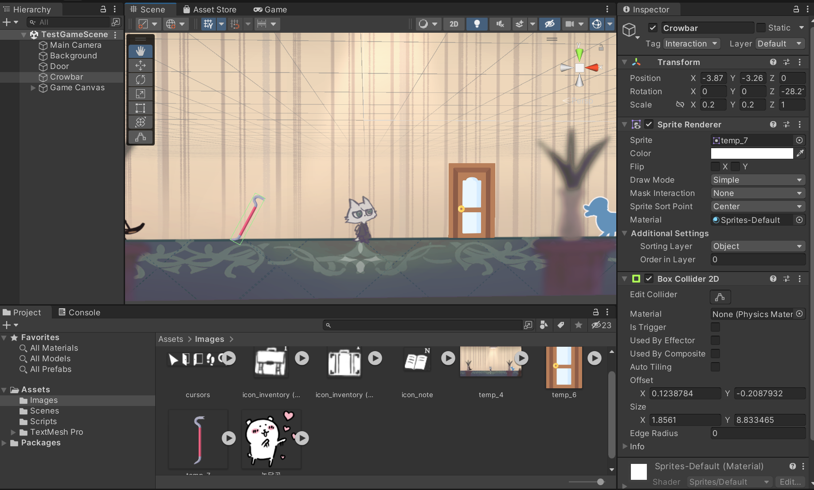


- 그리고 `Door`의 태그를 `Move_Interaction` 태그로 변경해 주었다.

  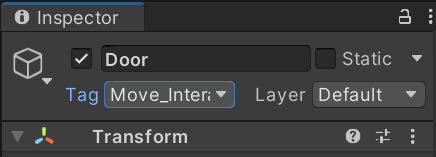


### 2. 맵 이동 커서 UI 추가

- Normal 커서와 Interactable 커서와 똑같은 방식으로, 이미지만 바꿔서 추가해 준다.

  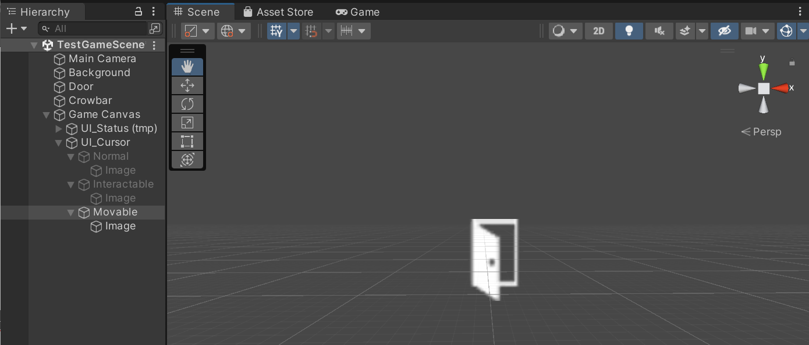


### 3. 스크립트 수정

- `InteractionController.cs` 수정

- 변수

  ```csharp
  [SerializeField] GameObject go_movableCursor;   // 맵 이동 커서
  
  bool isInteractive = false; // 상호작용 가능 오브젝트에 접촉하는 최초의 순간에 true로 변경
  bool isMovable = false; // 이동 상호작용 가능 오브젝트에 접촉하는 최초의 순간에 true로 변경
  ```

  - 기존 `isContact` 변수도 위와 같이 2개로 나누었다.
  - 이동 상호작용 오브젝트와, 그냥 상호작용 오브젝트가 붙어있는 경우, 그 사이에서 커서를 이동할 때에도 커서 이미지가 바뀔 수 있도록 하기 위함이다.


- `Contact()` 함수 수정

  ```csharp
  void Contact()
  {
      // 상호작용이 가능한 물체에 커서를 이동했을 때 실행
      if (hit.transform.CompareTag("Interaction"))
      {
          // isContact == false일 때만 실행
          if (!isInteractive)
          {
              isInteractive = true;
              isMovable = false;
  
              go_interactiveCursor.SetActive(true);
              go_normalCursor.SetActive(false);
              go_movableCursor.SetActive(false);
          }
      }
  
      // 이동 상호작용이 가능한 물체에 커서를 이동했을 때 실행
      else if (hit.transform.CompareTag("Move_Interaction"))
      {
          // isContact == false일 때만 실행
          if (!isMovable)
          {
              isMovable = true;
              isInteractive = false;
  
              go_interactiveCursor.SetActive(false);
              go_normalCursor.SetActive(false);
              go_movableCursor.SetActive(true);
          }
      }
  
      else
      {
          NotContact();
      }
  }
  ```


- `NotContact()` 함수 수정

  ```csharp
  void NotContact()
  {
      if (isMovable || isInteractive)
      {
          isMovable = false;
          isInteractive = false;
  
          go_interactiveCursor.SetActive(false);
          go_normalCursor.SetActive(true);
          go_movableCursor.SetActive(false);
      }
  }
  ```


### 4. 컴파일 및 실행

- `UI_Cursor` 오브젝트의 `Interaction Controller` 컴포넌트에, `Movable` 오브젝트를 `Go_movable Cursor`에 끌어다 놓는다.

  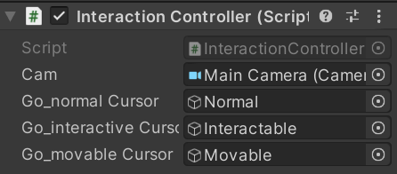


- `Door` 오브젝트 옆에 Interaction 태그를 가진 `Bear` 오브젝트를 하나 더 생성해 주었다.

  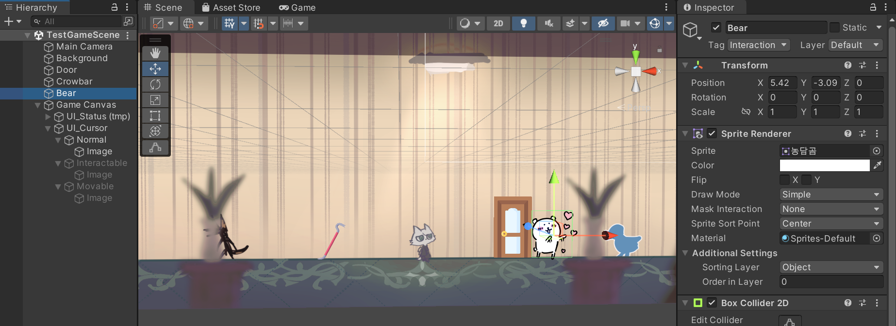


- 실행 결과

  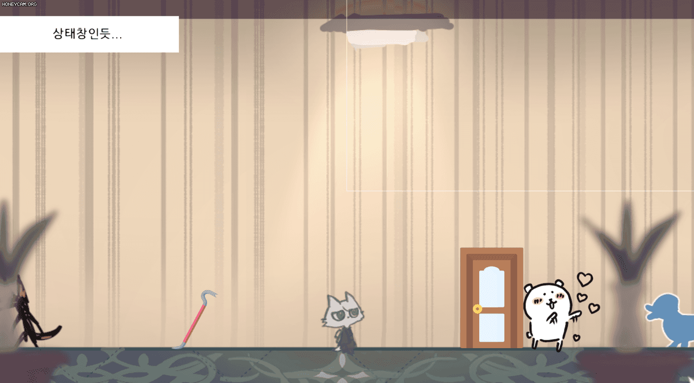


## 3. 다음에 할 일

- ~~카메라 이동 범위 제한하기~~
- ~~커서 이미지 & 포인트 매치시키기~~
- ~~상호작용 가능한 오브젝트에 커서를 옮기면, 이미지 바꿔보기~~
- ~~상호작용 & 이동 상호작용 분리하기~~
- 맵 이동 구현해보기
- 대사창 띄워보기
- 오브젝트 클로즈업(하면서 화면 이동)하기??
- 마우스 커서에 애니메이션? 넣기
- 마우스 커서에 이펙트 넣기


## 4. 참고할 만한 자료들 (아직 활용은 X)

- [[Unity] 엑셀 대화 정보들을 대화 이름으로 묶어서 가져오기](https://velog.io/@gkswh4860/Unity-%EC%97%91%EC%85%80-%EB%8C%80%ED%99%94-%EB%82%B4%EC%9A%A9%EC%9D%84-%EB%8C%80%ED%99%94-%EC%9D%B4%EB%A6%84%EC%9C%BC%EB%A1%9C-%EB%AC%B6%EC%96%B4%EC%84%9C-%EA%B0%80%EC%A0%B8%EC%98%A4%EA%B8%B0)
- [유니티로 미연시 만들기 졸업프로젝트](https://www.youtube.com/watch?v=eWT0TsknaiU&t=7s)
- [Unity 2D로 비주얼노벨 만들기(Flowchart)](https://m.blog.naver.com/liear1997/221292510685)


## 5. 오늘의 후기

- 최적화... 어떡하지22
- 그래도 아직까진 큰 어려움이 없는 것 같다. 이대로만 가자!! 이대로만!!!