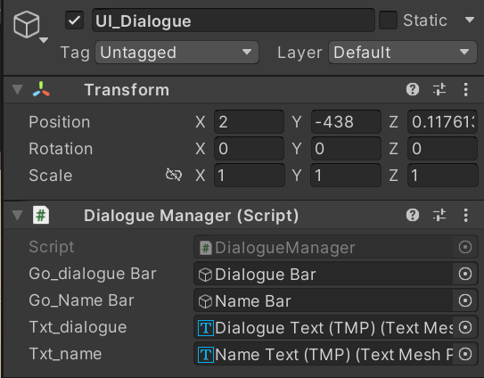

# 230110

- [유니티 강좌[3D 추리 비쥬얼 노벨] - 케이디](https://www.youtube.com/playlist?list=PLUZ5gNInsv_NG_UKZoua8goQbtseAo8Ow)
  - [[유니티 강좌] 단간론파를 유니티로 구현하기 Part 3 - 3 상호작용 이벤트](https://youtu.be/ftBw_KhI694?list=PLUZ5gNInsv_NG_UKZoua8goQbtseAo8Ow)

- [탑다운 2D RPG - 대화창 UI 구축하기 [유니티 기초 강좌 B22]](https://youtu.be/jVBiGhlwhZg?list=PLO-mt5Iu5TeYfyXsi6kzHK8kfjPvadC5u)


## 1. 대사창 UI 만들기

### 1. 대사창 이미지

- 빈 오브젝트 `UI_Dialogue`를 만들고, UI → `Image` 오브젝트를 하나 만들어서 자식으로 둔다.

  


- 대사창이 될 이미지가 있으면, **Texture Type**을 **Sprite (2D and UI)**로 해준다.
- 그리고 `Image` 오브젝트 Image 컴포넌트의 Source Image에, 대사창 이미지를 넣는다.


- Image를 **Set Native Size** 해주면, 씬 뷰와 게임 뷰에 다음과 같이 표시된다.

  


- 높이를 늘려봤더니? 이미지가 이상해짐..

  


- [탑다운 2D RPG - 대화창 UI 구축하기 [유니티 기초 강좌 B22]](https://youtu.be/jVBiGhlwhZg?list=PLO-mt5Iu5TeYfyXsi6kzHK8kfjPvadC5u)

- `Image` 오브젝트의 **Image Type**을 **Sliced**로 바꾼다.

  


- Sliced를 사용하기 위해서는 Sprite 설정이 필요하다.

  - Asset에 있는 대사창 이미지를 클릭해서, **Sprite Editor**를 켠다.

  - 변하지 않을 영역을 설정할 수 있다.

  - Sprite Editor를 켜면, 다음과 같은 화면이 뜬다.

    


- 모서리 부분을 잡기 위해, Border 값을 입력한다.

  

  - 이렇게 하면, 연두색 선의 바깥쪽 부분은 길이가 변해도 변하지 않게 된다.


- 이미지가 깔끔해 진 것을 볼 수 있다!

  


- pivot과 크기를 조정하면서 다음과 같이 대사창을 만들어 주었다. (아직은 임시 배경이라 오브젝트를 다 가린다...)

  


### 2. 대사창 텍스트


- `UI_Dialogue` 오브젝트 아래에 TMP 오브젝트를 하나 생성한다.
- 폰트를 한글 지원 폰트로 바꾸고, 내용을 로렘 입숨을 이용해서 하나 해주고, 줄 간격도 50 정도로 주었다.


- 캐릭터의 이름을 표시할 부분도 있어야 하기 때문에, **Name Bar**와 **Dialogue Bar**를 나누어 주었다. (Name Bar는 추후 구현할 예정)

  


- 그리고 게임 실행 시 커서가 대사창에 가려 보이지 않기 때문에, 커서를 아래로 내려주었다.

  


## 2. 오브젝트와 상호작용했을 때 대사창 띄우기

### 1. DialogueManager 스크립트 작성

- `DialogueManager.cs` 스크립트 생성

- 네임스페이스

  ```csharp
  // using UnityEngine.UI;   // Text 클래스 사용
  using TMPro;   // TextMeshProUGUI, TMP_Text 클래스 사용


- 변수

  ```csharp
  [SerializeField] GameObject go_dialogueBar;
  [SerializeField] GameObject go_NameBar;
  
  [SerializeField] TMP_Text txt_dialogue;
  [SerializeField] TMP_Text txt_name;
  
  bool isDialogue = false;    // 현재 대화중인지
  ```


- `ShowDialogue()` 함수

  ```csharp
  public void ShowDialogue()
  {
      txt_dialogue.text = "";
      txt_name.text = "";
  
      SettingUI(true);
  }
  ```


- `SettingUI()` 함수

  ```csharp
  void SettingUI(bool p_flag)
  {
      go_dialogueBar.SetActive(p_flag);
      go_NameBar.SetActive(p_flag);
  }
  ```


- 일단 기초적인 틀은 위와 같고, 추후 계속 수정할 예정(이라고 한다.)


- `UI_Dialogue` 오브젝트에 `Dialogue Manager` 컴포넌트를 추가하고, 다음과 같이 필드를 채워준다.

  


- `DialogueManager.cs` 안의 함수는, 오브젝트와 상호작용이 일어날 때 호출되어야 한다.


### 2.InteractionControllers 스크립트 수정

- 변수

  ```csharp
  bool clickedInteractive = false;    // 상호작용 가능 오브젝트를 클릭했는지
  DialogueManager dm;
  ```


- `Start()` 함수

  ```csharp
  void Start()
  {
      dm = FindObjectOfType<DialogueManager>();
  }
  ```

  - `FindObjectOfType`: 오브젝트를 Hierachy에서 하나하나 뒤져서 찾기 때문에, 성능 상 불리하다는 단점이 있다.


- `Update()` 함수

  ```csharp
  void Update()
  {
      CheckObject();
      LeftClick();
  }
  ```


- `LeftClick()` 함수

  ```csharp
  // 상호작용 가능 오브젝트를 좌클릭했을 때, Interact 함수 호출
  void LeftClick()
  {
      if (Input.GetMouseButtonDown(0))
      {
          if (isInteractive)
          {
              Interact();
          }
      }
  }
  ```


- `Interact()` 함수

  ```csharp
  // 상호작용 가능 오브젝트를 좌클릭했을 때, 대사창을 보여줌.
  void Interact()
  {
      clickedInteractive = true;
  
      dm.ShowDialogue();
  }
  ```


### 3. 컴파일 및 실행

- 실행 결과

  


## 3. 대사창을 띄우면, UI 숨기기

### 1. InteractionControllers 스크립트 수정

- 변수

  ```csharp
  [SerializeField] GameObject go_ui_cursor;  // UI_Cursor
  [SerializeField] GameObject go_ui_status;  // (임시) 상태창
  ```


- `HideUI()` 함수

  ```csharp
  // 대사창이 나오면, UI 숨기기 (DialogueManager.cs에서 호출)
  public void HideUI()
  {
      go_ui_cursor.SetActive(false);
      go_ui_status.SetActive(false);
  }
  ```


### 2. DialogueManager 스크립트 수정

- 변수

  ```csharp
  InteractionController ic;
  ```


- `Start()` 함수

  ```csharp
  void Start()
  {
      ic = FindObjectOfType<InteractionController>();
  }
  ```


- `ShowDialogue()` 함수 수정

  ```csharp
  public void ShowDialogue()
  {
      txt_dialogue.text = "";
      txt_name.text = "";
  
      ic.HideUI();    // 커서, 상태창 숨기기
      SettingUI(true);    // 대사창, 이름창 보이기
  }
  ```

  

### 3. 컴파일 및 실행

- `UI_Cursor` 오브젝트의 `Interaction Controller` 컴포넌트의 필드에 다음과 같이 채워준다.

  


- 실행 결과

  


## 4. 이벤트 동안, 다른 상호작용 막기

- 현재 눈으로 확인할 수는 없지만, 대사창이 떠 있는 동안에도 다른 오브젝트를 클릭해서 상호작용을 할 수 있다.
- 이를 막아 주어야 한다.


### 1. InteractionControllers 스크립트 수정

- 변수 수정

  ```csharp
  public static bool clickedInteractive = false;    // 상호작용 가능 오브젝트를 클릭했는지
  ```

  - `clickedInteractive` 변수를 **public static**으로 변경한다.
  - 이유는?? 다음에 알려 주신다고(...)


- `LeftClick()` 함수 수정

  ```csharp
  // 상호작용 가능 오브젝트를 좌클릭했을 때, Interact 함수 호출
  void LeftClick()
  {
      // clickedInteractive 값이 false일 때만 오브젝트를 클릭 가능
      if (!clickedInteractive)
      {
          if (Input.GetMouseButtonDown(0))
          {
              if (isInteractive)
              {
                  Interact();
              }
          }
      }
  }
  ```

  - 이벤트가 발생 중인 동안, 다른 오브젝트를 클릭할 수 없도록 막았다.


## 5. 다음에 할 일

- ~~카메라 이동 범위 제한하기~~
- ~~커서 이미지 & 포인트 매치시키기~~
- ~~상호작용 가능한 오브젝트에 커서를 옮기면, 이미지 바꿔보기~~
- ~~상호작용 & 이동 상호작용 분리하기~~
- ~~대사창 띄워보기~~
- **오브젝트 클릭 시, 강조하는 이펙트 넣기 & 코루틴으로 대사창 띄우는 시간 조정하기**
- 대사창 넘기기 & 대사창 닫기
- 오브젝트 클릭 시 대사창 & 인물 대사창 구분하기
- 맵 이동 구현해보기
- 오브젝트 클로즈업(하면서 화면 이동)하기??
- 마우스 커서에 애니메이션? 넣기
- 마우스 커서에 이펙트 넣기


## 6. 참고할 만한 자료들 (아직 활용은 X)

- [[Unity] 엑셀 대화 정보들을 대화 이름으로 묶어서 가져오기](https://velog.io/@gkswh4860/Unity-%EC%97%91%EC%85%80-%EB%8C%80%ED%99%94-%EB%82%B4%EC%9A%A9%EC%9D%84-%EB%8C%80%ED%99%94-%EC%9D%B4%EB%A6%84%EC%9C%BC%EB%A1%9C-%EB%AC%B6%EC%96%B4%EC%84%9C-%EA%B0%80%EC%A0%B8%EC%98%A4%EA%B8%B0)
- [유니티로 미연시 만들기 졸업프로젝트](https://www.youtube.com/watch?v=eWT0TsknaiU&t=7s)
- [Unity 2D로 비주얼노벨 만들기(Flowchart)](https://m.blog.naver.com/liear1997/221292510685)

- **오브젝트 상호작용 이펙트 및 이벤트**
  - [[유니티 강좌] 단간론파를 유니티로 구현하기 Part 3 - 3 상호작용 이벤트](https://youtu.be/ftBw_KhI694?list=PLUZ5gNInsv_NG_UKZoua8goQbtseAo8Ow)
  - [[유니티 강좌] 단간론파를 유니티로 구현하기 Part 3 - 2 상호작용 이펙트](https://youtu.be/DBFOqJICh3E?list=PLUZ5gNInsv_NG_UKZoua8goQbtseAo8Ow)


## 7. 오늘의 후기

- 상호작용 시 이펙트 구현 부분을 그냥 스킵했는데, 강의를 보니까 막 코루틴 써서 상호작용 끝날 때까지 기다린 다음에 대사창을 띄우고 막 그래서, 그 부분을 한 번 해 봐야 할 것 같다.
- 대신 오브젝트를 강조하는 이펙트는 따로 구현 (뭔가 검색하기 힘들다..)
  - 생각과 최대한 비슷한 영상을 찾아봤는데, 클릭하면 저렇게 비추도록 하는 것은 내가 해봐야겠지..
  - [Unity shader : Spotlight effect](https://youtu.be/Jr1agQsdfpY)

- 갑자기 어려워진 것 같다.. 하지만 이제 틀 잡는 거고, 스토리 진행하는 거나 분기 나누는 거도 더 머리 아플텐데 할 수 있겠지..? 파이팅...
