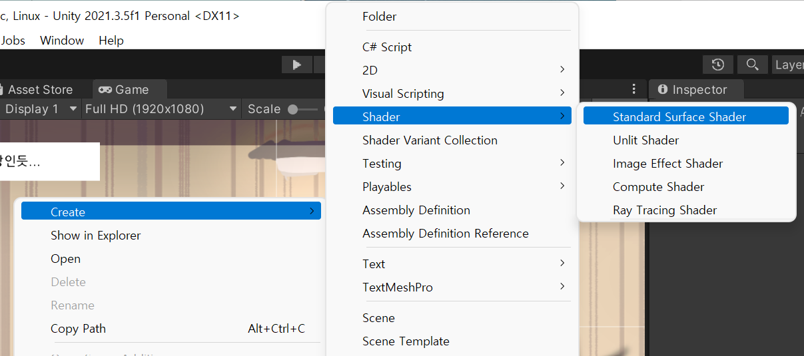
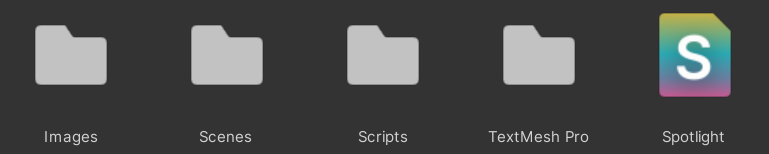
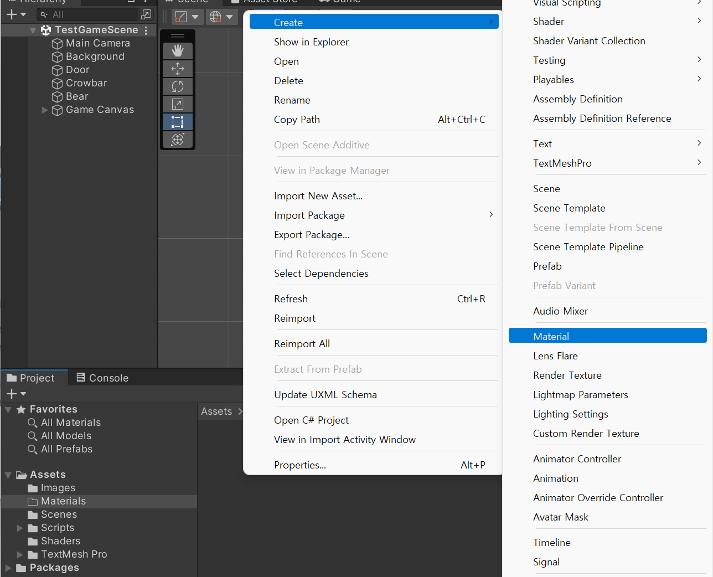
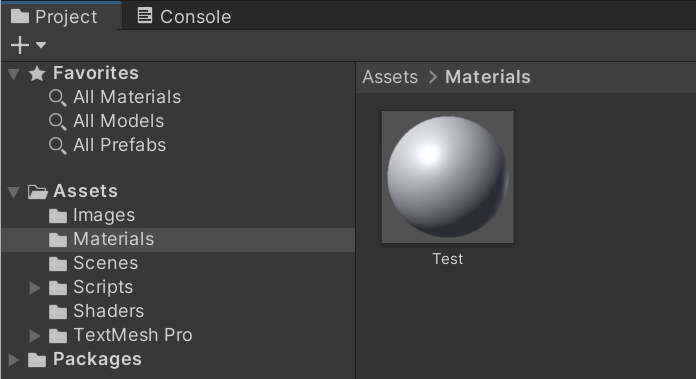
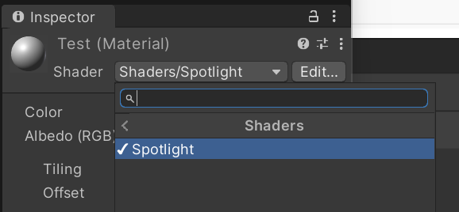
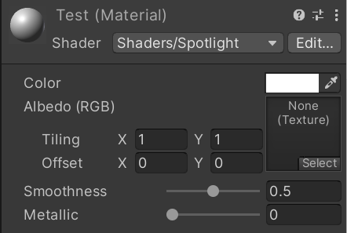
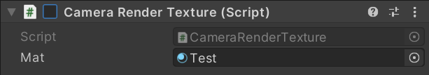
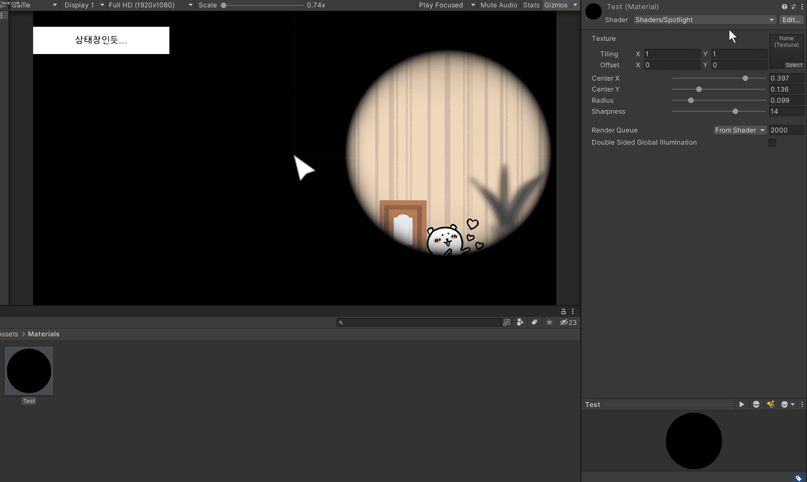

# 230121 (번외)

- [유니티 셰이더 Unity Shader - 01. 셰이더 기초](https://celestialbody.tistory.com/5)
- [a post rendering effect which acts like a spotlight.](http://www.shaderslab.com/demo-49---spotlight.html)
- [[UNITY] 쉐이더 1장 - 기본 이론](https://bornsoul.tistory.com/4)
- [Surface shaders in Unity3D](http://www.alanzucconi.com/2015/06/17/surface-shaders-in-unity3d/)
  - 영상: [Rendering and Shading](https://learn.unity.com/tutorial/rendering-and-shading#)
  - 번역: [셰이더 튜토리얼1: Unity 셰이더 입문](https://jinhomang.tistory.com/136)


## 1. 셰이더의 개념

- 3D 모델은 vertex라 불리는 3D 좌표들의 모음이고, vertex들은 삼각형을 이루며 연결되어 있다.
- 각 vertex는 색상, 방향(normal), UV값(텍스처 매핑을 위한 좌표)의 정보를 포함할 수 있다.
- 모델은 material 없이 렌더링될 수 없다. material은 셰이더 속성값과 셰이더를 포함하는 일종의 래퍼이다.
  - 서로 다른 material은, 서로 다른 데이터를 가지면서도 동일한 셰이더를 공유할 수 있다.
  - material은 애셋(asset)이다. 에디터 상이나, 게임을 실행하고 있을 동안의 property 변경이 그대로 남아있다.


### 1. 셰이더의 종류

- 셰이더
  - 3D 컴퓨터 그래픽에서, 물체의 3차원 위치를 나타내는 xyz 좌표나, 색상, 텍스쳐, 조명 등 다양한 시각적 효과를 계산하여 최종적으로 화면에 출력할 픽셀의 위치와 색상을 계산하는 함수
  - 셰이더 언어
    - **HLSL** (High Level Shading Language): 가장 유명하고 보편적인 언어
    - **GLSL** (OpenGL Shading Language): OpenGL에서 사용하는 언어
    - **CG **(C for Graphics): Nvdia와 Microsoft가 협력해 만든 언어
    - 유니티가 사용하는 언어는 CG이지만, 위 언어 3개는 굉장히 유사하다.


- 유니티에서 셰이더를 짜는 방법
  - Sharder Lab
    - 호환성은 좋지만, 할 수 있는 작업이 별로 없다.
  - **Surface Shader**
    - Shader Lab이라는 스크립트 안에, CG 코드가 들어가 있는 형식
    - 이걸 배워두면 Vertex & Fragment Shader, 렌더몽키, 노드 등을 이해할 수 있다.
    - Material이 매 순간 빛을 받으며 현실감 넘치게 시뮬레이션하고 싶을 때, 고급 효과를 만들 때 사용한다.
  - Vertex & Fragment Shader
    - Surface Shader의 상위 버전으로, CG를 더 디테일하게 다룬다.
    - Surface Shader가 자동이라면, 이건 수동이라는 느낌
    - 모델의 지오메트리는, 먼저 vertex를 변경할 수 있는 vert라는 함수(이름 지정)로 전달된다. 그 후, 각 픽셀에 대해 RGB 색상을 결정하는 frag 함수(이름 지정)로 전달된다.
    - 2D 이펙트, 후처리, 또는 Surface Shader로 표현하기 어려운 복잡한 3D 특수 이펙트를 구현하는 데 사용한다.


### 2. Surface Shader

- 멀티 플랫폼에 잘 대응되는 셰이더로, 프로그래머가 아니어도 배우기 쉽다.
- Visual Shader Editor와 개념적으로 상당히 비슷하며, 고급 기술은 아쉽지만 자동이라는 점이 큰 장점이다.


- Create → Shader → Standard Surface Shader로, 셰이더를 생성한다.

  

  


- Shaders 폴더를 생성한 후, `Spotlight.shader`를 그곳에 옮겨주었다.
  - 그리고 `Shader "Custom/Spotlight"`를 `Shader "Shaders/Spotlight"`로 변경해주었다.


- Materials 폴더를 생성한 후, 새로운 Material을 생성한다.

  

  


- Material의 Shader에 Sharders/Spotlight를 적용한다.

  


### 3. .shader 코드 살펴보기

- `Shader "Custom/NewSurfaceShader"`

  ```csharp
  Shader "Shaders/Spotlight"
  {
      // ...
  }
  ```

  - 셰이더가 시작한다는 것을 알려주며, "" 안의 문장은 셰이더의 경로와 이름을 나타낸다.


- `Properties`

  ```csharp
  Properties
  {
      // 명령어 예시
      _Name ("display name", Range (min, max)) = number
      _Name ("display name", Float) = number  
      _Name ("display name", int) = number  
  
      _Name ("display name", Color) = (number, number, number, number)
      _Name ("display name", Vector) = (number, number, number, number)
  }
  ```

  - 유니티 내부에서 변수들을 조작할 수 있는 인터페이스를 설정한다.

  - `_Color ("Color", Color) = (1, 1, 1, 1)`

    - _Color는 변수의 이름이다. 변수 이름에는 맨 앞에 언더바를 써 준다. (컨벤션)

    - 괄호 안의 "Color"는 프로퍼티에 표시되는 이름이다.

      

    

    - 그 다음으로는 Color, Range, 2D 등, 상황에 맞는 프로퍼티를 지정해 줄 수 있다.


- `SubShader`

  - `Properties`에서 작성한 내용은 인터페이스일 뿐이고, 작동하지는 않는다.
  - 셰이더의 내용을 결정해 주는 것이 `SubShader`이다.

  

  ```csharp
  SubShader
  {
      Tags { "RenderType"="Opaque" }
      LOD 200
  
      CGPROGRAM
      
      #pragma surface surf Standard fullforwardshadows
      #pragma target 3.0
  
      sampler2D _MainTex;
  
      struct Input
      {
          float2 uv_MainTex;
      };
  
      half _Glossiness;
      half _Metallic;
      fixed4 _Color;
  
      UNITY_INSTANCING_BUFFER_START(Props)
      UNITY_INSTANCING_BUFFER_END(Props)
  
      void surf (Input IN, inout SurfaceOutputStandard o)
      {
          fixed4 c = tex2D (_MainTex, IN.uv_MainTex) * _Color;
          o.Albedo = c.rgb;
  
          o.Metallic = _Metallic;
          o.Smoothness = _Glossiness;
          o.Alpha = c.a;
      }
      ENDCG
  }
  ```

  - `CGPROGRAM` ~ `ENDCG`

    - `CGPROGRAM` 부터 `ENDCG` 까지는 CG 언어로 쓰인 코드이다.
    - 이 부분의 코드는 세미콜론이 붙어있는 것을 확인할 수 있다.

  - `#pragma`

    - 설정, Snippet
    - 셰이더의 조명 계산 설정, 기타 세부적 분기를 정해주는 전처리이다.
    - `#pragma target 3.0`은 셰이더 3.0 버전으로 컴파일하라는 뜻

  - `struct Input`

    - `Input`이라는 이름의 구조체
    - 엔진으로부터 받아와야 할 데이터를 넣는다.

  - `void`

    - 색상, 이미지가 출력되는 부분을 만들어내는 함수

    - 위에 만들었던 프로퍼티가 작동하도록 한다.

    - 인자의 `inout SurfactOutputStandard o`

      - `inout`: `SurfactOutputStandard`라는 가방에 있는 것을 가지고 들어올 수도, 나갈 수도 있다는 뜻

      - `SurfactOutputStandard`: 유니티 내부에 자체적으로 있는 구조체로, 구조체 속 변수들을 꺼내 쓸 수 있다.

        ```csharp
        struct  SurfaceOutputStandard
        {
            fixed3 Albedo;	// 기본 색상, 오브젝트의 텍스처
            fixed3 Normal;	// 반사각을 결정하는 면의 방향
            fixed3 Emission;	// 이 오브젝트가 스스로 생성하는 빛의 양
            half Metallic;
            half Smoothness;
            half Occlusion;
            half Alpha;	// Material의 투명한 정도
        };
        ```

      - `o`: `SurfactOutputStandard`를 o라고 부르겠다는 뜻

      - 꺼내 쓸 때는 `o.Albedo` 이런 식으로 쓰면 된다.


## 2. `Spotlight.shader` 코드 작성해보기

### 1. `Spotlight.shader`

- [a post rendering effect which acts like a spotlight.](http://www.shaderslab.com/demo-49---spotlight.html)

- `Spotlight.shader`

  - Properties

    ```csharp
    Properties
    {
        _MainTex("Texture", 2D) = "white" {}
        _CenterX("Center X", Range(0.0, 0.5)) = 0.25
        _CenterY("Center Y", Range(0.0, 0.5)) = 0.25
        _Radius("Radius", Range(0.01, 0.5)) = 0.1
        _Sharpness("Sharpness", Range(1, 20)) = 1
    }
    ```

    - `_MainTex`: Texture 속성으로, **2D 텍스처(2D)**, 큐브맵(Cube), 3D 영역(3D)을 정의할 수 있다.
    - `_CenterX`, `_CenterY`: Range 속성으로, 라이트의 위치를 조정할 수 있다.
    - `_Radius`: Range 속성으로, 라이트의 지름을 조정할 수 있다.
    - `_Sharpness`: Range 속성으로, 라이트의 선명도를 조정할 수 있다.

  

  - SubShader

    ```csharp
    SubShader
    {
        Pass
        {
            CGPROGRAM
            #pragma vertex vert_img
            #pragma fragment frag
            #include "UnityCG.cginc"
    
            sampler2D _MainTex;
            float _CenterX, _CenterY;
            float _Radius;
            float _Sharpness;
    
            fixed4 frag(v2f_img i) : SV_Target
            {
                float dist = distance(float2(_CenterX, _CenterY), ComputeScreenPos(i.pos).xy / _ScreenParams.x);
                fixed4 col = tex2D(_MainTex, i.uv);
                return col * (1 - pow(dist / _Radius, _Sharpness));
            }
    
            ENDCG
        }
    }
    ```

    - `Pass`
      - 오브젝트 렌더링 단위로, Pass의 수만큼 오브젝트를 그려준다. 
      - CGPROGRAM ~ ENDCG 가 1Pass
    - `vertex/fragment` 셰이더
      - 이 셰이더의 CG 부분은 Pass 섹션 안에 있어야 한다.
      - `#pragma vertex vert_img`
        - vert_img는 UnityCG.cginc에 정의된, 최소 정점 셰이더이다.
        - vertex 데이터를 fragment 셰이더로 전달하기 위해 쓴다.
    - 나머지 코드 모르겠다...


### 2. `CameraRenderTexture.cs`

- 직접 Material을 조작하기 위해서 테스트용으로 코드를 작생했다.

- `CameraRenderTexture.cs`

  ```csharp
  [ExecuteInEditMode]
  public class CameraRenderTexture : MonoBehaviour
  {
      public Material Mat;
  
      public void OnRenderImage(RenderTexture source, RenderTexture destination)
      {
          Graphics.Blit(source, destination, Mat);
      }
  }
  ```

  - `OnRenderImage`
    - source의 이미지를 destination으로 교체해 준다.
  - Graphics.Blit(source, destination, material);
    - source를 material의 셰이더를 이용해서 그려 주는 함수이다.


- Main Camera의 컴포넌트로 추가해 주고, Mat 자리에 Test를 넣는다. (현재는 비활성화 해주었다.)

  


- 실행 결과

  


## 3. 후기

- 그냥 오브젝트 클릭하면 저걸로 비춰주고 싶었는데, 셰이더라는 너무 생소한 개념을 사용하니까 너무 어려웠다.
- 코드를 봐도 모르겠고, 개념을 공부하니 까도까도 계속 나오는 게 양파같다.
- Render를 껐다 켰다 하고 싶고, 더 나아가서 크기 같은 걸 코드로 조작하는 법은 더 모르겠다.
- 일단은 저런 효과를 빼고 셰이더는 나중에 기초부터 차근차근 배워보아야 할 것 같다.