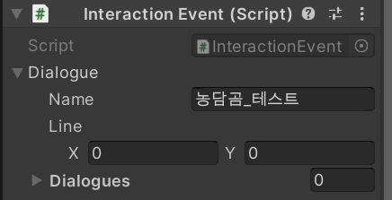
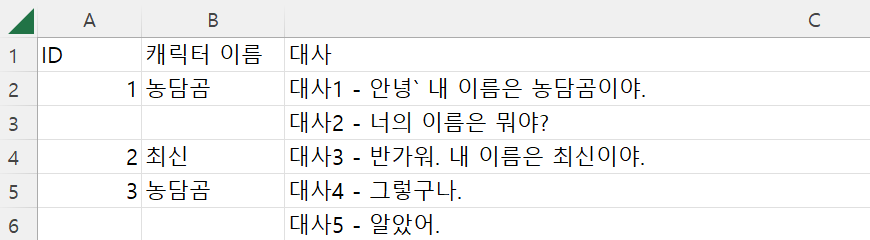
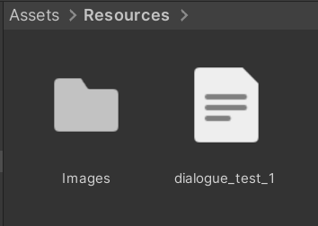
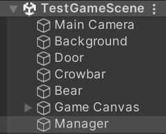
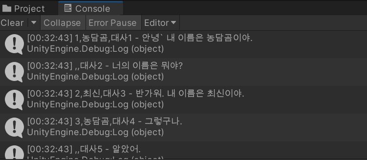
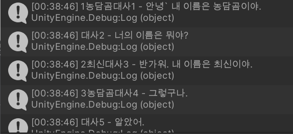
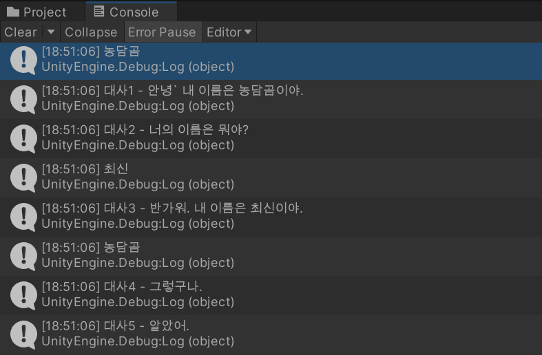
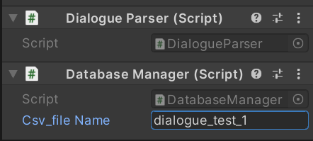
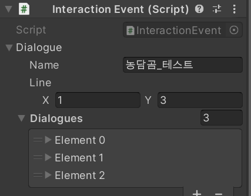
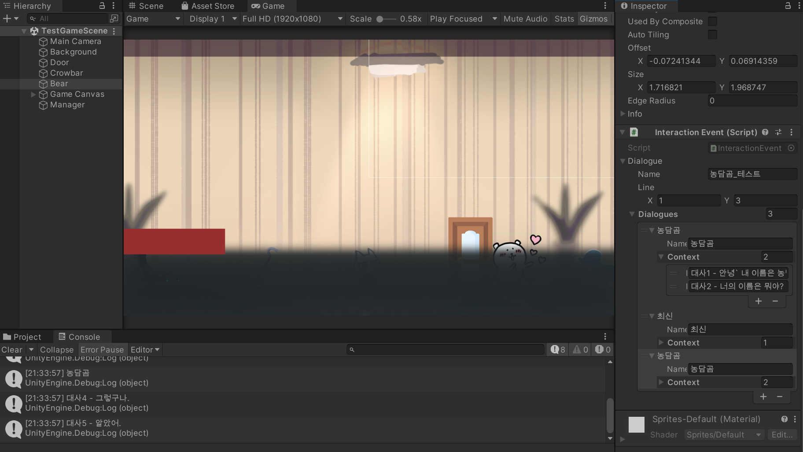

# 230126

- [[유니티 강좌] 단간론파를 유니티로 구현하기 Part 4 - 1 데이터 파싱 및 엑셀 관리](https://youtu.be/DPWvoUlHbjg?list=PLUZ5gNInsv_NG_UKZoua8goQbtseAo8Ow)

- **대사 클래스 → 대사 이벤트 클래스 → 엑셀 파일 파싱 클래스 → 파싱된 데이터 저장하는 데이터베이스 매니저 클래스 → 상호작용 컨트롤러 → 대화 시스템** 순서로 진행


## 1. 대사 이벤트 구현 스크립트 작성하기

- Scripts 폴더 내에 Dialogue 폴더를 생성한다.

- `Dialogue.cs` 스크립트를 생성한 후, 클래스에서 상속 받고 있는 MonoBehaviour를 지워 준다.

- `Dialogue` 클래스 (커스텀 클래스)

  ```csharp
  [System.Serializable]	// 커스텀 클래스를 인스펙터 창에서 수정하기 위해서 추가
  public class Dialogue
  {
      [Tooltip("대사 치는 캐릭터 이름")]	// 캐릭터 이름을 inspector 창에 띄움
      public string name; // 캐릭터 이름
  
      [Tooltip("대사 내용")]
      public string[] context; // 배열이라 여러 대사를 담을 수 있음.
  }
  ```

- `DialogueEvent` 클래스 (커스텀 클래스)

  ```csharp
  [System.Serializable]
  public class DialogueEvent
  {
      public string name;     // 대화 이벤트 이름
      public Vector2 line;    // x줄부터 y줄까지의 대사를 가져옴.
      public Dialogue[] dialogues;    // 대사를 여러 명이서 하기 때문에 배열 생성
  }
  ```


- Scripts 폴더 내에 Interaction 폴더를 생성한다.

- `InteractionEvent.cs` 스크립트를 생성한다.

- `InteractionEvent.cs`

  ```csharp
  public class InteractionEvent : MonoBehaviour
  {
      [SerializeField] DialogueEvent dialogue;
  }
  ```


- `InteractionEvent.cs` 파일을 `Bear` 오브젝트의 컴포넌트로 넣어 주고, 이벤트 이름을 적당히 지어 주었다.

  


## 2. 엑셀 데이터 파싱하기

- 구글 스프레드 시트도 가능!

- csv 파일은 `,`로 구분하기 때문에, 대사에 `,`가 들어가면 안 된다.

  - 그래서 특수 문자를 유니티에서 `,`로 치환하는 작업을 할 것이다.

- 우선은 다음과 같이 적당히 적고, csv 형식으로 저장한다.

  


- csv 파일을 메모장 등으로 열고, 맨 마지막 공백을 지워준다. (IndexOutOfRangeException 방지)

- Resources 폴더를 만들고, 그 안으로 Images 폴더를 옮긴 다음에 csv 파일도 옮긴다.

  


### 1. 줄 단위로 대사 나누기

- Dialogue 폴더에, 엑셀 데이터를 파싱할 스크립트 `DialogueParser.cs`를 생성한다.

- `DialogueParser.cs`

  ```csharp
  public class DialogueParser : MonoBehaviour
  {
      private void Start()
      {
          Parse("dialogue_test_1");
      }
      
      public Dialogue[] Parse(string _CSVFileName)
      {
          List<Dialogue> dialogueList = new List<Dialogue>(); // 대사 리스트 생성 (배열 크기를 모를 땐 리스트가 좋다!)
          TextAsset csvData = Resources.Load<TextAsset>(_CSVFileName);    // TextAsset 형태로 CSV를 가져와서 그 데이터를 담는다.
  
          string[] data = csvData.text.Split(new char[] { '\n' });    // 엔터 단위로 대사 쪼개기
          
          for (int i = 1; i < data.Length;)   // data[0] = {'ID', '캐릭터 이름', '대사'}
          {
              Debug.Log(data[i]);
  
              if (++i < data.Length)
              {
                  ;
              }
          }
  
          return dialogueList.ToArray();
      }
  }
  ```

  - for문에 i++를 하지 않고 무한 반복문을 만든다.
    - if문에서 ++i와 data.Length를 비교한다.


- 유니티에 돌아와서, 빈 오브젝트 `Manager`를 생성한다.

  


- 그리고 `Manager` 오브젝트의 컴포넌트로 `DialogueParser.cs`를 추가해 준다.

- 실행 화면

  


### 2. 콤마 단위로 대사 나누기

- 위에서 대사가 잘 출력되고 있지만, `,` 단위로 대사를 분리해 주어야 한다.

- `DialogueParser.cs`를 수정한다.

  ```csharp
  public Dialogue[] Parse(string _CSVFileName)
  {
      // ...
      
      for (int i = 1; i < data.Length;)
      {
          string[] row = data[i].Split(new char[] { ',' });   // , 단위로 쪼개기
          Debug.Log(row[0] + row[1] + row[2]);
  
          // ...
      }
      
      // ...
  }
  ```


- 실행 결과

  


### 3. 캐릭터 별 대사 묶기

- `DialogueParser.cs`를 수정한다.

  ```csharp
  public Dialogue[] Parse(string _CSVFileName)
  {
      List<Dialogue> dialogueList = new List<Dialogue>(); // 대사 리스트
      TextAsset csvData = Resources.Load<TextAsset>(_CSVFileName);    // CSV 데이터
  
      string[] data = csvData.text.Split(new char[] { '\n' });    // 엔터 단위로 대사 쪼개기
  
      for (int i = 1; i < data.Length;)
      {
          string[] row = data[i].Split(new char[] { ',' });   // , 단위로 쪼개기
  
          Dialogue dialogue = new Dialogue(); // 캐릭터 한 명의 대사들
  
          dialogue.name = row[1];
          Debug.Log(row[1]);
  
          List<string> contextList = new List<string>();
  
          do
          {
              contextList.Add(row[2]);
              Debug.Log(row[2]);
  
              // 다음 줄 미리 비교
              if (++i < data.Length)
              {
                  row = data[i].Split(new char[] { ',' });
              }
  
              // 다음 줄이 데이터 보다 길어지면 그냥 break
              else
              {
                  break;
              }
          } while (row[0].ToString() == "");  // 다음 줄 캐릭터 이름이 공백이면 대사를 더 채우기
  
  
          // dialogue.context = row[2] ← context는 배열이기 때문에 이런 식으로 할당할 수 X.
      }
  
      return dialogueList.ToArray();
  }
  ```

  - for문 안의 내용을 전반적으로 수정한다.
  - Dialogue 타입의 변수 `dialogue`를 생성한다.
  - `dialogue`의 name 속성에 row[1]을 담는다.
  - `dialogue`의 context에는 row[2]를 바로 할당할 수 없기 때문에, List인 `contextList`를 하나 만들어 준다.
    - do-while문을 이용해, 최초 대사 하나를 `contextList`에 넣는다.
    - 다음 줄을 미리 가져와서, 다음 줄의 id가 비어있으면, 계속 그 캐릭터의 대사를 `contextList`에 넣는다.
    - 만약 다음 줄이 비어있으면, while문을 벗어난다.


- 실행 화면

  


- 이제 Debug.Log 말고, 대사를 `dialogue.context`에 넣어보자.

  ```csharp
  public Dialogue[] Parse(string _CSVFileName)
  {
      // ...
      dialogue.context = contextList.ToArray();   // 리스트를 배열로
      dialogueList.Add(dialogue);
  }
  ```

  - 이제 한 캐릭터가 다른 캐릭터가 말하기 전 까지 한 모든 대사들이 묶여서, dialogueList에 들어가게 된다.
  - 그러면 dialogueList가 배열로 바뀌고, 그것이 반환된다.
  - Start 함수도 지워준다.


## 3. 파싱 데이터 저장 및 관리하기

- 유니티로 돌아와서, Managers 폴더에 `DatabaseManager.cs`를 만들어준다.

  - 파싱한 데이터를 DB에 저장하고 관리하는 스크립트이다.

  - 변수

    ```csharp
    public static DatabaseManager instance; // DB 자체를 인스턴스화, 참조가 편하게 static
    
    [SerializeField] string csv_fileName;
    
    Dictionary<int, Dialogue> dialogueDic = new Dictionary<int, Dialogue>();   // int로 대사를 찾는다.
    
    public static bool isFinish = false;    // 파싱한 데이터를 모두 저장했는지
    ```

    

  - Awake() 함수

    ```csharp
    private void Awake()
    {
        if (instance == null)
        {
            instance = this;    // 자기 자신을 넣어준다.
            DialogueParser parser = GetComponent<DialogueParser>();
            Dialogue[] dialogues = parser.Parse(csv_fileName);  // dialogues에 모든 데이터가 담기게 된다.
    
            for (int i = 0; i < dialogues.Length; i++)
            {
                dialogueDic.Add(i + 1, dialogues[i]);    // 키는 1부터 시작
            }
    
            isFinish = true;
        }
    }
    ```

    - 첫 실행 시, instance는 아무것도 없는 상태일 테니까, 위의 변수에 대한 정보들을 넣어준다.
    - parser를 컴포넌트로 가져와서, parser의 Parser 함수를 실행해서 대사를 반환한다.
    - 그 대사들을 dialogueDic에 저장한다.

  

  - GetDialogue() 함수

    ```csharp
    // _StartNum ~ _EndNum 사이의 대사를 가지고 옴.
    public Dialogue[] GetDialogue(int _StartNum, int _EndNum)
    {
        List<Dialogue> dialogueList = new List<Dialogue>();
    
        for (int i = _StartNum; i <= _EndNum; i++)
        {
            dialogueList.Add(dialogueDic[i]);
        }
    
        return dialogueList.ToArray();
    }
    ```

    - 딕셔너리에 저장한 대사를, 원하는 만큼 가져온다.


- 유니티로 돌아와서, `Manager` 오브젝트의 컴포넌트로 `DatabaseManager`를 넣은 후, csv 파일의 이름을 적어준다.

  


## 4. 상호작용 관련 파일 수정하기

- `Bear` 오브젝트에 있는 `InteractionEvent.cs` 코드를 수정한다.

  ```csharp
  public class InteractionEvent : MonoBehaviour
  {
      [SerializeField] DialogueEvent dialogue;
  
      // DatabaseManager에 저장된 실제 대사 데이터를 꺼내온다.
      public Dialogue[] GetDialogue()
      {
          dialogue.dialogues = DatabaseManager.instance.GetDialogue((int)dialogue.line.x, (int)dialogue.line.y);
  
          return dialogue.dialogues;
      }
  }
  ```

  - DatabaseManager의 instance를 가져와서, GetDialogue 함수를 실행한다.
    - 인자로 _StartNum, _EndNum을 받는데 그건 DialogueEvent의 line 벡터가 가지고 있다.
    - 벡터는 float인데, 인자는 int이므로 강제 형 변환을 시켜준다.


- `InteractionController.cs` 파일의 `Interact()` 함수를 수정한다.

  ```csharp
  void Interact()
  {
      clickedInteractive = true;
  
      // 상호작용한 오브젝트의 대사 이벤트를 꺼내온다.
      dm.ShowDialogue(hit.transform.GetComponent<InteractionEvent>().GetDialogue(););
  }
  ```


- `DialogueManager.cs` 파일의 `ShowDialogue()` 함수도 수정한다.

- 변수

  ```csharp
  Dialogue[] dialogues;
  ```

- ShowDialogue() 함수

  ```csharp
  public void ShowDialogue(Dialogue[] p_dialogues)
  {
      txt_dialogue.text = "";
      txt_name.text = "";
  
      dialogues = p_dialogues;
  
      ic.HideUI();    // 커서, 상태창 숨기기
      SettingUI(true);    // 대사창, 이름창 보이기
  }
  ```


- `Bear` 오브젝트의 `InteractionEvent` 컴포넌트에 꺼내올 Line을 입력한다.

- 그리고 Line의 수 만큼 Dialogues에 채워준다.

  


- 실행했을 때 오류가 없다면 파싱이 잘 된 것이다. 실행한 후 농담곰을 클릭해 보면, 대사가 자동으로 잘 들어가는 것을 볼 수 있다.


- 실행 화면

  


## 5. 다음에 할 일

- ~~카메라 이동 범위 제한하기~~
- ~~커서 이미지 & 포인트 매치시키기~~
- ~~상호작용 가능한 오브젝트에 커서를 옮기면, 이미지 바꿔보기~~
- ~~상호작용 & 이동 상호작용 분리하기~~
- ~~대사창 띄워보기~~
- ~~엑셀의 대사 데이터 파싱하기~~
- **오브젝트 클릭 시, 강조하는 이펙트 넣기 & 코루틴으로 대사창 띄우는 시간 조정하기** (할 수 있을까? ㅠㅠ)
- 대사창 넘기기 & 대사창 닫기
- 오브젝트 클릭 시 대사창 & 인물 대사창 구분하기
- 맵 이동 구현해보기
- 오브젝트 클로즈업(하면서 화면 이동)하기??
- 마우스 커서에 애니메이션? 넣기
- 마우스 커서에 이펙트 넣기


## 6. 참고할 만한 자료들 (아직 활용은 X)

- [[Unity] 엑셀 대화 정보들을 대화 이름으로 묶어서 가져오기](https://velog.io/@gkswh4860/Unity-%EC%97%91%EC%85%80-%EB%8C%80%ED%99%94-%EB%82%B4%EC%9A%A9%EC%9D%84-%EB%8C%80%ED%99%94-%EC%9D%B4%EB%A6%84%EC%9C%BC%EB%A1%9C-%EB%AC%B6%EC%96%B4%EC%84%9C-%EA%B0%80%EC%A0%B8%EC%98%A4%EA%B8%B0)
- [유니티로 미연시 만들기 졸업프로젝트](https://www.youtube.com/watch?v=eWT0TsknaiU&t=7s)
- [Unity 2D로 비주얼노벨 만들기(Flowchart)](https://m.blog.naver.com/liear1997/221292510685)

- **오브젝트 상호작용 이펙트 및 이벤트**
  - [[유니티 강좌] 단간론파를 유니티로 구현하기 Part 3 - 3 상호작용 이벤트](https://youtu.be/ftBw_KhI694?list=PLUZ5gNInsv_NG_UKZoua8goQbtseAo8Ow)
  - [[유니티 강좌] 단간론파를 유니티로 구현하기 Part 3 - 2 상호작용 이펙트](https://youtu.be/DBFOqJICh3E?list=PLUZ5gNInsv_NG_UKZoua8goQbtseAo8Ow)
- [[유니티 강좌] 단간론파를 유니티로 구현하기 Part 3 - 4 디테일 (Tooltip + 추가 연출)](https://www.youtube.com/watch?v=-89RsNEgE7w&list=PLUZ5gNInsv_NG_UKZoua8goQbtseAo8Ow&index=11)


## 7. 오늘의 후기

- 진짜 너무 어려웠다. 코드를 이리저리 이동하고 거기서 어느 걸 꺼내와서 어떻게 쓰는지... 그냥 따라 적긴 했는데 코드 이해도를 더 높여야겠다.
- 우선 Controller, Manager의 역할을 알아보고, 영상, 문서, 코드를 보면서 더 이해해 보아야 할 것 같다.
