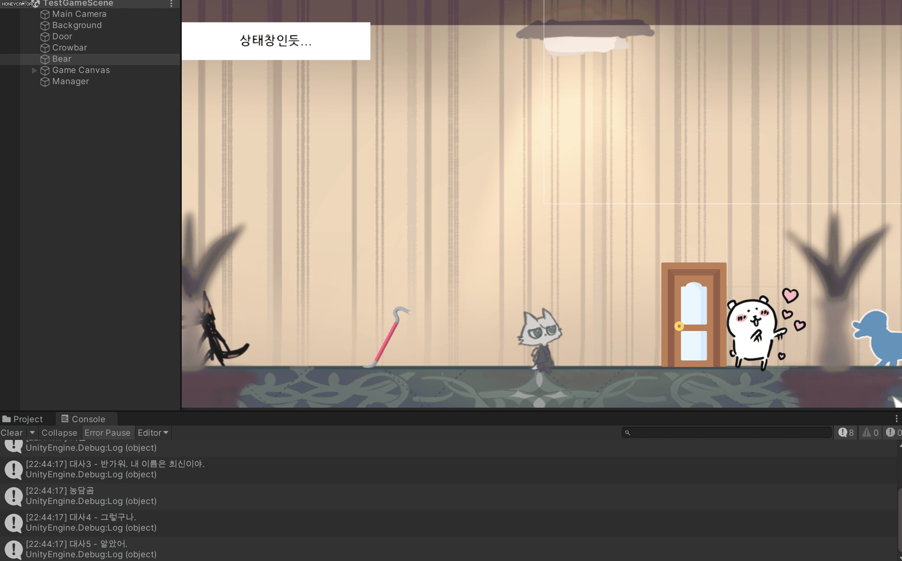

# 230128

- [[유니티 강좌] 단간론파를 유니티로 구현하기 Part 4 - 2 대화 시스템 구현](https://youtu.be/N4fudqV49TU?list=PLUZ5gNInsv_NG_UKZoua8goQbtseAo8Ow)
- [[Unity] 코루틴(Coroutine) 총 정리 _ (feat. RPG 포션 딜레이 예제)](https://novlog.tistory.com/54)
- [[Unity] 인스펙터를 정리해보자 : Inspector Attribute](https://m.blog.naver.com/PostView.naver?isHttpsRedirect=true&blogId=2983934&logNo=221428284978)


## 1. 대화 시스템 구현하기

### 1. 대사창에 텍스트 넣기

- `DialogueManager.cs` 수정

- 변수

  ```csharp
  bool isNext = false;	// 특정 키 입력 대기를 위한 변수
  int dialogueCnt = 0;    // 대화 카운트. 한 캐릭터가 다 말하면 1 증가
  int contextCnt = 0; 	// 대사 카운트. 한 캐릭터가 여러 대사를 할 수 있다.
  ```

  - `isNext`
    - 특정 키 입력 대기를 위한 변수이다.
    - true일 시 엔터, 스페이스 키 입력이 가능하게 한다.
  - `lineCnt`
    - 한 캐릭터가 다 말하면 1 증가시킨다.
    - 아마 ID와 비슷하게 증가할 듯
  - `contextCnt`
    - 한 캐릭터가 말하는 대사 수


- `TypeWriter()` 코루틴

  ```c#
  // 텍스트 출력 코루틴
  IEnumerator TypeWriter()
  {
      SettingUI(true);    // 대사창 이미지를 띄운다.
  
      string t_ReplaceText = dialogues[dialogueCnt].contexts[contextCnt];   // 특수문자를 ,로 치환
      t_ReplaceText = t_ReplaceText.Replace("`", ",");    // backtick을 comma로 변환
  
      txt_dialogue.text = t_ReplaceText;
  
      isNext = true;
  
      yield return null;	 // 다음 대사를 출력 가능하도록
  }
  ```

  - 텍스트를 출력한다.
  - [[Unity] 코루틴(Coroutine) 총 정리 _ (feat. RPG 포션 딜레이 예제)](https://novlog.tistory.com/54)


- `ShowDialogue()` 함수

  ```c#
  public void ShowDialogue(Dialogue[] p_dialogues)
  {
      txt_dialogue.text = "";
      txt_name.text = "";
  
      ic.HideUI();    // 커서, 상태창 숨기기
  
      dialogues = p_dialogues;
  
      StartCoroutine(TypeWriter());	// 상호작용 동시에 텍스트 출력 코루틴 시작
  }
  ```


- 실행 결과

  


### 2. 한 캐릭터의 다음 대사 출력하기

- `DialogueManager.cs` 수정

- `Update()` 함수

  ```c#
  private void Update()
  {
      if (isDialogue)
      {
          if (isNext)
          {
              if (Input.GetKeyDown(KeyCode.Space))
              {
                  isNext = false;
                  txt_dialogue.text = "";
  
                  ++contextCnt;
                  StartCoroutine(TypeWriter());
              }
          }
      }
  }
  ```

  - 대화 중이고, 다음 키 입력이 이뤄졌는지, 어떤 키가 입력되었는지 체크
  - 특정 키가 입력되면
    - `isNext`를 false로 초기화
    - 대화창의 텍스트를 공백으로 초기화
    - `contextCnt`를 1 증가시킨 후, 다음 대사를 출력하기 위한 코루틴을 실행한다.


- `ShowDialogue()` 함수

  ```c#
  public void ShowDialogue(Dialogue[] p_dialogues)
  {
      isDialogue = true;
      // ...
  }
  ```

  - 현재 대화 중임을 알리기 위해 `isDialogue`를 true로 변경한다.


- 실행 결과

  

  - IndexOutOfRangeException 에러가 뜬다.
  - 왜냐면 농담곰의 대사는 2개인데, 다음으로 넘어가려 하기 때문이다.
  - 배열의 크기가 클 때, 다음 캐릭터의 대사를 해야 한다.


### 3. 다음 캐릭터의 대사 출력하기

- `DialogueManager.cs` 수정

- `Update()` 함수

  ```c#
  private void Update()
  {
      if (isDialogue)
      {
          if (isNext)
          {
              if (Input.GetKeyDown(KeyCode.Space))
              {
                  isNext = false;
                  txt_dialogue.text = "";
  
                  // 현재 캐릭터의 다음 대사 출력
                  if (++contextCnt < dialogues[dialogueCnt].contexts.Length)
                  {
                      StartCoroutine(TypeWriter());
                  }
  
                  // 다음 캐릭터의 대사 출력
                  else
                  {
                      contextCnt = 0;
  
                      if (++dialogueCnt < dialogues.Length)
                      {
                          StartCoroutine(TypeWriter());
                      }
                  }
              }
          }
      }
  }
  ```

  - 현재 캐릭터의 대사가 남아 있다면, 그걸 계속 출력한다.
  - 대사가 끝났다면, contextCnt를 0으로 초기화한다.
    - 다음 캐릭터의 대사가 있다면, 그 대사를 출력한다.


- 실행 결과

  

  - 대화가 종료되면 여백만이 남아있다.
  - 대화가 종료되면 대화창도 꺼야 한다.


### 4. 대화가 종료되면 대화창 끄기

- `DialogueManager.cs` 수정

- `EndDialogue()` 함수

  ```c#
  void EndDialogue()
  {
      isDialogue = false;
      contextCnt = 0;
      dialogueCnt = 0;
      dialogues = null;
      isNext = false;
      SettingUI(false);
  }
  ```

  

- `Update()` 함수

  ```c#
  private void Update()
  {
      if (isDialogue)
      {
          if (isNext)
          {
              if (Input.GetKeyDown(KeyCode.Space))
              {
                  isNext = false;
                  txt_dialogue.text = "";
  
                  // 현재 캐릭터의 다음 대사 출력
                  if (++contextCnt < dialogues[dialogueCnt].contexts.Length)
                  {
                      StartCoroutine(TypeWriter());
                  }
  
                  // 다음 캐릭터의 대사 출력
                  else
                  {
                      contextCnt = 0;
  
                      if (++dialogueCnt < dialogues.Length)
                      {
                          StartCoroutine(TypeWriter());
                      }
  
                      // 다음 캐릭터가 없으면 (대화가 끝났으면)
                      else
                      {
                          EndDialogue();
                      }
                  }
              }
          }
      }
  }
  ```

  - else문을 하나 만들어서, `EndDialogue()` 함수를 실행해 주었다.


- 실행 결과

  

  - 대화가 무사히 종료되는 것을 볼 수 있다.
  - 이제 사라진 UI들(상태창, 커서)을 다시 표시해보자.


### 5. 대화 종료 후 UI 표시하기

- `InteractionController.cs` 수정

- `SettingUI()` 함수 생성 (기존 `HideUI()` 함수 삭제)

  ```c#
  public void SettingUI(bool p_flag)
  {
      go_ui_cursor.SetActive(p_flag);
      go_ui_status.SetActive(p_flag);
  }
  ```


- `DialogueManager.cs` 수정

- `ShowDialogue()` 함수

  ```c#
  public void ShowDialogue(Dialogue[] p_dialogues)
  {
      // ...
      ic.SettingUI(false);	// 커서, 상태창 숨기기
      // ...
  }
  ```

- `EndDialogue()` 함수

  ```c#
  void EndDialogue()
  {
      // ...
      ic.SettingUI(true);	// 커서, 상태창 보이기
  }
  ```


- 실행 결과

  


- [[유니티 강좌] 단간론파를 유니티로 구현하기 Part 3 - 4 디테일 (Tooltip + 추가 연출)](https://youtu.be/-89RsNEgE7w?list=PLUZ5gNInsv_NG_UKZoua8goQbtseAo8Ow&t=1040)

- `InteractionController.cs` 수정

- `Update()` 함수 수정

  ```c#
  void Update()
  {
      if (!clickedInteractive)
      {
          CheckObject();
          LeftClick();
      }
  }
  ```

  - 이미 대화가 진행 중일 때, 다른 상호작용 이벤트가 발생하는 것을 미연에 방지하기 위함.
  - 그러면 `clickedInteractive`의 값을 다시 false로 돌려주어야 한다.


- `SettingUI()` 함수 수정

  ```c#
  public void SettingUI(bool p_flag)
  {
      go_ui_cursor.SetActive(p_flag);
      go_ui_status.SetActive(p_flag);
  
      clickedInteractive = !p_flag;
  }
  ```

  - 커서와 상태창이 보이면(`p_flag` = true), 상호작용 중이 아니어야 한다.(`clickedInteractive` = false)
  - 커서와 상태창이 보이지 않으면(`p_flag` = false), 상호작용 중이다.(`clickedInteractive` = true)


### 6. 대사창에 캐릭터 이름 출력하기

- `DialogueManager.cs`

- `TypeWriter()` 코루틴 수정

  ```c#
  IEnumerator TypeWriter()
  {
      // ...
      
      txt_name.text = dialogues[dialogueCnt].name;
      txt_dialogue.text = t_ReplaceText;
  	
      // ...
  }
  ```


- 실행 결과

  


## 2. 대사 출력 시 타이핑 효과 넣기

- `DialogueManager.cs` 수정

- 변수

  ```c#
  [Header("텍스트 출력 딜레이")]
  [SerializeField] float textDelay;
  ```

  - `Header`
    - 인스펙터 내에서 타이틀을 달 수 있는 속성이다.
    - [[Unity] 인스펙터를 정리해보자 : Inspector Attribute](https://m.blog.naver.com/PostView.naver?isHttpsRedirect=true&blogId=2983934&logNo=221428284978)


- `TextWriter()` 코루틴

  ```c#
  IEnumerator TypeWriter()
  {
      SettingUI(true);    // 대사창 이미지를 띄운다.
  
      string t_ReplaceText = dialogues[dialogueCnt].contexts[contextCnt];   // 특수문자를 ,로 치환
      t_ReplaceText = t_ReplaceText.Replace("`", ",");    // backtick을 comma로 변환
  
      txt_name.text = dialogues[dialogueCnt].name;
  
      // 한 글자씩 출력
      for (int i = 0; i < t_ReplaceText.Length; i++)
      {
          txt_dialogue.text += t_ReplaceText[i];
          yield return new WaitForSeconds(textDelay);
      }
  
      isNext = true; // 다음 대사를 출력 가능하도록
  }
  ```

  - yield return 뒤에는 반환 시간이 오는데, 반환 시간 만큼 코드 동작을 중지하고, 시간이 지나면 그 다음 줄부터 코루틴이 다시 동작한다.


- `UI_Dialogue` 오브젝트의 `Dialogue Manager` 컴포넌트에 생긴 Text Delay에 0.01을 입력한다.

  


- 실행 결과

  


## 3. 다음에 할 일

- ~~카메라 이동 범위 제한하기~~
- ~~커서 이미지 & 포인트 매치시키기~~
- ~~상호작용 가능한 오브젝트에 커서를 옮기면, 이미지 바꿔보기~~
- ~~상호작용 & 이동 상호작용 분리하기~~
- ~~대사창 띄워보기~~
- ~~엑셀의 대사 데이터 파싱하기~~
- **오브젝트 클릭 시, 강조하는 이펙트 넣기 & 코루틴으로 대사창 띄우는 시간 조정하기** (할 수 있을까? ㅠㅠ)
- ~~대사창 넘기기 & 대사창 닫기~~
- 오브젝트 클릭 시 대사창 & 인물 대사창 구분하기
- 맵 이동 구현해보기
- 오브젝트 클로즈업(하면서 화면 이동)하기??
- 마우스 커서에 애니메이션? 넣기
- 마우스 커서에 이펙트 넣기


## 4. 참고할 만한 자료들

- [[Unity] 엑셀 대화 정보들을 대화 이름으로 묶어서 가져오기](https://velog.io/@gkswh4860/Unity-%EC%97%91%EC%85%80-%EB%8C%80%ED%99%94-%EB%82%B4%EC%9A%A9%EC%9D%84-%EB%8C%80%ED%99%94-%EC%9D%B4%EB%A6%84%EC%9C%BC%EB%A1%9C-%EB%AC%B6%EC%96%B4%EC%84%9C-%EA%B0%80%EC%A0%B8%EC%98%A4%EA%B8%B0)
- [유니티로 미연시 만들기 졸업프로젝트](https://www.youtube.com/watch?v=eWT0TsknaiU&t=7s)
- [Unity 2D로 비주얼노벨 만들기(Flowchart)](https://m.blog.naver.com/liear1997/221292510685)

- **오브젝트 상호작용 이펙트 및 이벤트**
  - [[유니티 강좌] 단간론파를 유니티로 구현하기 Part 3 - 3 상호작용 이벤트](https://youtu.be/ftBw_KhI694?list=PLUZ5gNInsv_NG_UKZoua8goQbtseAo8Ow)
  - [[유니티 강좌] 단간론파를 유니티로 구현하기 Part 3 - 2 상호작용 이펙트](https://youtu.be/DBFOqJICh3E?list=PLUZ5gNInsv_NG_UKZoua8goQbtseAo8Ow)
- [[유니티 강좌] 단간론파를 유니티로 구현하기 Part 3 - 4 디테일 (Tooltip + 추가 연출)](https://www.youtube.com/watch?v=-89RsNEgE7w&list=PLUZ5gNInsv_NG_UKZoua8goQbtseAo8Ow&index=11)


## 5. 오늘의 후기

- 드디어 대사창을 구현해 보았다.
- 나중에 대사가 다 출력 되면 대사 옆에 아이콘을 보이게 할 수 있을까?
- 대사 스킵, 로그 기능도 넣을 수 있으면 좋겠다.