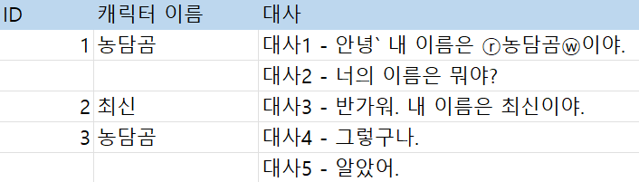
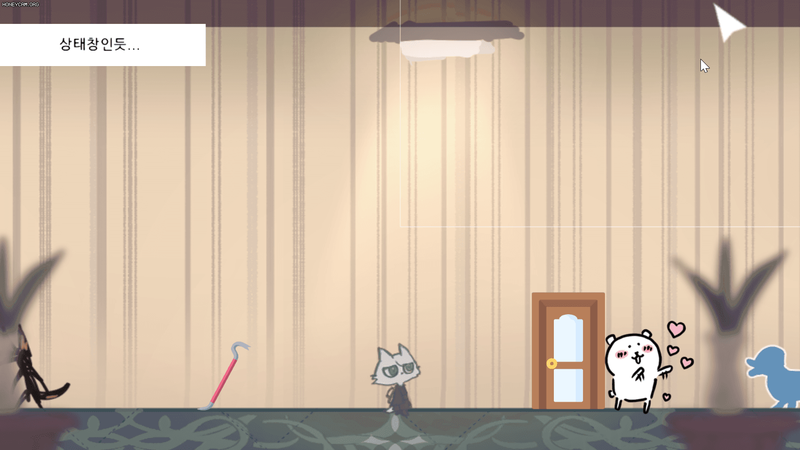
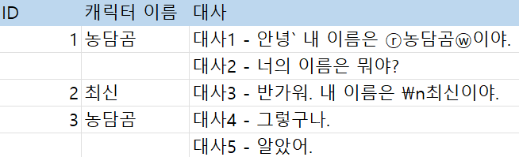
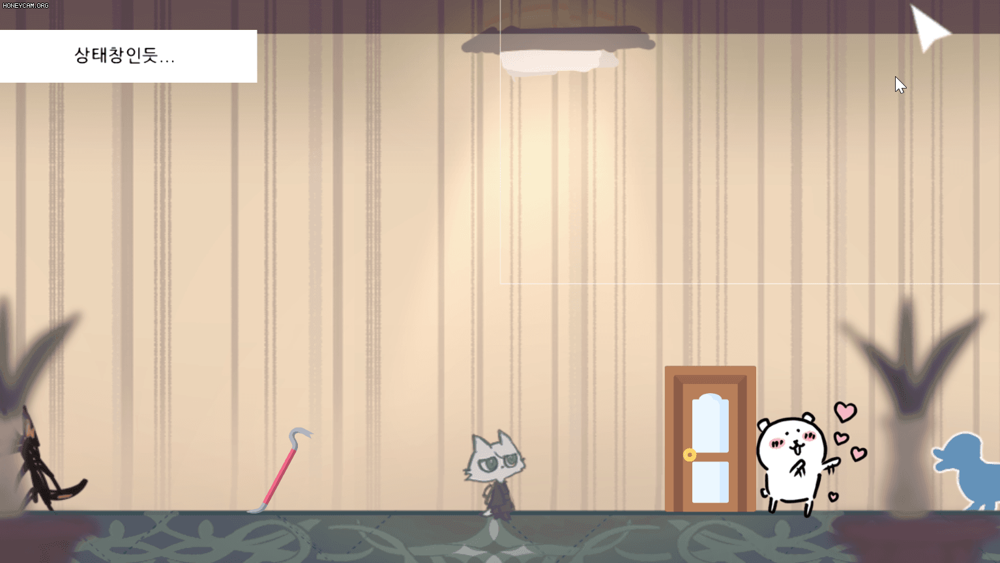
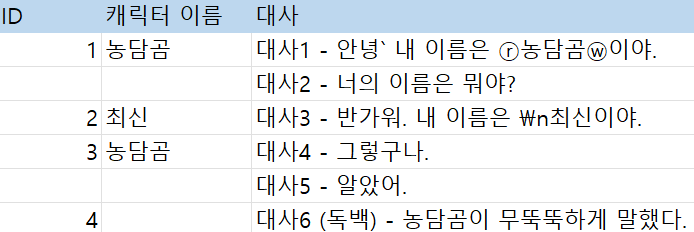
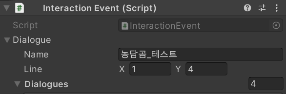
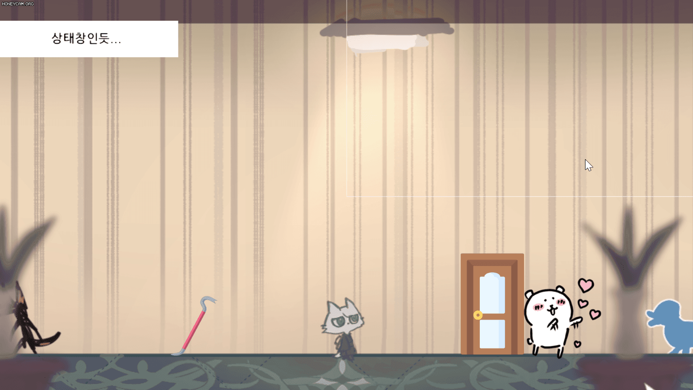
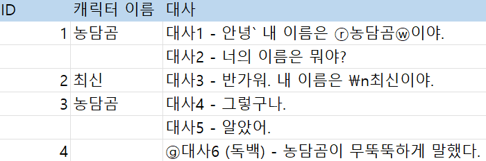
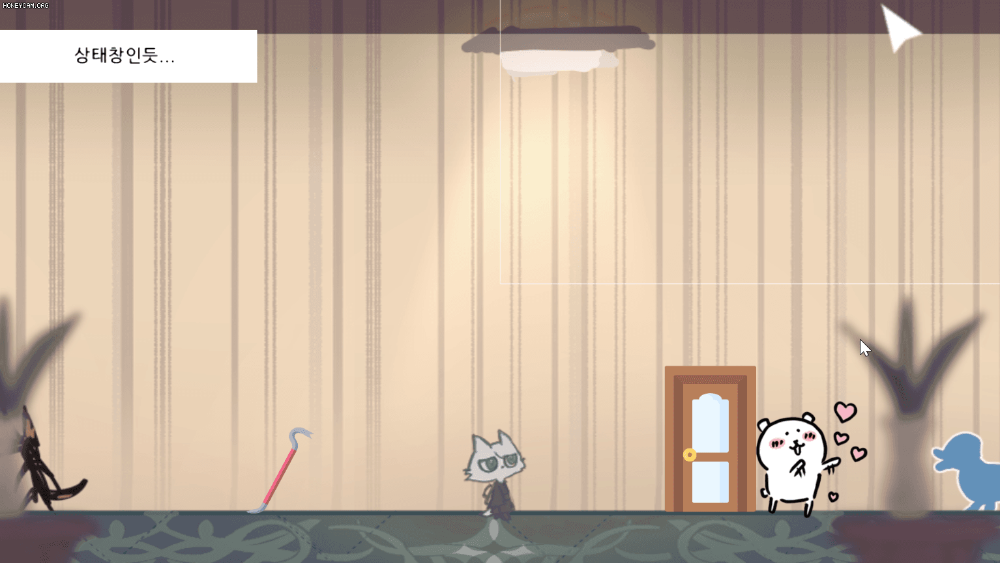

# 230202

- [[유니티 강좌] 단간론파를 유니티로 구현하기 Part 4 - 3 디테일 (글자색 변경 등등)](https://youtu.be/TNcovhTxqFA?list=PLUZ5gNInsv_NG_UKZoua8goQbtseAo8Ow)


## 1. 텍스트 색 변경하기

### 1. 엑셀에 특수 문자 입력

- `Replace`를 이용하여, 텍스트 색을 변경할 예정

- `dialogue_test_1.csv`

  - 변경하고 싶은 단어 앞에 색을 지정하는 특수 문자를 입력한다.

  - 빨간색은 ⓡ, 흰색은 ⓦ로 표기했다.

    


### 2. 스크립트 수정

- `DialogueManager.cs` 수정

- `TypeWriter()` 코루틴

  ```c#
  IEnumerator TypeWriter()
      {
          SettingUI(true);    // 대사창 이미지를 띄운다.
  
          string t_ReplaceText = dialogues[dialogueCnt].contexts[contextCnt];   // 특수문자를 ,로 치환
          t_ReplaceText = t_ReplaceText.Replace("`", ",");    // backtick을 comma로 변환
  
          txt_name.text = dialogues[dialogueCnt].name;    // 캐릭터 이름
  
          bool t_white = false, t_red = false;    // 글자색
          bool t_ignore = false;  // 특수문자는 대사로 출력 X
          
          // 한 글자씩 출력
          for (int i = 0; i < t_ReplaceText.Length; i++)
          {
              switch (t_ReplaceText[i])
              {
                  case 'ⓦ': 
                      t_white = true; t_red = false; t_ignore = true;
                      break;
  
                  case 'ⓡ':
                      t_white = false; t_red = true; t_ignore = true;
                      break;
              }
  
              string t_letter = t_ReplaceText[i].ToString();
              if (!t_ignore)
              {
                  if (t_white)
                  {
                      t_letter = "<color=#ffffff>" + t_letter + "</color>";    // HTML Tag
                  }
  
                  else if (t_red)
                  {
                      t_letter = "<color=#E33131>" + t_letter + "</color>";
                  }
  
                  txt_dialogue.text += t_letter;  // 특수문자가 아니면 대사 출력
              }
              t_ignore = false;   // 한 글자를 찍으면 다시 false로
  
              
              yield return new WaitForSeconds(textDelay);
          }
          
          isNext = true; // 다음 대사를 출력 가능하도록
      }
  ```

  - `t_white`, `t_red`: 특수 문자를 만나면 true로 바뀌고, true인 동안 글자 색을 바꾼다.
  - `t_ignore`: 색 특수 문자는 대사로 출력할 필요가 없으므로, 특수 문자 하나만 무시한다.
  - switch 문
    - 한 글자를 받아서 (`t_ReplaceText[i]`)
    - 그 글자가 ⓦ이면 `t_white`를 true로, `t_red`를 false로 하고, 무시해야 하므로 `t_ignore`를 true로 한다.
    - ⓡ인 경우도 비슷하게 처리한다.
  - `t_letter`: 한 글자를 string으로 바꾼다.
    - 무시하는 글자가 아닌 경우
      - `t_white`가 true면 흰 글자로 만든다.
        - 이때 `<color=#ffffff>Text</color>` 와 같은 형태로 하면, 텍스트에 색을 입힐 수 있다. (HTML 같은 느낌)
      - `t_red`가 true인 경우도 비슷하게 구현한다.
      - 무시하는 글자가 아니므로, 게임 창에 출력한다. (`txt_dialogue.text += t_letter;`)
    - `t_ignore`의 값을 false로 해서, 다음 글자가 무시되지 않도록 한다.


- 실행 결과

  


## 2. 대사를 두 줄로 출력하기

### 1. 엑셀에 개행 문자 입력

- `dialogue_test_1.csv`

  - 개행을 원하는 단어 앞에, 개행 문자 `\n`를 입력한다.

    


### 2. 스크립트 수정

- `DialogueManager.cs` 수정

- `TypeWriter()` 코루틴

  ```c#
  IEnumerator TypeWriter()
  {
      SettingUI(true);    // 대사창 이미지를 띄운다.
  
      string t_ReplaceText = dialogues[dialogueCnt].contexts[contextCnt];
      t_ReplaceText = t_ReplaceText.Replace("`", ",");    // backtick을 comma로 변환
      t_ReplaceText = t_ReplaceText.Replace("\\n", "\n"); // 엑셀의 \n은 텍스트이기 때문에, 앞에 \를 한 번 더 입력
      
      // ...
  }
  ```

  - Replace의 첫 번째 인자  `\n`은 텍스트이므로, 텍스트임을 명시하기 위해 `\`를 한 번 더 입력한다.


- 실행 결과

  


## 3. 독백(나레이션) 구현하기

### 1. 엑셀에 새 대사 입력

- 엑셀에 캐릭터 이름을 비워둔다.

- `dialogue_test_1.csv`

  


### 2. 스크립트 수정

- `DialogueManager.cs` 수정

- `SettingUI()` 함수

  ```c#
  // 대사창 활성화
  void SettingUI(bool p_flag)
  {
      go_dialogueBar.SetActive(p_flag);
  
      if (p_flag)
      {
          // 독백이면 캐릭터 이름창 표시 X
          if (dialogues[dialogueCnt].name == "")
          {
              go_NameBar.SetActive(false);
          }
  
          // 독백이 아닌 경우 캐릭터 이름창 & 캐릭터 이름 표시
          else
          {
              go_NameBar.SetActive(true);
              txt_name.text = dialogues[dialogueCnt].name;
          }
      }
  }
  ```

  - 독백인 경우, 즉 캐릭터 이름이 공백인 경우는 캐릭터 이름을 표시하는 UI를 보여주지 않는다.


- `TypeWriter()` 코루틴

  ```c#
  IEnumerator TypeWriter()
  {
  	// ...
      // txt_name.text = dialogues[dialogueCnt].name;    // 캐릭터 이름
      // ...
  }
  ```

  - 독백이 아닌 경우에만 캐릭터 이름을 출력하면 된다.
  - 그러므로, `TypeWriter()`에 있던 캐릭터 이름을 출력하는 구문을 `SettingUI()` 함수의 else문에 넣어준다.


- 대사가 증가했으므로, 유니티로 돌아와 `Bear` 오브젝트의 `Interaction Event` 컴포넌트의 값을 다음과 같이 수정한다.

  


- 실행 결과

  


### 3. 독백 텍스트 색 변경하기

- `dialogue_test_1.csv`

  


- `TypeWriter()` 코루틴

  - `t_gray` 변수 추가
  - switch 분기에 'ⓖ'인 경우 추가 (기존 분기에 `t_gray`를 false로 하는 작업 필요)
  - `t_gray` 색상 코드 적용

  

- 실행 결과

  


## 4. 다음에 할 일

- 맵 이동 구현해보기
- 오브젝트 클로즈업(하면서 화면 이동)하기??
- 마우스 커서에 애니메이션? 넣기
- 마우스 커서에 이펙트 넣기
- **오브젝트 클릭 시, 강조하는 이펙트 넣기 & 코루틴으로 대사창 띄우는 시간 조정하기**


## 5. 참고할 만한 자료들

- [[Unity] 엑셀 대화 정보들을 대화 이름으로 묶어서 가져오기](https://velog.io/@gkswh4860/Unity-%EC%97%91%EC%85%80-%EB%8C%80%ED%99%94-%EB%82%B4%EC%9A%A9%EC%9D%84-%EB%8C%80%ED%99%94-%EC%9D%B4%EB%A6%84%EC%9C%BC%EB%A1%9C-%EB%AC%B6%EC%96%B4%EC%84%9C-%EA%B0%80%EC%A0%B8%EC%98%A4%EA%B8%B0)
- [유니티로 미연시 만들기 졸업프로젝트](https://www.youtube.com/watch?v=eWT0TsknaiU&t=7s)
- [Unity 2D로 비주얼노벨 만들기(Flowchart)](https://m.blog.naver.com/liear1997/221292510685)

- **오브젝트 상호작용 이펙트 및 이벤트**
  - [[유니티 강좌] 단간론파를 유니티로 구현하기 Part 3 - 3 상호작용 이벤트](https://youtu.be/ftBw_KhI694?list=PLUZ5gNInsv_NG_UKZoua8goQbtseAo8Ow)
  - [[유니티 강좌] 단간론파를 유니티로 구현하기 Part 3 - 2 상호작용 이펙트](https://youtu.be/DBFOqJICh3E?list=PLUZ5gNInsv_NG_UKZoua8goQbtseAo8Ow)
- [[유니티 강좌] 단간론파를 유니티로 구현하기 Part 3 - 4 디테일 (Tooltip + 추가 연출)](https://www.youtube.com/watch?v=-89RsNEgE7w&list=PLUZ5gNInsv_NG_UKZoua8goQbtseAo8Ow&index=11)


## 6. 오늘의 후기

- 독백을 만들고 이름 출력하는 코드를 `SettingUI()` 함수 내에 옮겼을 때, 자꾸 NullReferenceException이 떠서 보니까 `Dialogues` 배열에 값이 없다고 계속 그러더라..
- 그래서 보니까 `ShowDialogues()` 함수에서 `SettingUI()` → `StartCorutine(TypeWriter())` 순서로 호출하기 때문에 Dialogue에 값이 안 담긴 거였음..
- 영상을 다시 보니까 `ShowDialogues()` 함수에서 `SettingUI()`를 호출하지 않았더라.. 그래서 지워주니 정상적으로 작동했다.
- 이 에러를 제외하면 굉장히 수월했던 것 같다. 다음은 대사 이벤트 하나 더 만들어 보고 다음 영상으로 진도 빼야겠다.