# 230204

- [[유니티 강좌] 단간론파를 유니티로 구현하기 Part 6 - 1 스프라이트 교체](https://youtu.be/EYShARasmHQ?list=PLUZ5gNInsv_NG_UKZoua8goQbtseAo8Ow)
- [[유니티 강좌] 단간론파를 유니티로 구현하기 Part 5 - 1 카메라 타겟팅](https://youtu.be/sYUwrE2jszk?list=PLUZ5gNInsv_NG_UKZoua8goQbtseAo8Ow&t=516)


## 1. 대화창에 캐릭터 스탠딩 이미지 구현

### 1. 스탠딩 들어갈 자리 만들기

- ~~다양한 표정의 농담곰 이미지들(**jokebear**)을 스프라이트 시트로 제작해, **Resource → Images → Characters** 폴더에 저장했다.~~

  - 스프라이트 시트로 만드니까 나중에 `Resources.Load()` 하니까 불러오질 못 하더라..

  - 그냥 표정 하나하나 이미지로 넣어주었다.

    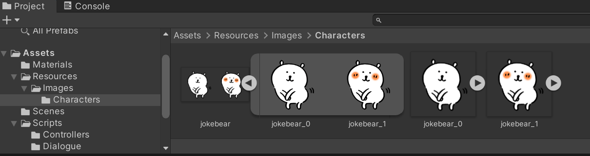


- `Standing Image` 라는 빈 오브젝트를 생성, 그 아래 `Image` 라는 UI 이미지 오브젝트를 만들어 주었다. 이미지 크기와 위치를 적절히 조절했다. 

- 그리고 `Standing Image` 오브젝트를 비활성화한다.

  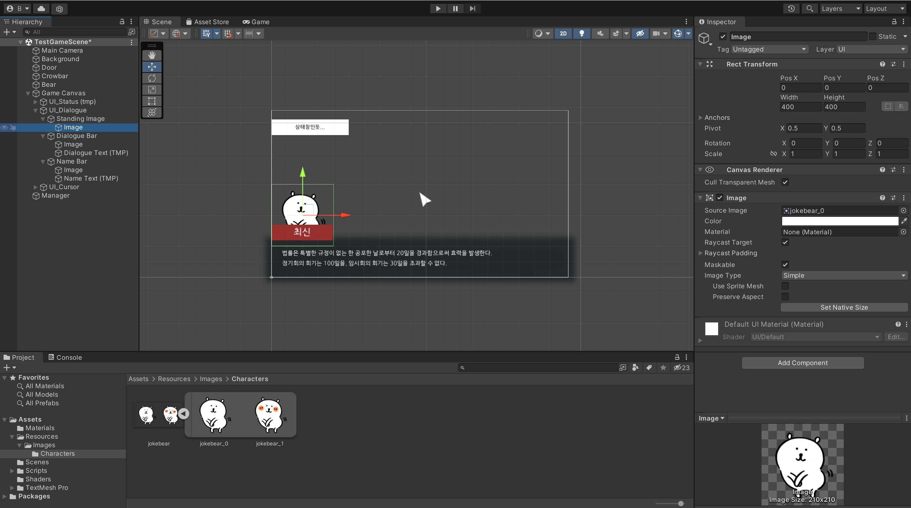


### 2. 엑셀에 새 열 생성

- `dialogue_test_1.csv`

  - **Sprite Name**이라는 Column을 생성해서, 농담곰의 Sprite Sheet 이름(jokebear_0, jokebear_1)을 넣는다.

  - 표정 변화가 없을 때는 그냥 비워둔다. (추후 수정)

    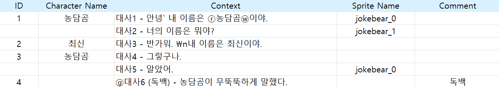


### 3. 스크립트 수정

- `Dialogue.cs` 수정

- `Dialogue` 클래스

  ```c#
  [System.Serializable]
  public class Dialogue
  {
      [Header("스탠딩 일러스트")]
      public Transform tf_standing;
      
      [Tooltip("캐릭터")]   
      public string name; // 캐릭터 이름
  
      [HideInInspector]	// 인스펙터 창에서 변수를 숨긴다.
      public string[] contexts; // 배열이라 여러 대사를 담을 수 있다.
  
      [HideInInspector]
      public string[] spriteName; // 여러 개의 스프라이트 이미지
  }
  ```

  - Transform 속성의 `standing` 변수를 선언한다. 후에 스탠딩 일러스트 변경을 위해 쓰인다.
  - 기존의 `contexts` 필드의 `[Tooltip]`을 지우고, `[HideInInspector]` 로 대체해준다. public으로 선언된 변수를 인스펙터 상에서 숨길 수 있다.
  - 스프라이트 이미지 이름을 저장할 배열 `spriteName`을 선언하였다.


- `DialogueParser.cs` 수정

- `Parse()` 함수

  ```c#
  public Dialogue[] Parse(string _CSVFileName)
  {
      // ...
  
      for (int i = 1; i < data.Length;)   // data[0] = {'ID', '캐릭터 이름', '대사'}
      {
          string[] row = data[i].Split(new char[] { ',' });   // , 단위로 쪼개기
  
          Dialogue dialogue = new Dialogue(); // 캐릭터 한 명의 대사들
  
          dialogue.name = row[1];
          List<string> contextList = new List<string>();
          List<string> spriteList = new List<string>();
  
          do
          {
              contextList.Add(row[2]);
              spriteList.Add(row[3]);
  
              // 다음 줄 미리 비교
              if (++i < data.Length)
              {
                  row = data[i].Split(new char[] { ',' });
              }
  
              // 다음 줄이 데이터 보다 길어지면 그냥 break
              else
              {
                  break;
              }
          } while (row[0].ToString() == "");  // 다음 줄 캐릭터 이름이 공백이면 대사를 더 채우기
  
          dialogue.contexts = contextList.ToArray();   // 리스트를 배열로
          dialogue.spriteName = spriteList.ToArray();
          dialogueList.Add(dialogue);
      }
  
      return dialogueList.ToArray();
  }
  ```

  - spriteList 리스트를 만들고, 행을 순회하면서 엑셀의 3번째 열을 리스트에 담는다.
  - 그리고 spriteList를 배열로 전환한 후, Dialogue 클래스의 spriteName 배열에 저장한다.


### 4. `SpriteManager.cs` 스크립트 생성

- 스프라이트 이미지를 변경해 줄 매니저 스크립트

- `SpriteManager.cs`

- 라이브러리

  ```c#
  using UnityEngine.UI;
  ```

  - `Image` 클래스를 사용하기 위해 선언한다.


- 변수

  ```c#
  [SerializeField] float fadeSpeed;   // 이미지를 서서히 변경
  ```

  - `fadeSpeed`: 이미지를 바로 바꾸지 않고, 서서히 변경되도록 하기 위한 변수


- `CheckSameSprite()` 함수

  ```c#
  bool CheckSameSprite(Image p_image, Sprite p_sprite)
  {
      if (p_image.sprite == p_sprite)
          return true;
      else
          return false;
  }
  ```

  - 현재 sprite와 변경하고자 하는 sprite가 같은 경우, 변경할 필요가 없기 때문에, 두 sprite가 같은 지의 여부를 판별하는 함수이다.
  - 인자
    - `p_image`: Image 타입. 현재 sprite를 의미한다.
    - `p_sprite`: 변경하고자 하는 새로운 sprite를 의미한다.
  - 현재 sprite와 새로운 sprite가 같으면 true, 아니면 false를 반환한다.


- `SpriteChangeCoroutine()` 코루틴

  ```c#
  // p_target: 어떤 이미지를 변경할 것인지, p_spriteName: 어떤 이미지로 변경할 것인지
  public IEnumerator SpriteChangeCoroutine(Transform p_target, string p_spriteName)
  {
      // 1. t_image 이미지를 변경
      // Standing Image 오브젝트에는 Image 컴포넌트 X → 그 자식인 Image 오브젝트에는 Image 컴포넌트 O
      Image t_image = p_target.GetComponentInChildren<Image>();
  
      // 2. t_sprite 이미지로 변경
      // Characters 폴더에 있는 이미지를 가져와 Sprite 타입으로 변경 가능한지 검증한 후, Sprite로 강제 형변환
      p_spriteName = p_spriteName.Trim(); // 공백 제거
      Sprite t_sprite = Resources.Load("Images/Characters/" + p_spriteName, typeof(Sprite)) as Sprite;
  
      // 두 이미지가 같지 않으면 새 이미지로 변경
      if (!CheckSameSprite(t_image, t_sprite))
      {
          // 1. 현재 이미지를 지우기
          Color t_color = t_image.color; // 현재 이미지의 color 속성
          t_color.a = 0;  // 투명도를 0으로
          t_image.color = t_color;       // 바뀐 투명도를 적용
  
          // 2. 새 이미지를 보여주기
          t_image.sprite = t_sprite;     // 이미지 교체
  
          while (t_color.a < 1)
          {
              t_color.a += fadeSpeed; // 투명도를 0에서부터 서서히 올리기
              t_image.color = t_color;   // 바뀐 투명도를 적용
  
              yield return null;  // 1프레임 대기
          }
      }
  }
  ```

  - sprite 이미지를 변경하는 함수이다.
  - 인자
    - `p_target`: 어떤 이미지를 변경할 것인지, 대상을 선택한다.
    - `p_spriteName`: 어떤 이미지로 변경할 것인지, sprite 이미지 이름을 가져온다.
  - **`t_image`**
    - 현재 스프라이트 이미지를 의미한다.
    - `p_target`의 자식의 Image 컴포넌트를 가져온다.
    - `Standing Image` 오브젝트의 자식은 `Image` 오브젝트인데, 부모에는 위 컴포넌트가 없고, 자식 오브젝트에만 있기 때문에 자식의 컴포넌트를 가져오는 것이다.
  - **`t_sprite`**
    - `t_image`의 이미지를 `t_sprite`로 변경한다.
    - Resources 내 Characters 폴더에 있는, `p_spriteName` 이미지를 가져온다.
    - 이때 그 이미지가 Sprite 타입으로 변경 가능한지 체크(`typeof()`)한 후, Sprite 타입으로 강제 형변환해준다.
  - **`t_image`**와 **`t_sprite`**가 같지 않으면
    - 현재 이미지의 투명도를 0으로 만들어주고
    - 현재 스프라이트 이미지를 새 스프라이트 이미지 **`t_sprite`**로 바꾸고
    - 다시 투명도를 1까지 서서히 올려준다.


### 5. `DialogueManager.cs` 스크립트 수정

- `SpriteManager.cs`를 불러와서, 대화 중간중간 스프라이트 이미지를 변경해 주어야 한다.

- `DialogueManager.cs`

- 변수

  ```c#
  SpriteManager sm;
  ```


- `Start()` 함수

  ```c#
  void Start()
  {
      // ...
      sm = FindObjectOfType<SpriteManager>();
  }
  ```


- `ChangeSprite()` 함수 생성

  ```c#
  void ChangeSprite()
  {
      // 캐릭터가 대사를 할 때, spriteName이 공백이 아니면 이미지 변경
      if (dialogues[dialogueCnt].spriteName[contextCnt] != "")
      {
          StartCoroutine(sm.SpriteChangeCoroutine(dialogues[dialogueCnt].tf_standing, dialogues[dialogueCnt].spriteName[contextCnt]));
      }
  }
  ```

  - 캐릭터가 대사를 하면서 표정이 바뀌는데, 그때 표정 스프라이트가 지정되어 있을 때만 `SpriteChangeCoroutine()`을 실행한다.
  - 캐릭터의 `Stading Image` 오브젝트의 Transform 정보와, 캐릭터의 `contextCnt`번째 SpriteName 정보를 넘겨준다.


- `TypeWriter()` 코루틴

  ```c#
  IEnumerator TypeWriter()
  {
      SettingUI(true);    // 대사창 이미지를 띄운다.
      ChangeSprite();		// 스탠딩 이미지를 변경한다.
      
      // ...
  }
  ```

  


### 6. 적용

- `Manager` 오브젝트에 `SpriteManager` 컴포넌트 적용

  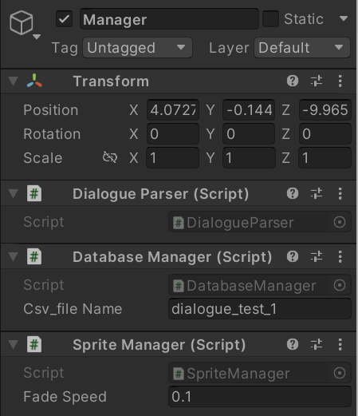


- `Bear` 오브젝트의 `Dialogue` 컴포넌트에 있는 `tf_standing`에 다음과 같이 `Standing Image` 오브젝트를 드래그한다.

  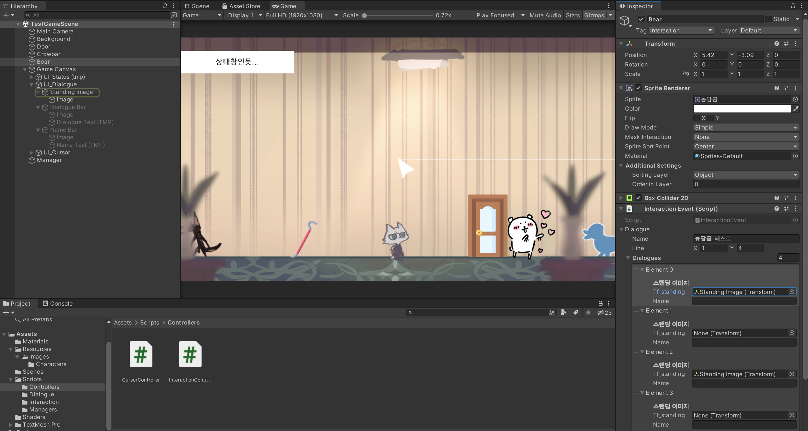


- 실행 결과

  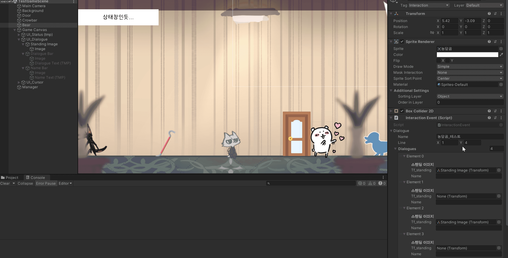

  - 기껏 드래그해서 넣었더니, 대화를 시작하자마자 `tf_standing`이 None이 되어버리는 현상을 목격할 수 있다.


### 7. 상호작용 이벤트 수정

- 위와 같은 원인이 일어나는 이유는, 우리가 `InteractionEvent.cs` 스크립트에서 확인할 수 있다.

- `InteractionEvent.cs`

  ```c#
  public class InteractionEvent : MonoBehaviour
  {
      [SerializeField] DialogueEvent dialogue;
  
      // DatabaseManager에 저장된 실제 대사 데이터를 꺼내온다.
      public Dialogue[] GetDialogue()
      {
          dialogue.dialogues = DatabaseManager.instance.GetDialogue((int)dialogue.line.x, (int)dialogue.line.y);
  
          return dialogue.dialogues;
      }
  }
  ```

  - `GetDialogue()` 함수에서, `dialogue` 원본에 대사 정보만 넣기 때문에 스탠딩 이미지에 관한 정보는 없는 채로 저장되게 된다.
  - 따라서, 원본에 바로 덮어 쓰지 말고 임시 변수를 만든 후 치환해 줄 필요가 있다.


- `InteractionEvent.cs` 수정

  ```c#
  public Dialogue[] GetDialogue()
  {
      DialogueEvent t_dialogueEvent = new DialogueEvent();    // 임시 변수
      t_dialogueEvent.dialogues = DatabaseManager.instance.GetDialogue((int)dialogueEvent.line.x, (int)dialogueEvent.line.y);
  
      for (int i = 0; i < dialogueEvent.dialogues.Length; i++)
      {
          // dialogueEvent에 넣은 Standing Image 오브젝트를 임시 변수에 넣기
          t_dialogueEvent.dialogues[i].tf_standing = dialogueEvent.dialogues[i].tf_standing;
      }
  
      // 원본에 임시 변수 덮어쓰기
      dialogueEvent.dialogues = t_dialogueEvent.dialogues;
  
      return dialogueEvent.dialogues;
  }
  ```

  - `t_dialogueEvent`라는 임시 변수를 만들고, 거기에다 DB의 대사를 넣어준다.
  - 그 후, 원본 `dialogueEvent`에 들어있는 `tf_standing`의 정보를 `t_dialogueEvent`에도 넣어준다.
  - `dialogueEvent`에 `t_dialogueEvent`를 덮어 씌운다.


- 실행 결과

  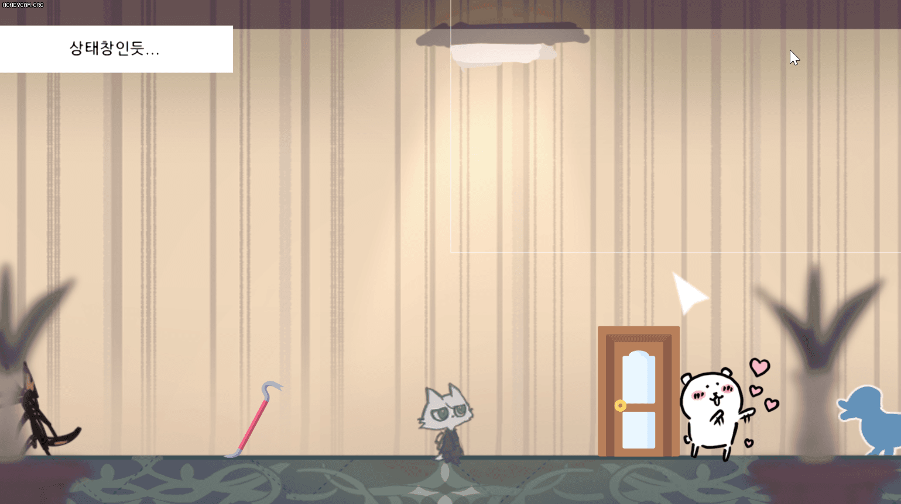

  - 에러는 없어졌지만, 많은 것이 마음에 들지 않는다.
  - 최신이 말할 땐 스탠딩 이미지가 사라졌으면 좋겠는데, 엑셀 파일과 `DialogueManager.cs`에서 코루틴 실행할 때의 조건문을 수정해야 할 것 같다.
  - 그리고 대화가 끝나면 스탠딩 이미지가 사라지도록, `SettingUI()` 함수를 손 볼 필요가 있을 것 같다.


## 2. 스탠딩 일러스트 디테일 구현

### 1. 대화 끝나면 스탠딩 이미지 사라지도록 구현

- `DialogueManager.cs` 수정

- 변수

  ```c#
  [SerializeField] GameObject go_standingImage;
  ```


- `SettingUI()` 함수 수정

  ```c#
  void SettingUI(bool p_flag)
  {
      go_dialogueBar.SetActive(p_flag);
      go_standingImage.SetActive(p_flag);
  
      if (p_flag)
      {
          // ...
      }
  }
  ```


- `UI_Dialogue` 오브젝트의 컴포넌트를 다음과 같이 설정한다.

  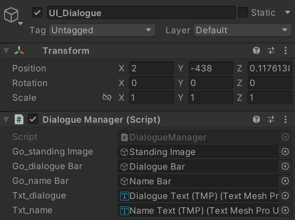


- 실행 결과

  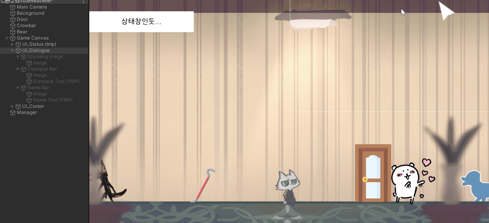

  - 대화가 끝나면 스탠딩 이미지가 잘 사라지는 것을 확인할 수 있다.


### 2. 대화 도중 스탠딩 이미지 사라지도록 구현

- `DialogueManager.cs`

- `ChangeSprite()` 함수 수정

  ```c#
  void ChangeSprite()
  {
      StartCoroutine(sm.SpriteChangeCoroutine(dialogues[dialogueCnt].tf_standing, dialogues[dialogueCnt].spriteName[contextCnt]));
  }
  ```

  - 기존에, spriteName이 공백이 아닐 때만 코루틴을 호출했었는데, 그 조건문을 지워준다.
  - spriteName이 공백일 때, 스탠딩 이미지의 투명도를 0으로 해주도록 코루틴을 수정한다.


- `SpriteManager.cs`

- `SpriteChangeCoroutine()` 코루틴 수정

  ```c#
  public IEnumerator SpriteChangeCoroutine(Transform p_target, string p_spriteName)
  {
      // ...
  
      if (!CheckSameSprite(t_image, t_sprite))
      {
          // ...
  
          while (t_color.a < 1)
          {
              if (t_sprite != null)
              {
                  t_color.a += fadeSpeed; // 투명도를 0에서부터 서서히 올리기
                  t_image.color = t_color;   // 바뀐 투명도를 적용
              }
  
              yield return null;  // 1프레임 대기
          }
      }
  }
  ```

  - 기존 이미지의 투명도를 0으로 한 후, 새로운 이미지 투명도를 서서히 1로 올리는 코드에 조건문을 추가한다.
  - 새 이미지가 null이 아닐 때만 투명도를 올리고, null인 경우는 투명도를 0으로 유지한다.


- 실행 결과

  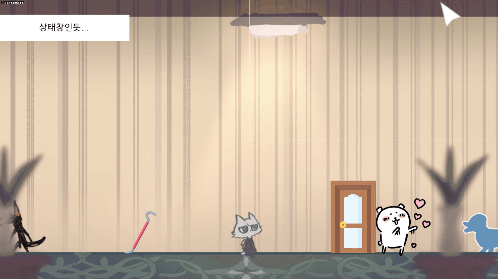

  

### 3. 더 자연스럽게 연출

- 농담곰 스탠딩 이미지가 등장하는 타이밍을 좀 더 앞당길 필요가 있다.

- 같은 이미지인지 체크하는 함수가 의미가 있나 싶지만, 어떻게 될지 모르니 일단은 코드를 그대로 두기로 했다.

- `dialogue_test_1.csv`

  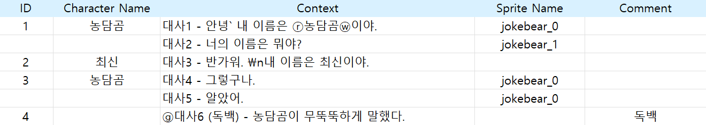


- 실행 결과

  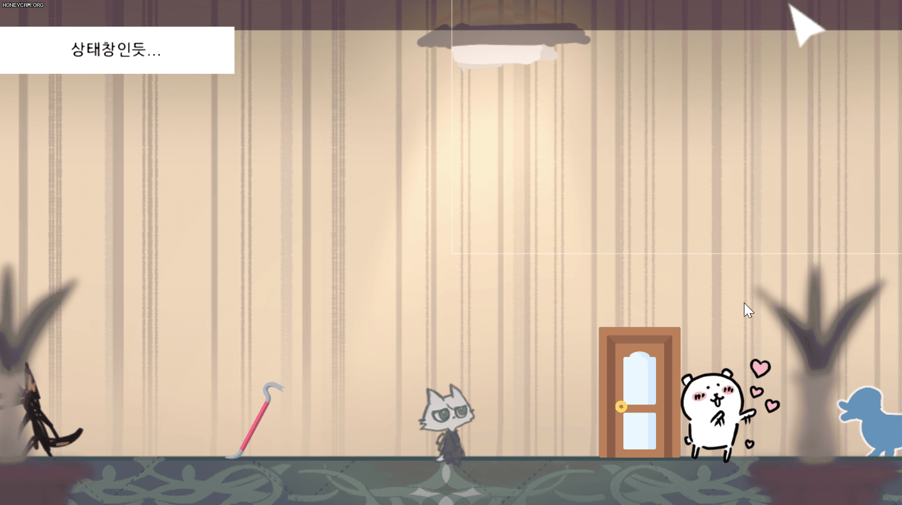


## 3. 다음에 할 일

- ~~스탠딩 이미지 기능 구현하기~~

- 맵 이동 구현해보기
- 오브젝트 클로즈업(하면서 화면 이동)하기??
- 마우스 커서에 애니메이션? 넣기
- 마우스 커서에 이펙트 넣기
- 오브젝트 획득 및 활용
- 한 번만 발생하는 이벤트 구현
- **오브젝트 클릭 시, 강조하는 이펙트 넣기 & 코루틴으로 대사창 띄우는 시간 조정하기**


## 4. 참고할 만한 자료들

- [[Unity] 엑셀 대화 정보들을 대화 이름으로 묶어서 가져오기](https://velog.io/@gkswh4860/Unity-%EC%97%91%EC%85%80-%EB%8C%80%ED%99%94-%EB%82%B4%EC%9A%A9%EC%9D%84-%EB%8C%80%ED%99%94-%EC%9D%B4%EB%A6%84%EC%9C%BC%EB%A1%9C-%EB%AC%B6%EC%96%B4%EC%84%9C-%EA%B0%80%EC%A0%B8%EC%98%A4%EA%B8%B0)
- [유니티로 미연시 만들기 졸업프로젝트](https://www.youtube.com/watch?v=eWT0TsknaiU&t=7s)
- [Unity 2D로 비주얼노벨 만들기(Flowchart)](https://m.blog.naver.com/liear1997/221292510685)

- **오브젝트 상호작용 이펙트 및 이벤트**
  - [[유니티 강좌] 단간론파를 유니티로 구현하기 Part 3 - 3 상호작용 이벤트](https://youtu.be/ftBw_KhI694?list=PLUZ5gNInsv_NG_UKZoua8goQbtseAo8Ow)
  - [[유니티 강좌] 단간론파를 유니티로 구현하기 Part 3 - 2 상호작용 이펙트](https://youtu.be/DBFOqJICh3E?list=PLUZ5gNInsv_NG_UKZoua8goQbtseAo8Ow)
- [[유니티 강좌] 단간론파를 유니티로 구현하기 Part 3 - 4 디테일 (Tooltip + 추가 연출)](https://www.youtube.com/watch?v=-89RsNEgE7w&list=PLUZ5gNInsv_NG_UKZoua8goQbtseAo8Ow&index=11)


## 5. 후기

- **1차 위기:** 강의는 스탠딩 일러스트를 변경하는 대상이 GameObject의 Sprite여서 `SpriteRenderer` 컴포넌트를 가져왔는데, 나는 UI에서 변경하는 것이기 때문에 `Image` 클래스를 사용해야 했다.
- **2차 위기:** 대사를 출력해 보니 Resources.Load에서 자꾸 Null 에러가 떴다. 디버깅을 할 줄 몰라 Debug.Log()로 여러 변수의 값을 계속 출력해 본 결과, [여기](#6-적용)와 같이 대사를 시작하면 `tf_standing`이 계속 증발하는 현상이 원인이었다. 분명 내가 본 영상에선 이런 현상이 없었는데? 하고 봤더니 내가 스킵했던 이전 영상(카메라 타게팅)에 나오는 내용이어서 그걸 보고 따라했다. 해결법을 찾는 데 오래 걸렸다...
- 큰 흐름은 영상이랑 비슷한데, UI Image를 변경시키고, 대화 끝내면 이미지 비활성화 하고, 주인공은 아직까진 얼굴이 없기 때문에 주인공 대사 때는 이미지를 안 보이게 하는 등 세부적인 부분은 혼자 해냈다! 뿌듯하다.
- 다음엔 오브젝트 획득 및 활용, 맵 이동 등을 구현해 봐야겠다. 더 복잡하겠지..? ㅠㅠ