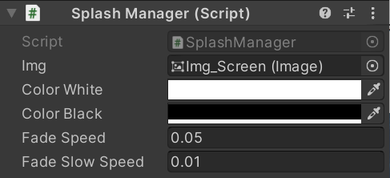

# 230208

- [[유니티 강좌] 단간론파를 유니티로 구현하기 Part 5 - 1 카메라 타겟팅](https://youtu.be/sYUwrE2jszk?list=PLUZ5gNInsv_NG_UKZoua8goQbtseAo8Ow&t=516)
- [[유니티 강좌] 단간론파를 유니티로 구현하기 Part 7 페이드 인 아웃](https://youtu.be/-8xOz3aGGRU?list=PLUZ5gNInsv_NG_UKZoua8goQbtseAo8Ow)
- [[유니티 강좌] 단간론파를 유니티로 구현하기 Part 5 - 2 카메라 리셋](https://youtu.be/WEKu-A2bVtk?list=PLUZ5gNInsv_NG_UKZoua8goQbtseAo8Ow&t=528)


## 1. 카메라 타게팅 구현 (아직 큰 의미는 X)

- 대화 중 카메라가 타게팅하는 오브젝트를 `tf_target`에 저장한다.
- `tf_target`은 대체로 화자를 의미하지만, 후에 컷씬을 보여줄 때도 활용한다.


### 1. 카메라가 타게팅할 대상 정하기

- `Dialogue.cs` 수정

- `Dialogue` 클래스에 필드 추가

  ```c#
  public class Dialogue
  {
      [Header("카메라 타게팅 대상")]
      public Transform tf_target;
      
      // ...
  }
  ```


- `Bear` 오브젝트의 `tf_target`에 카메라가 타게팅했으면 하는 오브젝트를 넣는다. 우선 Element 0에만 넣어준다.

  


### 2. 실행 시 타게팅 대상이 Null이 되는 오류 수정하기

- `InteractionEvent.cs`

- `GetDialogue()` 함수

  ```c#
  public Dialogue[] GetDialogue()
  {
      // ...
  
      for (int i = 0; i < dialogueEvent.dialogues.Length; i++)
      {
          // ...
          
          // dialogueEvent에 넣은 타게팅 대상 오브젝트를 임시 변수에 넣기
          t_dialogueEvent.dialogues[i].tf_target = dialogueEvent.dialogues[i].tf_target;
      }
  
      // ...
  }
  ```


## 2. Splash 효과 구현

### 1. 카메라 타입 구분

- `Dialogue.cs` 수정

- 열거형 `CameraType` 생성

  ```c#
  public enum CameraType
  {
      Target, // 오브젝트 타겟
      FadeOut,
      FadeIn,
      FlashOut,
      FlashIn,
  }
  ```

  - `Target`은 지금 카메라가 화자를 타겟팅 하고 있다는 의미 (실질적인 의미는 X)


- `Dialogue` 클래스

  ```c#
  [System.Serializable]
  public class Dialogue
  {
      [Header("카메라 타겟팅 대상")]
      public CameraType cameraType;
      public Transform tf_target;
      
      // ...
  }
  ```

  - 카메라가 무엇을 하는지 그 타입을 저장할 변수, `cameraType`을 선언한다.


### 2. Splash 효과 구현

- Managers 폴더 내에 `SplashManager.cs` 스크립트 생성

- 변수

  ```c#
  [SerializeField] Image img; // 배경 이미지 → 얘를 페이드인/아웃
  
  [SerializeField] Color colorWhite;
  [SerializeField] Color colorBlack;
  
  [SerializeField] float fadeSpeed;
  [SerializeField] float fadeSlowSpeed;
  
  // 페이드되는 동안은 텍스트 출력 X
  public static bool isFinished = false;   // 페이드 완료 여부
  ```

  - `img`: 페이드인/아웃이 되는 대상 이미지
  - `colorWhite` & `colorBlack`: `img`의 배경색
  - `fadeSpeed` & `fadeSlowSpeed`: `img`가 페이드되는 속도
  - `isFinished`: 기본값은 false, 페이드가 다 완료되면 true


- `FadeOut()` 코루틴

  ```c#
  public IEnumerator FadeOut(bool _isWhite, bool _isSlow)
  {
      Color t_color = (_isWhite == true) ? colorWhite : colorBlack;   // 배경색 결정
  
      t_color.a = 0;
      img.color = t_color;
  
      while (t_color.a < 1)   // 점점 불투명하게
      {
          t_color.a += (_isSlow == true) ? fadeSlowSpeed : fadeSpeed; // 페이드아웃 속도 결정
          img.color = t_color;
  
          yield return null;
      }
  
      isFinished = true;  // 페이드아웃 완료
  }
  ```


- `FadeIn()` 코루틴

  ```c#
  public IEnumerator FadeIn(bool _isWhite, bool _isSlow)
  {
      Color t_color = (_isWhite == true) ? colorWhite : colorBlack;
  
      t_color.a = 1;
      img.color = t_color;
  
      while (t_color.a > 0)   // 점점 투명하게
      {
          t_color.a -= (_isSlow == true) ? fadeSlowSpeed : fadeSpeed;
          img.color = t_color;
  
          yield return null;
      }
  
      isFinished = true;
  }
  ```


- `Manager` 오브젝트에 `Splash Manager` 컴포넌트를 추가한 후, 다음과 같이 설정한다.

  


- 아직 `Img`가 None이므로, `UI_Splash` 빈 오브젝트를 생성하고, 그 자식으로 Image UI 오브젝트를 생성해 준다.

  


- `Image` 크기를 화면 다 덮을만큼 키워주고, 투명도를 0으로 설정한다.

  


- `Image` 오브젝트의 이름을 `Img_Screen`으로 바꿔주고, 다시 `Manager` 오브젝트의 컴포넌트에 드래그해서 넣는다.

  


- `Bear` 오브젝트의 `Camera Type`을 다음과 같이 설정해준다.

  


- `Main Camera` 오브젝트에 `Camera Controller` 컴포넌트를 추가한 후, `Bear` 오브젝트를 클릭해보면, 잘 들어가 있던 `tf_target`이 None이 되어 있는 것을 확인할 수 있다.

  


### 3. 카메라 타입에 따른 함수 호출

- `DialogueManager.cs`

- 변수

  ```c#
  SplashManager splashManager;
  ```


- `Start()` 함수

  ```c#
  void Start()
  {
      // ...
      splashManager = FindObjectOfType<SplashManager>();
  }
  ```


- `CameraTargettingType()` 코루틴 생성

  ```c#
  IEnumerator CameraTargettingType()
  {
      switch (dialogues[dialogueCnt].cameraType)
      {
          case CameraType.FadeIn:
              SplashManager.isFinished = false;
              StartCoroutine(splashManager.FadeIn(false, true));  // 검은 화면, 느리게 전환
              yield return new WaitUntil(() => SplashManager.isFinished); // isFinished가 true가 될 때까지 대기
              break;
  
          case CameraType.FadeOut:
              SplashManager.isFinished = false;
              StartCoroutine(splashManager.FadeOut(false, true));  // 흰 화면, 느리게 전환
              yield return new WaitUntil(() => SplashManager.isFinished);
              break;
  
          case CameraType.FlashIn:
              SplashManager.isFinished = false;
              StartCoroutine(splashManager.FadeIn(true, true));  // 검은 화면, 느리게 전환
              yield return new WaitUntil(() => SplashManager.isFinished);
              break;
  
          case CameraType.FlashOut:
              SplashManager.isFinished = false;
              StartCoroutine(splashManager.FadeOut(true, true));  // 흰 화면, 느리게 전환
              yield return new WaitUntil(() => SplashManager.isFinished);
              break;
      }
  
      StartCoroutine(TypeWriter());
  }
  ```

  - 카메라 타입에 따라 함수를 골라서 실행


- `ShowDialogue()` 함수

  ```c#
  public void ShowDialogue(Dialogue[] p_dialogues)
  {
      // ...
      
      // StartCoroutine(TypeWriter());
      StartCoroutine(CameraTargettingType());
  }
  ```

  - 기존 `TypeWriter()` 코루틴 시작 구문을 지우고, `CameraTargettingType()` 코루틴을 시작하도록 한다.


- `Update()` 함수

  ```c#
  private void Update()
  {
      if (isDialogue)
      {
          if (isNext)
          {
              if (Input.GetKeyDown(KeyCode.Space))
              {
                  isNext = false;
                  txt_dialogue.text = "";
  
                  // 현재 캐릭터의 다음 대사 출력
                  if (++contextCnt < dialogues[dialogueCnt].contexts.Length)
                  {
                      StartCoroutine(TypeWriter());
                  }
  
                  // 다음 캐릭터의 대사 출력
                  else
                  {
                      contextCnt = 0;
  
                      if (++dialogueCnt < dialogues.Length)
                      {
                          // StartCoroutine(TypeWriter());
                          StartCoroutine(CameraTargettingType());
                      }
  
                      // 다음 캐릭터가 없으면 (대화가 끝났으면)
                      else
                      {
                          EndDialogue();
                      }
                  }
              }
          }
      }
  }
  ```


### 4. 실행 및 수정

- 실행했더니, 또 `Bear` 오브젝트에서 설정했던 `Camera Type` 값이 또 초기화되는 문제가 발생했다. (이제 그만...)
- [[유니티 강좌] 단간론파를 유니티로 구현하기 Part 5 - 2 카메라 리셋](https://youtu.be/WEKu-A2bVtk?list=PLUZ5gNInsv_NG_UKZoua8goQbtseAo8Ow&t=528)

- `InteractionEvent.cs` 수정

- `GetDialogue()` 함수

  ```c#
  public Dialogue[] GetDialogue()
  {
      // ...
  
      for (int i = 0; i < dialogueEvent.dialogues.Length; i++)
      {
          // ...
  
          // dialogueEvent에 넣은 카메라 타입을 임시 변수에 넣기
          t_dialogueEvent.dialogues[i].cameraType = dialogueEvent.dialogues[i].cameraType;
      }
  
      // ...
  }
  ```


- 실행 결과

  

  - 대화는 잘 진행되고 있지만, 대화창이 보이지 않는다.
  - 그리고 페이드인/아웃 시 대화창이 사라지도록 해야 한다.


- 하이어라키 뷰에서, `UI_Dialogue` 오브젝트를 맨 아래로 내린다.

  


- `DialogueManager.cs`

- `CameraTargettingType()` 코루틴 수정

  ```c#
  IEnumerator CameraTargettingType()
  {
      switch (dialogues[dialogueCnt].cameraType)
      {
          case CameraType.FadeIn:
              SettingUI(false);
              // ...
              break;
  
          case CameraType.FadeOut:
              SettingUI(false);
              // ...
              break;
  
          case CameraType.FlashIn:
              SettingUI(false);
              // ...
              break;
  
          case CameraType.FlashOut:
              SettingUI(false);
              // ...
              break;
      }
  
      StartCoroutine(TypeWriter());
  }
  ```

  - 각 case마다 `SettingUI(false)`로 대화창 UI를 꺼준다.


- `SettingUI()` 함수 수정

  ```c#
  void SettingUI(bool p_flag)
  {
      // ...
  
      if (p_flag)
      {
          // ...
      }
  
      else
      {
          go_nameBar.SetActive(false);
      }
  }
  ```

  - `p_flag`가 false면 이름창을 숨기는 else문을 추가해준다.


- 실행 결과

  


## 3. 다음에 할 일

- ~~스탠딩 이미지 기능 구현하기~~

- ~~페이드 효과 구현하기~~

- 컷씬 기능 구현하기

- 맵 이동 구현해보기
- 오브젝트 클로즈업(하면서 화면 이동)하기??
- 마우스 커서에 애니메이션? 넣기
- 마우스 커서에 이펙트 넣기
- 오브젝트 획득 및 활용
- 한 번만 발생하는 이벤트 구현
- **오브젝트 클릭 시, 강조하는 이펙트 넣기 & 코루틴으로 대사창 띄우는 시간 조정하기**


## 4. 참고할 만한 자료들

- [[Unity] 엑셀 대화 정보들을 대화 이름으로 묶어서 가져오기](https://velog.io/@gkswh4860/Unity-%EC%97%91%EC%85%80-%EB%8C%80%ED%99%94-%EB%82%B4%EC%9A%A9%EC%9D%84-%EB%8C%80%ED%99%94-%EC%9D%B4%EB%A6%84%EC%9C%BC%EB%A1%9C-%EB%AC%B6%EC%96%B4%EC%84%9C-%EA%B0%80%EC%A0%B8%EC%98%A4%EA%B8%B0)
- [유니티로 미연시 만들기 졸업프로젝트](https://www.youtube.com/watch?v=eWT0TsknaiU&t=7s)
- [Unity 2D로 비주얼노벨 만들기(Flowchart)](https://m.blog.naver.com/liear1997/221292510685)

- **오브젝트 상호작용 이펙트 및 이벤트**
  - [[유니티 강좌] 단간론파를 유니티로 구현하기 Part 3 - 3 상호작용 이벤트](https://youtu.be/ftBw_KhI694?list=PLUZ5gNInsv_NG_UKZoua8goQbtseAo8Ow)
  - [[유니티 강좌] 단간론파를 유니티로 구현하기 Part 3 - 2 상호작용 이펙트](https://youtu.be/DBFOqJICh3E?list=PLUZ5gNInsv_NG_UKZoua8goQbtseAo8Ow)
- [[유니티 강좌] 단간론파를 유니티로 구현하기 Part 3 - 4 디테일 (Tooltip + 추가 연출)](https://www.youtube.com/watch?v=-89RsNEgE7w&list=PLUZ5gNInsv_NG_UKZoua8goQbtseAo8Ow&index=11)


## 5. 후기

- 저번에 스탠딩 이미지 기능을 다 구현한 후, 심심해서 다음 영상을 보다가 컷씬 구현하는 걸 봤는데, 그 때 `Camera Type`과 `tf_target`으로 컷씬 분기 확인하고 보여주길래 이번에 다뤄보았다.
- 일단 영상과 최대한 비슷하게 해봤고, 추후 필요 없는 부분은 다시 없애려고 한다.
- 이번에는 적절히 필요한 내용만 뽑아서 적절히 섞어야 하는 부분이 어려웠다. 강의가 없으면 구현이 아직은 힘들다 ㅠㅠ.. 유니티 독학은 대체 어떻게 하는 것일까
