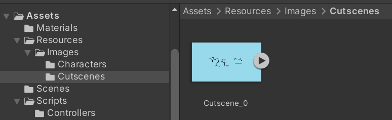
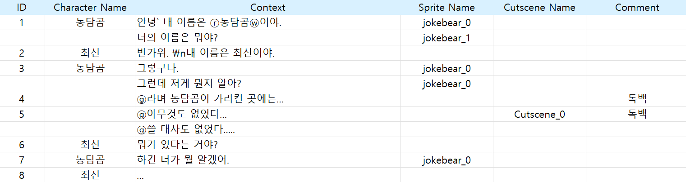
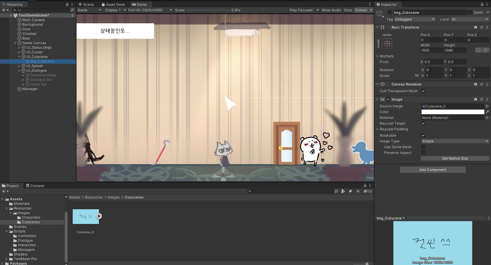
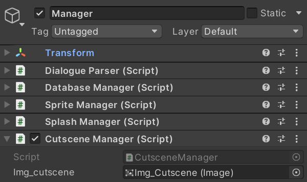
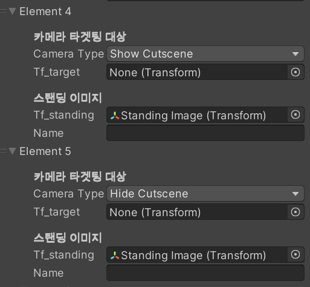
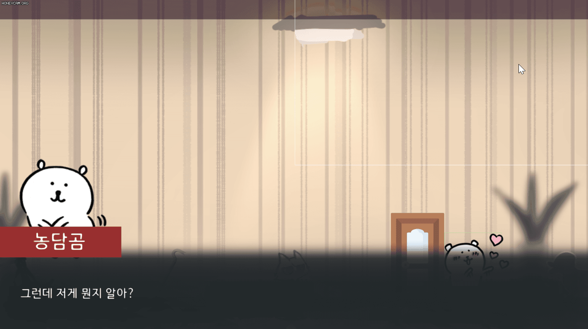
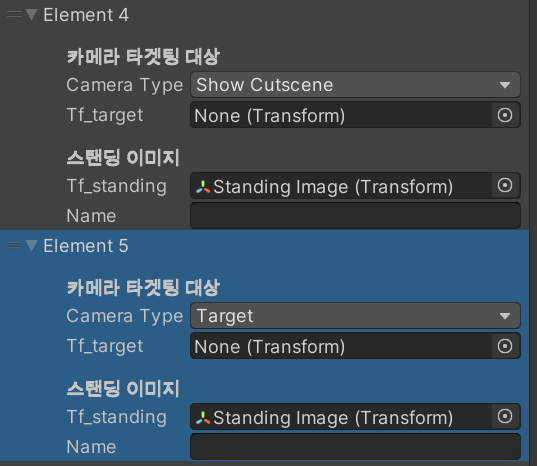

# 230210

- [[유니티 강좌] 단간론파를 유니티로 구현하기 Part 9 - 1 컷씬 연출](https://youtu.be/lpmPaCMh7-M?list=PLUZ5gNInsv_NG_UKZoua8goQbtseAo8Ow)
- [[유니티 강좌] 단간론파를 유니티로 구현하기 Part 9 - 2 디테일](https://youtu.be/lN0gzYhR7IA?list=PLUZ5gNInsv_NG_UKZoua8goQbtseAo8Ow)


## 1. 컷신 효과 구현 

- Resources → Images → Cutscenes 폴더에 컷신 이미지를 넣는다.

  


### 1. `CutsceneManager.cs` 스크립트 생성

- 변수

  ```c#
  public static bool isFinished = false;  // 컷신이 다 불러와졌는지
  
  SplashManager splashManager;
  
  [SerializeField] Image img_cutscene;
  ```


- `Start()` 함수

  ```c#
  void Start()
  {
      splashManager = FindObjectOfType<SplashManager>();
  }
  ```


- `CutsceneCoroutine()` 코루틴

  ```c#
  public IEnumerator CutsceneCoroutine(string p_cutsceneName, bool p_isShow)
  {
      SplashManager.isFinished = false;
      StartCoroutine(theSplashManager.FadeOut(true, false));      // 하얗고 빠르게
      yield return new WaitUntil(() => SplashManager.isFinished); // 페이드아웃 끝날 때까지 대기
  
      // 컷신을 보여준다.
      if (p_isShow)
      {
          Sprite t_sprite = Resources.Load<Sprite>("Images/Cutscenes/" + p_cutsceneName);
  
          if (t_sprite != null)
          {
              img_cutscene.gameObject.SetActive(true);
              img_cutscene.sprite = t_sprite;
          }
      }
  
      // 컷신을 보여주지 않는다.
      else
      {
          img_cutscene.gameObject.SetActive(false);
      }
  
      SplashManager.isFinished = false;
      StartCoroutine(theSplashManager.FadeIn(true, false));       // 하얗고 빠르게
      yield return new WaitUntil(() => SplashManager.isFinished); // 페이드인 끝날 때까지 대기
  
      yield return new WaitForSeconds(0.5f);  // 컷신 끝나고 0.5초 후 텍스트 출력
  
      isFinished = true;  // 컷신 불러오기 끝
  }
  ```

  - 화면 페이드 아웃
    - 페이드 아웃이 시작되었기 때문에 `SplashManager.isFinished`를 false로 설정
    - 페이드 아웃 코루틴 호출
    - `SplashManager.isFinished`가 true가 될 때까지 대기
  - `p_isShow`가 true이면 컷신 보여주기
    - Resources → Images → Cutscenes 폴더에서 Sprite 이미지를 가져와서,
    - 그 이미지를 보여준다.
  - `p_isShow`가 flase이면 컷신 을 보여주지 않는다.
  - 화면 페이드 인
    - 페이드 인이 시작되었기 때문에 `SplashManager.isFinished`를 false로 설정
    - 페이드 인 코루틴 호출
    - `SplashManager.isFinished`가 true가 될 때까지 대기
  - 컷신 불러오기가 모두 끝났기 때문에, `isFinished`를 true로 설정


### 2. 엑셀 수정

- `dialogue_test_1.csv`

  

  - 대사와 열을 좀 추가해 주었다.
  - 컷신이 있는 대사에도 id를 넣어준다.


- `UI_Cutscene`라는 빈 오브젝트를 생성하고, 그 자식으로 UI 타입의 `Img_Cutscene` 오브젝트를 생성해서 Sprite에 컷신이 될 이미지를 넣고 비활성화 한다.

- 그 후, `UI_Splash`의 위로 배치한다.

  


- ~~`Img_Cutscene` 오브젝트에 `Cutscene Manager` 컴포넌트를 추가한 후, `Img_Cutscene` 오브젝트를 넣어준다.~~

- `Manager` 오브젝트에 `Cutscene Manager` 컴포넌트를 추가한 후, `Img_Cutscene` 오브젝트를 넣어준다.

  


### 3. 대화 관련 스크립트 수정

- `Dialogue.cs` 스크립트 수정

- `CameraType` 추가

  ```c#
  public enum CameraType
  {
      // ...
      ShowCutscene,
      HideCutscene,
  }
  ```


- `Dialogue` 클래스에 필드 추가

  ```c#
  [System.Serializable]
  public class Dialogue
  {
      // ...
      
      [HideInInspector]
      public string[] cutsceneName;   // 여러 개의 컷신 이미지
  }
  ```


- `DialogueParser.cs` 수정

  ```c#
  public Dialogue[] Parse(string _CSVFileName)
  {
      // ...
  
      for (int i = 1; i < data.Length;)   // data[0] = {'ID', '캐릭터 이름', '대사'}
      {
          // ...
          
          List<string> cutsceneList = new List<string>(); // 컷신 이미지 리스트
  
          // ...
          
          dialogue.cutsceneName = cutsceneList.ToArray();
          dialogueList.Add(dialogue);
      }
  
      return dialogueList.ToArray();
  }
  ```


- `DialogueManager.cs` 수정

- 변수

  ```c#
  CutsceneManager theCutsceneManager;
  ```


- `Start()` 함수

  ```c#
  void Start()
  {
      // ...
      theCutsceneManager = FindObjectOfType<CutsceneManager>();
  }
  ```


- `CameraTargettingType()` 코루틴 수정

  ```c#
  IEnumerator CameraTargettingType()
  {
      switch (dialogues[dialogueCnt].cameraType)
      {
          // ...
  
          case CameraType.ShowCutscene:
              SettingUI(false);
              CutsceneManager.isFinished = false;
              StartCoroutine(theCutsceneManager.CutsceneCoroutine(dialogues[dialogueCnt].cutsceneName[contextCnt], true));
              yield return new WaitUntil(() => CutsceneManager.isFinished);
              break;
  
          case CameraType.HideCutscene:
              SettingUI(false);
              CutsceneManager.isFinished = false;
              StartCoroutine(theCutsceneManager.CutsceneCoroutine(null, false));
              yield return new WaitUntil(() => CutsceneManager.isFinished);
              break;
      }
  
      StartCoroutine(TypeWriter());
  }
  ```


- `Bear` 오브젝트의 `Dialogues` 배열에 원하는 위치의 `Camera Type`을 Show Cutscene과 Hide Cutscene으로 설정해 준다.

  


- 실행 결과

  


## 2. 대화가 끝나면 자동으로 컷신 닫기

- 아직은 `Hide Cutscene`을 지정해 주어야 하지만, 대화가 끝나면 자동으로 컷신도 닫히도록 구현할 필요가 있다.


- `CutsceneManager.cs` 수정

- `CheckCutscene()` 함수 생성

  ```c#
  public bool CheckCutscene()
  {
      return img_cutscene.gameObject.activeSelf;  // 현재 이 객체가 활성화 상태인지 반환
  }
  ```

  - `img_cutscene` 오브젝트가 활성화 상태인지, 비활성화 상태인지를 반환한다.
    - 활성화: 컷신 재생 중
    - 비활성화: 컷신 재생 중 X


- `DialogueManager.cs` 수정

- `EndDialogue()` 함수를 코루틴으로 변경

  ```c#
  IEnumerator EndDialogue()
  {
      // Hide Cutscene
      if (theCutsceneManager.CheckCutscene())
      {
          SettingUI(false);
          CutsceneManager.isFinished = false;
          StartCoroutine(theCutsceneManager.CutsceneCoroutine(null, false));
          yield return new WaitUntil(() => CutsceneManager.isFinished);
      }
  
      isDialogue = false;
      contextCnt = 0;
      dialogueCnt = 0;
      dialogues = null;
      isNext = false;
  
      theInteractionController.SettingUI(true); // 커서, 상태창 보이기
      SettingUI(false);   // 대사창, 이름창 숨기기
  }
  ```

  - 만약 컷신이 재생 중이라면, Hide Cutscene의 내용을 실행한다.


- `Update()` 함수
  - 기존에 `EndDialogue()` 함수를 호출하던 것을
  - 코루틴을 시작하는 구문 `StartCoroutine(EndDialogue());`으로 대체해 준다.


- 그리고 `Bear` 오브젝트의 `Dialogues`에서 Hide Cutscene 타입을 지워본다.

  


- 실행 결과

  


## 3. 불필요한 코드 삭제 및 전체적인 정리

- `CameraController.cs` 삭제
  - `Main Camera` 오브젝트에서 컴포넌트 삭제
  - `DialogueManager.cs`에서 `CameraController`형 변수 선언 코드 삭제

- `Dialogue.cs` 수정
  - `CameraType`에 `Default` 옵션 추가 (아무 효과 X)
  - `Dialogue` 클래스의 `tf_target` 필드 삭제
  - `InteractionEvent.cs`에서 관련 코드 삭제


## 4. 다음에 할 일

- ~~스탠딩 이미지 기능 구현하기~~
- ~~페이드 효과 구현하기~~
- ~~컷신 기능 구현하기~~
- 맵 이동 구현해보기
- 사운드 관련 기능들 구현해보기 (효과음, 보이스, 배경 음악)
- 오브젝트 클로즈업(하면서 화면 이동)하기??
- 마우스 커서에 애니메이션? 넣기
- 마우스 커서에 이펙트 넣기
- 오브젝트 획득 및 활용
- 한 번만 발생하는 이벤트 구현
- **오브젝트 클릭 시, 강조하는 이펙트 넣기 & 코루틴으로 대사창 띄우는 시간 조정하기**


## 5. 참고할 만한 자료들

- [[Unity] 엑셀 대화 정보들을 대화 이름으로 묶어서 가져오기](https://velog.io/@gkswh4860/Unity-%EC%97%91%EC%85%80-%EB%8C%80%ED%99%94-%EB%82%B4%EC%9A%A9%EC%9D%84-%EB%8C%80%ED%99%94-%EC%9D%B4%EB%A6%84%EC%9C%BC%EB%A1%9C-%EB%AC%B6%EC%96%B4%EC%84%9C-%EA%B0%80%EC%A0%B8%EC%98%A4%EA%B8%B0)
- [유니티로 미연시 만들기 졸업프로젝트](https://www.youtube.com/watch?v=eWT0TsknaiU&t=7s)
- [Unity 2D로 비주얼노벨 만들기(Flowchart)](https://m.blog.naver.com/liear1997/221292510685)

- **오브젝트 상호작용 이펙트 및 이벤트**
  - [[유니티 강좌] 단간론파를 유니티로 구현하기 Part 3 - 3 상호작용 이벤트](https://youtu.be/ftBw_KhI694?list=PLUZ5gNInsv_NG_UKZoua8goQbtseAo8Ow)
  - [[유니티 강좌] 단간론파를 유니티로 구현하기 Part 3 - 2 상호작용 이펙트](https://youtu.be/DBFOqJICh3E?list=PLUZ5gNInsv_NG_UKZoua8goQbtseAo8Ow)
- [[유니티 강좌] 단간론파를 유니티로 구현하기 Part 3 - 4 디테일 (Tooltip + 추가 연출)](https://www.youtube.com/watch?v=-89RsNEgE7w&list=PLUZ5gNInsv_NG_UKZoua8goQbtseAo8Ow&index=11)


## 6. 후기

- 처음에 컷신 코드를 적용했더니 null 오류가... 왜인가 했는데 CutsceneManager 컴포넌트가 있는 `Img_CutScene` 오브젝트가 비활성화 되어서 해당 컴포넌트를 찾을 수 없었던 것.
- [FindObjectOfType returning null](https://stackoverflow.com/questions/44090855/findobjectoftype-returning-null)
- 그래서 그냥 Manager 오브젝트에 컴포넌트를 넣었다...