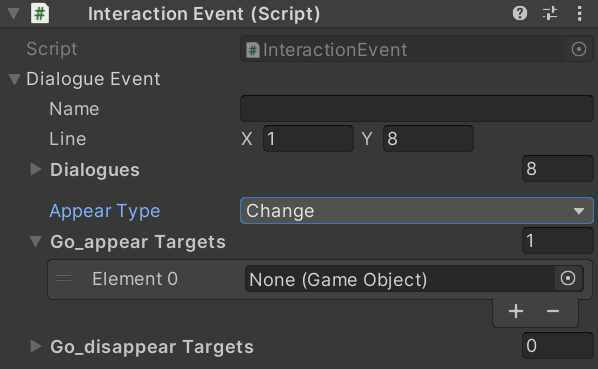
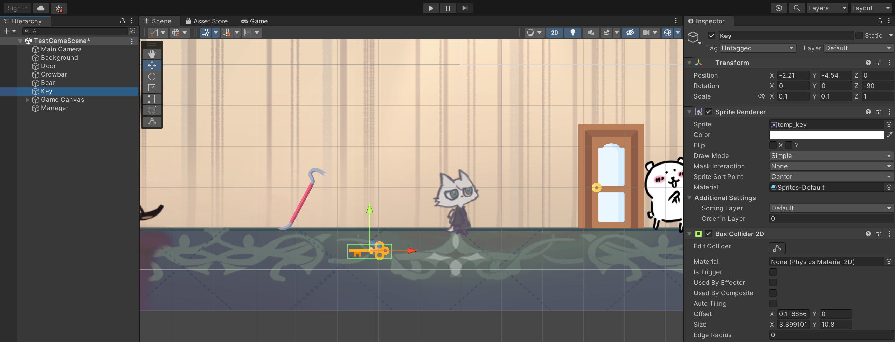
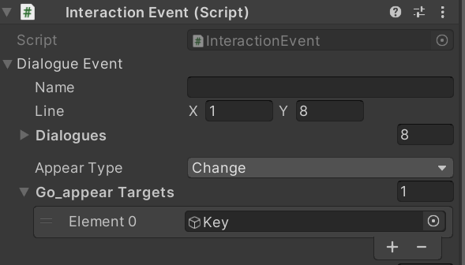
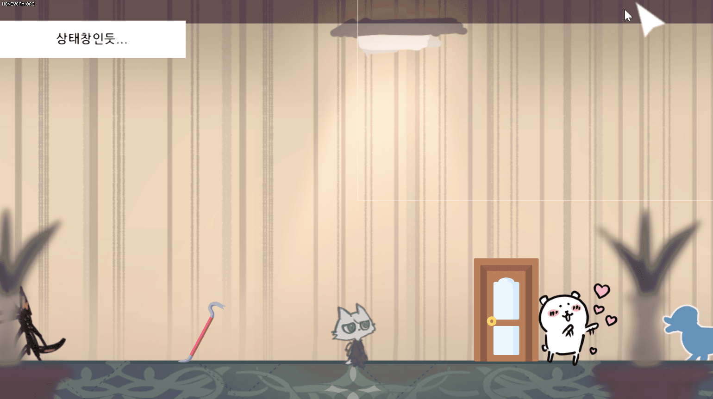

# 230221

- [[유니티 강좌] 단간론파를 유니티로 구현하기 Part 11 캐릭터 등장 및 퇴장](https://youtu.be/6XVWFEbB3tU?list=PLUZ5gNInsv_NG_UKZoua8goQbtseAo8Ow)


## 1. 이벤트 종료 후, 오브젝트 변화시키기

### 1. `Dialogue.cs` 수정

- 새로운 열거형 `AppearType` 생성

  ```c#
  public enum AppearType
  {
      Default,    // 아무 변화 X
      Change,     // Appear 혹은 Disappear
  }
  ```

  - `Default`: 오브젝트의 변화가 없을 때
  - `Change`: 새로 등장시킬 오브젝트나 퇴장시킬 오브젝트가 있을 때


- `DialogueEvent` 클래스 수정

  ```c#
  [System.Serializable]
  public class DialogueEvent
  {
      // ...
  
      [Space]
      public AppearType appearType;
      public GameObject[] go_appearTargets;       // 이벤트 후 새로 등장시킬 오브젝트 배열
      public GameObject[] go_disappearTargets;    // 이벤트 후 퇴장시킬 오브젝트 배열
  }
  ```

  - `appearType`: Default / Change
  - `go_appearTargets`: 이벤트 후 새로 등장시킬 오브젝트들의 배열
  - `go_disappearTargets`: 이벤트 후 퇴장시킬 오브젝트들의 배열


### 2. 이벤트 후, 새로 등장시킬 오브젝트 만들기

- 농담곰과의 대화가 끝나면 열쇠 오브젝트를 하나 보여주고자 한다.

- `Bear` 오브젝트의 `Interaction Event` 컴포넌트를 다음과 같이 설정한다.

  


- 새로운 오브젝트 `Key`를 생성하고, 적당하게 배치한 후, 비활성화한다. (Tag를 Interaction으로 바꿔준다.)

  


- `Bear` 오브젝트의 `Interaction Event` 컴포넌트에 방금 만든 `Key` 오브젝트를 배열에 추가한다.




### 3. `DialogueManager.cs` 수정

- 변수

  ```c#
  GameObject[] go_appearTargets;
  GameObject[] go_disappearTargets;
  byte appearTypeNum; // 0: 아무 변화 X, 1: 변화
  const byte NONE = 0, CHANGE = 1;
  ```

  - `go_appearTargets`: 등장시킬 오브젝트들의 배열
  - `go_disappearTargets`: 퇴장시킬 오브젝트들의 배열
  - `appearTypeNum`: 0은 아무 변화 X, 1은 등장 혹은 퇴장


- `SetAppearObjects()` 함수 생성

  ```c#
  public void SetAppearObjects(GameObject[] p_appear, GameObject[] p_disappear)
  {
      go_appearTargets = p_appear;
      go_disappearTargets = p_disappear;
  
      appearTypeNum = CHANGE;
  }
  ```

  - 인자로 등장시킬 오브젝트들의 배열과 퇴장시킬 오브젝트들의 배열을 각각 받아온다.
  - `appearTypeNum`을 CHANGE(1)로 설정한다.


- `AppearOrDisappearObjects()` 함수 생성

  ```c#
  void AppearOrDisappearObjects()
  {
      if (appearTypeNum == CHANGE)
      {
          // 등장시킬 오브젝트
          if (go_appearTargets != null)
          {
              for (int i = 0; i < go_appearTargets.Length; i++)
              {
                  go_appearTargets[i].SetActive(true);
              }
          }
  
          // 퇴장시킬 오브젝트
          if (go_disappearTargets != null)
          {
              for (int i = 0; i < go_disappearTargets.Length; i++)
              {
                  go_disappearTargets[i].SetActive(false);
              }
          }
      }
  
      go_appearTargets = null;
      go_disappearTargets = null;
      appearTypeNum = NONE;
  }
  ```

  - `appearTypeNum`의 값이 `CHANGE`일 때
    - `go_appearTargets`가 null이 아니면, 오브젝트들을 활성화한다.
    - `go_disappearTargets`가 null이 아니면, 오브젝트들을 비활성화한다.


- `EndDialogue()` 코루틴에서 `AppearOrDisappearObjects()` 함수를 호출한다.

  ```c#
  IEnumerator EndDialogue()
  {
      if (theCutsceneManager.CheckCutscene())
      {
          // ...
      }
  
      AppearOrDisappearObjects();
  
      // ...
  }
  ```


### 4. `InteractionEvent.cs` 수정

- `GetAppearType()` 함수 생성

  ```c#
  public AppearType GetAppearType()
  {
      return dialogueEvent.appearType;
  }
  ```


- `GetAppearTargets()` 함수 생성

  ```c#
  public GameObject[] GetAppearTargets()
  {
      return dialogueEvent.go_appearTargets;
  }
  ```

  

- `GetDisppearTargets()` 함수 생성

  ```c#
  public GameObject[] GetDisppearTargets()
  {
      return dialogueEvent.go_disappearTargets;
  }
  ```


### 5. `InteractionController.cs` 수정

- `Interact()` 함수 수정

  ```c#
  // 상호작용 가능 오브젝트를 좌클릭했을 때, 대사창을 보여줌.
  void Interact()
  {
      clickedInteractive = true;
  
      InteractionEvent t_event = hit.transform.GetComponent<InteractionEvent>();
  
      if (t_event.GetAppearType() == AppearType.Change)
      {
          dm.SetAppearObjects(t_event.GetAppearTargets(), t_event.GetDisppearTargets());
      }
  
      dm.ShowDialogue(t_event.GetDialogue()); // 상호작용한 오브젝트의 대사 이벤트를 꺼내온다.
  }
  ```

  - 클릭한 오브젝트의 이벤트 정보를 `t_event`에 담는다.
  - `t_event`의 `AppearType`이 `Change`이면, `DialogueManager.cs`의 `SetAppearObjects()` 함수를 실행한다.
  - 이때 인자로는 등장시킬 배열, 퇴장시킬 배열을 받아와서 넣는다.


- 실행 결과

  


## 2. 다음에 할 일

- ~~스탠딩 이미지 기능 구현하기~~
- ~~페이드 효과 구현하기~~
- ~~컷신 기능 구현하기~~
- ~~이벤트 후 오브젝트 등장 및 퇴장시키기~~
- 맵 이동 구현해보기
- 사운드 관련 기능들 구현해보기 (효과음, 보이스, 배경 음악)
- 오브젝트 클로즈업(하면서 화면 이동)하기??
- 마우스 커서에 애니메이션? 넣기
- 마우스 커서에 이펙트 넣기
- 오브젝트 획득 및 활용
- 한 번만 발생하는 이벤트 구현
- **오브젝트 클릭 시, 강조하는 이펙트 넣기 & 코루틴으로 대사창 띄우는 시간 조정하기**


## 3. 참고할 만한 자료들

- [[Unity] 엑셀 대화 정보들을 대화 이름으로 묶어서 가져오기](https://velog.io/@gkswh4860/Unity-%EC%97%91%EC%85%80-%EB%8C%80%ED%99%94-%EB%82%B4%EC%9A%A9%EC%9D%84-%EB%8C%80%ED%99%94-%EC%9D%B4%EB%A6%84%EC%9C%BC%EB%A1%9C-%EB%AC%B6%EC%96%B4%EC%84%9C-%EA%B0%80%EC%A0%B8%EC%98%A4%EA%B8%B0)
- [유니티로 미연시 만들기 졸업프로젝트](https://www.youtube.com/watch?v=eWT0TsknaiU&t=7s)
- [Unity 2D로 비주얼노벨 만들기(Flowchart)](https://m.blog.naver.com/liear1997/221292510685)

- **오브젝트 상호작용 이펙트 및 이벤트**
  - [[유니티 강좌] 단간론파를 유니티로 구현하기 Part 3 - 3 상호작용 이벤트](https://youtu.be/ftBw_KhI694?list=PLUZ5gNInsv_NG_UKZoua8goQbtseAo8Ow)
  - [[유니티 강좌] 단간론파를 유니티로 구현하기 Part 3 - 2 상호작용 이펙트](https://youtu.be/DBFOqJICh3E?list=PLUZ5gNInsv_NG_UKZoua8goQbtseAo8Ow)
- [[유니티 강좌] 단간론파를 유니티로 구현하기 Part 3 - 4 디테일 (Tooltip + 추가 연출)](https://www.youtube.com/watch?v=-89RsNEgE7w&list=PLUZ5gNInsv_NG_UKZoua8goQbtseAo8Ow&index=11)


## 4. 후기

- 영상에서는 이벤트 후 캐릭터들을 모두 등장 & 퇴장시키기 때문에 GameObject형 배열을 하나만 썼지만, 나는 한 이벤트가 끝나면 어떤 오브젝트는 사라지고 어떤 오브젝트는 등장하도록 구현해 보았다.
- 크게 어렵지 않아서 다행이다. 나도 조금은 실력이 늘은 걸까... 그랬으면 좋겠다.