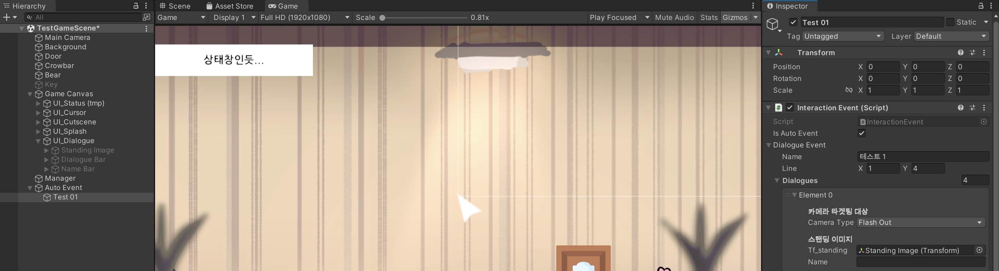

# 230223

- [[유니티 강좌] 단간론파를 유니티로 구현하기 Part 12 자동 이벤트](https://youtu.be/BpYBES6VIeY?list=PLUZ5gNInsv_NG_UKZoua8goQbtseAo8Ow)


## 1. 자동 이벤트

### 1. `InteractionEvent.cs` 수정

- 변수

  ```c#
  [SerializeField] bool isAutoEvent = false;  // true → 자동으로 실행되는 이벤트
  ```


- `Update()` 함수

  ```c#
  private void Update()
  {
      // 자동 이벤트이고, 데이터 파싱 후 테이블에 모두 저장되면 (오류 방지)
      if (isAutoEvent && DatabaseManager.isFinish)
      {
          DialogueManager theDM = FindObjectOfType<DialogueManager>();
          theDM.ShowDialogue(GetDialogue());
  
          gameObject.SetActive(false);    // 자동 이벤트를 한 번만 보기 위해 아예 비활성화한다.
      }
  }
  ```

  - `isAutoEvent`가 true이고, 파싱된 데이터가 모두 저장되었으면 자동 이벤트를 실행한다.
    - `DialogueManager`를 불러와서, `ShowDialogue()` 함수를 호출한다.
    - 이때 인자를 `InteractionEvent.cs` 내부의 대사 정보를 가져오는 함수인 `GetDialogue()`를 통해 넘겨준다.
    - `Update()` 함수 내에 선언되었으므로, 이벤트가 반복해서 실행되지 않도록 게임 오브젝트를 비활성화한다.
  - 왜 게임 오브젝트를 비활성화하냐면, 자동 이벤트가 실행될 때만 쓸 게임 오브젝트를 하나 만들어 `Interaction Event` 컨트롤러를 추가할 것이기 때문이다.


- `Auto Event`라는 빈 오브젝트를 생성하고, 그 아래 `Test 01`이라는 객체를 만들었다.

- 그리고 컴포넌트로 `Interaction Event`를 넣고, 기존 엑셀에서 대사 4개만 자동으로 출력해보려고 다음과 같이 설정했다. (스탠딩 이미지를 넣어주는 것도 잊지 말자!)

  


- 실행 결과

  

  - 아무것도 클릭하지 않았는데 자동으로 대화가 진행되는 모습이다.


### 2. 약간 대기 후 자동 이벤트 재생

- `DialogueManager.cs` 수정

- 변수

  ```c#
  public static bool isWaiting = false;
  ```

  - `isWaiting`: true가 되면서 자동 이벤트 전에 대기한다.


- `InteractionEvent.cs` 수정

- `Update()` 함수 수정

  ```c#
  private void Update()
  {
      // 자동 이벤트이고, 데이터 파싱 후 테이블에 모두 저장되면 (오류 방지)
      if (isAutoEvent && DatabaseManager.isFinish)
      {
          DialogueManager theDM = FindObjectOfType<DialogueManager>();
          DialogueManager.isWaiting = true;   // true → 자동 이벤트 대기
          theDM.ShowDialogue(GetDialogue());
  
          gameObject.SetActive(false);    // 자동 이벤트를 한 번만 보기 위해 아예 비활성화한다.
      }
  }
  ```

  - `DialogueManager`의 `isWaiting` 값을 true로 만들어, 이벤트 전에 대기할 수 있도록 한다.
  - 실제로 대기하는 코드는 `DialogueManager.cs`에서 작성한다.


- `DialogueManager.cs` 수정

- `StartDialogue()` 코루틴 생성

  ```c#
  IEnumerator StartDialogue()
  {
      if (isWaiting)
      {
          yield return new WaitForSeconds(0.5f);  // 자동 이벤트 0.5초 대기
      }
  
      isWaiting = false;
      StartCoroutine(CameraTargettingType());
  }
  ```

  - `isWaiting`이 true면 자동 이벤트(대화 이벤트)를 0.5초 후에 발생시킨다.
  - `isWaiting` 값을 false로 되돌린다.
  - 페이드인/아웃, 플래시인/아웃, 컷신 기능에 따라 카메라를 조절하는 `CameraTargettingType()` 코루틴을 실행하는 구문을 넣는다.


- `ShowDialogue()` 함수 수정

  ```c#
  public void ShowDialogue(Dialogue[] p_dialogues)
  {
      // StartCoroutine(CameraTargettingType());
      StartCoroutine(StartDialogue());
  }
  ```

  - `CameraTargettingType()` 코루틴 대신, `StartDialogue()` 코루틴을 실행한다.


### 3. 자동 이벤트 후에도 사물 등장/퇴장시키기

- `InteractionEvent.cs` 수정

- `Update()` 함수 수정

  ```c#
  private void Update()
  {
      // 자동 이벤트이고, 데이터 파싱 후 테이블에 모두 저장되면 (오류 방지)
      if (isAutoEvent && DatabaseManager.isFinish)
      {
          DialogueManager theDM = FindObjectOfType<DialogueManager>();
          DialogueManager.isWaiting = true;   // true → 자동 이벤트 대기
  
          // 오브젝트 등장/퇴장
          if (GetAppearType() == AppearType.Change)
          {
              theDM.SetAppearObjects(GetAppearTargets(), GetDisppearTargets());
          }
  
          theDM.ShowDialogue(GetDialogue());
  
          gameObject.SetActive(false);    // 자동 이벤트를 한 번만 보기 위해 아예 비활성화한다.
      }
  }
  ```

  - `InteractionController.cs`의 코드를 살짝 변형해서 넣는다.


- `Auto Event`의 `Test 01` 오브젝트의 `Interaction Event` 컴포넌트에서, 이벤트 후 퇴장시킬 오브젝트를 설정하였다.

  


- 실행 결과

  


## 2. 다음에 할 일

- ~~스탠딩 이미지 기능 구현하기~~
- ~~페이드 효과 구현하기~~
- ~~컷신 기능 구현하기~~
- ~~이벤트 후 오브젝트 등장 및 퇴장시키기~~
- ~~자동 이벤트 발생시키기~~
- 이벤트 연속으로 발생시키기
- 맵 이동 구현해보기
- 사운드 관련 기능들 구현해보기 (효과음, 보이스, 배경 음악)
- 오브젝트 클로즈업(하면서 화면 이동)하기??
- 마우스 커서에 애니메이션? 넣기
- 마우스 커서에 이펙트 넣기
- 오브젝트 획득 및 활용
- 한 번만 발생하는 이벤트 구현
- **오브젝트 클릭 시, 강조하는 이펙트 넣기 & 코루틴으로 대사창 띄우는 시간 조정하기**


## 3. 참고할 만한 자료들

- [[Unity] 엑셀 대화 정보들을 대화 이름으로 묶어서 가져오기](https://velog.io/@gkswh4860/Unity-%EC%97%91%EC%85%80-%EB%8C%80%ED%99%94-%EB%82%B4%EC%9A%A9%EC%9D%84-%EB%8C%80%ED%99%94-%EC%9D%B4%EB%A6%84%EC%9C%BC%EB%A1%9C-%EB%AC%B6%EC%96%B4%EC%84%9C-%EA%B0%80%EC%A0%B8%EC%98%A4%EA%B8%B0)
- [유니티로 미연시 만들기 졸업프로젝트](https://www.youtube.com/watch?v=eWT0TsknaiU&t=7s)
- [Unity 2D로 비주얼노벨 만들기(Flowchart)](https://m.blog.naver.com/liear1997/221292510685)

- **오브젝트 상호작용 이펙트 및 이벤트**
  - [[유니티 강좌] 단간론파를 유니티로 구현하기 Part 3 - 3 상호작용 이벤트](https://youtu.be/ftBw_KhI694?list=PLUZ5gNInsv_NG_UKZoua8goQbtseAo8Ow)
  - [[유니티 강좌] 단간론파를 유니티로 구현하기 Part 3 - 2 상호작용 이펙트](https://youtu.be/DBFOqJICh3E?list=PLUZ5gNInsv_NG_UKZoua8goQbtseAo8Ow)
- [[유니티 강좌] 단간론파를 유니티로 구현하기 Part 3 - 4 디테일 (Tooltip + 추가 연출)](https://www.youtube.com/watch?v=-89RsNEgE7w&list=PLUZ5gNInsv_NG_UKZoua8goQbtseAo8Ow&index=11)
- [[유니티 강좌] 단간론파를 유니티로 구현하기 Part 8 사운드 매니저 + 강조 연출](https://youtu.be/04RYW3i35jI?list=PLUZ5gNInsv_NG_UKZoua8goQbtseAo8Ow)


## 4. 후기

- 이벤트를 원하는 때에 자동으로 호출하면 어떨까 생각했는데, 그러면 그냥 사물 얻고 이벤트를 발생시키는 게 나을 것 같다는 생각이 들었다.
- 그래도 자동 이벤트로 여러 연출을 시도해볼 수 있을 것 같다. (회상, 오프닝 등등...)