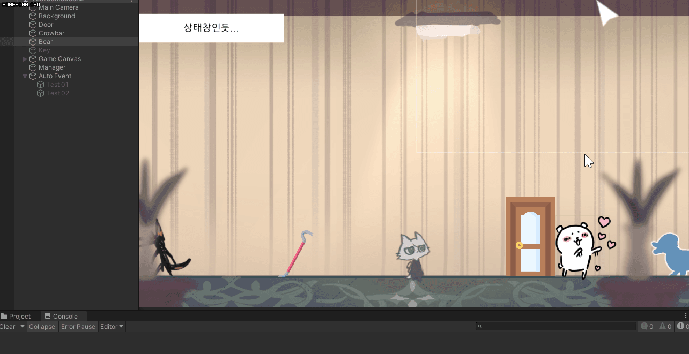

# 230225

- [[유니티 강좌] 단간론파를 유니티로 구현하기 Part 13 연속 이벤트 호출](https://youtu.be/PSV1xCTeu00?list=PLUZ5gNInsv_NG_UKZoua8goQbtseAo8Ow)


## 1. 연속으로 이벤트 호출하기

- 이벤트 후 오브젝트가 등장/퇴장한 후에, 자동으로 다음 이벤트를 진행해보자.


### 1. 다음 이벤트 정보 저장하기

- 📑 **`Dialogue.cs` 수정**

- `DialogueEvent` 클래스 수정

  ```c#
  [System.Serializable]
  public class DialogueEvent
  {
      // ...
      
      [Space]
      public GameObject go_nextEvent; // null → 대화 끝 / null X → 다음 이벤트 연속 호출
  }
  ```

  - `go_nextEvent`: 값이 있다면, 이벤트가 끝난 후 다음 이벤트를 연속으로 호출하고, null이라면 그대로 대화를 끝낸다.


- 유니티로 돌아가 `Bear` 오브젝트를 보면 `go_nextEvent`가 생겨있는데, 거기에 저번에 만들었던 자동 이벤트인 `Test 01`을 드래그해서 넣는다.

  


- 그리고 게임 실행 시 자동으로 실행되었던 이벤트인 `Test 01`은 잠시 비활성화 해둔다.

  


- 📑 **`InteractionEvent.cs` 수정**

- `Dialogue Manager`에게 다음에 재생할 이벤트 정보(`go_nextEvent`)를 전달해야 한다.

- `GetNextEvent()` 함수 생성

  ```c#
  public GameObject GetNextEvent()
  {
      return dialogueEvent.go_nextEvent;
  }
  ```

  - 유니티에서 설정한 `go_nextEvent`의 값을 가져온다.


- 📑 **`DialogueManager.cs` 수정**

- 변수

  ```c#
  GameObject go_nextEvent;
  ```


- `SetNextEvent()` 함수 생성

  ```c#
  public void SetNextEvent(GameObject p_nextEvent)
  {
      go_nextEvent = p_nextEvent;
  }
  ```

  - `InteractionEvent.cs`에서 해당 함수를 호출해서, `Dialogue Manager`의 `go_nextEvent`에도 다음 이벤트의 정보가 저장되도록 한다.


- 📑 **`InteractionEvent.cs` 수정** (⛔ 오류 있음!!! 수정본은 [여기로](#3-오류를-고쳐라))

- `Update()` 함수 생성

  ```c#
  private void Update()
  {
      // 자동 이벤트이고, 데이터 파싱 후 테이블에 모두 저장되면 (오류 방지)
      if (isAutoEvent && DatabaseManager.isFinish)
      {
          // ...
  
          theDM.SetNextEvent(GetNextEvent());
          theDM.ShowDialogue(GetDialogue());
  
          gameObject.SetActive(false);    // 자동 이벤트를 한 번만 보기 위해 아예 비활성화한다.
      }
  }
  ```

  - `Dialogue Manager`의 `SetNextEvent()` 함수를 호출하고, 인자로는 `GetNextEvent()`의 반환 값인 유니티의 `go_nextEvent`를 받는다.


### 2. 다음 이벤트 정보 가져오기

- 📑 **`DialogueManger.cs` 수정**

- `EndDialogue()` 코루틴 수정

  ```c#
  IEnumerator EndDialogue()
  {
      // ...
  
      // 모든 대화가 끝날 때까지 기다린 후, 다음 이벤트가 있으면 실행
      yield return new WaitUntil(() => !InteractionController.clickedInteractive);
  
      if (go_nextEvent != null)
      {
          go_nextEvent.SetActive(true);
          go_nextEvent = null;
      }
  }
  ```


- 그런데 이렇게 했을 때, `Bear` 오브젝트를 클릭하면 나오는 대화는 자동 이벤트가 아니기 때문에, `InteractionEvent.cs`의 `isAutoEvent` 조건문 안에 들어가지 않아 `GetNextEvent()` 함수가 실행되지 않는다.
- 그래서 else문을 만들고 거기서 `theDM.SetNextEvent(GetNextEvent())`를 호출했으나, 다음 이벤트가 발생하긴 하지만 무한으로 발생하는 오류가 생겼다. 아마 `Update()`에서 계속 위 함수를 호출하기 때문인 것 같다.


### 3. 오류를 고쳐라

- `theDM.SetNextEvent(GetNextEvent())`을 한 번만 호출한다.
- 그래서 그냥 `InteractionEvent.cs`에 `Start()` 함수를 만들어 거기서 호출하였다.


- 변수

  ```c#
  DialogueManager theDM;
  ```


- `Start()` 함수 생성

  ```c#
  private void Start()
  {
      theDM = FindObjectOfType<DialogueManager>();
      theDM.SetNextEvent(GetNextEvent());	// 다음 이벤트 정보를 저장
  }
  ```


- `Update()` 함수 원상복귀

  ```c#
  private void Update()
  {
      // 자동 이벤트이고, 데이터 파싱 후 테이블에 모두 저장되면 (오류 방지)
      if (isAutoEvent && DatabaseManager.isFinish)
      {
          DialogueManager.isWaiting = true;   // true → 자동 이벤트 대기
  
          // 오브젝트 등장/퇴장
          if (GetAppearType() == AppearType.Change)
          {
              theDM.SetAppearObjects(GetAppearTargets(), GetDisppearTargets());
          }
  
          theDM.ShowDialogue(GetDialogue());
  
          gameObject.SetActive(false);    // 자동 이벤트를 한 번만 보기 위해 아예 비활성화한다.
      }
  }
  ```


- 실행 결과

  

  - `Dialogue Manager`에서 `go_nextEvent`의 정보를 출력하게 해 보았다.
  - `Test 01`의 다음 이벤트로 `Test 02`를 넣으면, 자동 이벤트를 두 번 더 볼 수 있다.
  - 다시 농담곰을 클릭하면, `go_nextEvent`의 정보가 null이 되기 때문에 다시 이벤트가 발생하지 않는다.
  - 그러나 이벤트 사이에 잠깐 상태창과 커서가 노출되는 현상이 생긴다. (추후 고쳐보도록 하겠다...)


## 2. 다음에 할 일

- ~~이벤트 연속으로 발생시키기~~
- 맵 이동 구현해보기
- 사운드 관련 기능들 구현해보기 (효과음, 보이스, 배경 음악)
- 오브젝트 클로즈업(하면서 화면 이동)하기??
- 마우스 커서에 애니메이션? 넣기
- 마우스 커서에 이펙트 넣기
- 오브젝트 획득 및 활용
- 한 번만 발생하는 이벤트 구현
- **오브젝트 클릭 시, 강조하는 이펙트 넣기 & 코루틴으로 대사창 띄우는 시간 조정하기**


## 3. 참고할 만한 자료들

- [[Unity] 엑셀 대화 정보들을 대화 이름으로 묶어서 가져오기](https://velog.io/@gkswh4860/Unity-%EC%97%91%EC%85%80-%EB%8C%80%ED%99%94-%EB%82%B4%EC%9A%A9%EC%9D%84-%EB%8C%80%ED%99%94-%EC%9D%B4%EB%A6%84%EC%9C%BC%EB%A1%9C-%EB%AC%B6%EC%96%B4%EC%84%9C-%EA%B0%80%EC%A0%B8%EC%98%A4%EA%B8%B0)
- [유니티로 미연시 만들기 졸업프로젝트](https://www.youtube.com/watch?v=eWT0TsknaiU&t=7s)
- [Unity 2D로 비주얼노벨 만들기(Flowchart)](https://m.blog.naver.com/liear1997/221292510685)

- **오브젝트 상호작용 이펙트 및 이벤트**
  - [[유니티 강좌] 단간론파를 유니티로 구현하기 Part 3 - 3 상호작용 이벤트](https://youtu.be/ftBw_KhI694?list=PLUZ5gNInsv_NG_UKZoua8goQbtseAo8Ow)
  - [[유니티 강좌] 단간론파를 유니티로 구현하기 Part 3 - 2 상호작용 이펙트](https://youtu.be/DBFOqJICh3E?list=PLUZ5gNInsv_NG_UKZoua8goQbtseAo8Ow)
- [[유니티 강좌] 단간론파를 유니티로 구현하기 Part 3 - 4 디테일 (Tooltip + 추가 연출)](https://www.youtube.com/watch?v=-89RsNEgE7w&list=PLUZ5gNInsv_NG_UKZoua8goQbtseAo8Ow&index=11)
- [[유니티 강좌] 단간론파를 유니티로 구현하기 Part 8 사운드 매니저 + 강조 연출](https://youtu.be/04RYW3i35jI?list=PLUZ5gNInsv_NG_UKZoua8goQbtseAo8Ow)


## 4. 후기

- 영상에서는 `isAutoEvent`가 true인 if문 안에 `theDM.SetNextEvent(GetNextEvent())`를 쓰고 잘 실행되길래 왜 난 실행이 안 되지 했는데, 되는 게 더 이상한 거 아닌가?? 봉란이는 Auto Event도 아니었는데... 혼란스럽다.
- 오류를 고칠 때, 자동 이벤트가 아니니까 else문을 만들어서 거기서 `SetNextEvent()` 함수 호출하면 되겠지~ 했는데 이벤트가 계속 무한으로 발생해 버렸다.. 분명 `go_nextEvent`를 null로 만들었는데? `go_nextEvent`를 출력하면 null이 아니야.. 무서웠다. 그런데 `InteractionEvent.cs`에서 매 프레임마다 `SetNextEvent()`를 호출했으니, null로 만들어도 그만큼 다시 다음 이벤트가 생겨 버린 것이었다. 그래서 한 번만 호출하도록 `Start()` 함수를 만들긴 했는데, 나중에 이거 때문에 오류가 발생하지만을 않길 바랄 뿐이다...
- UI 중간에 노출되는 현상은 코드가 너무 달라서 아직 해결을 못 하고 있다. 맵 이동 구현해보고 고쳐봐야지..