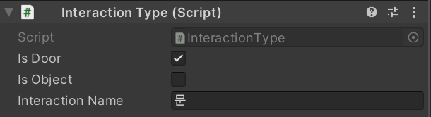
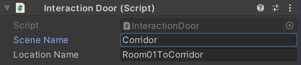
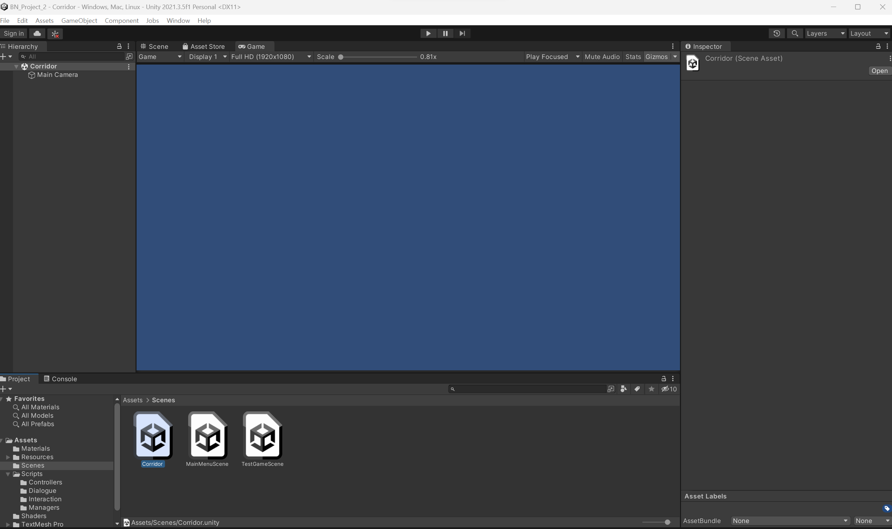
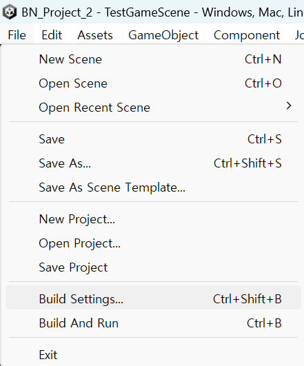
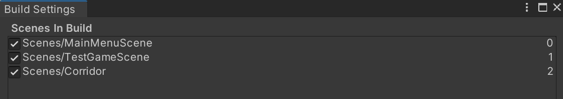
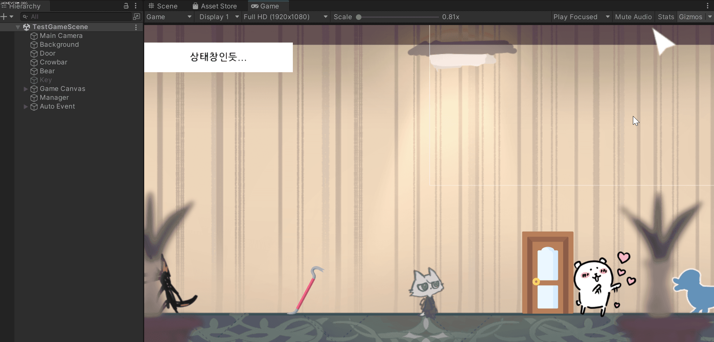
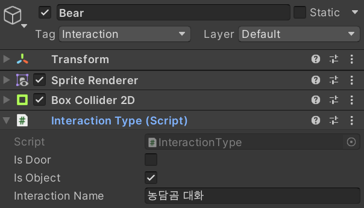

# 230307

- [[유니티 강좌] 단간론파를 유니티로 구현하기 Part 14 - 1 맵 이동 (씬 변경)](https://youtu.be/DV14FGGvUTU?list=PLUZ5gNInsv_NG_UKZoua8goQbtseAo8Ow)


## 1. 맵 이동 (신 변경)

### 1. 상호작용 타입 분리

- 📑 **`InteractionType.cs` 생성**

- 변수

  ```c#
  public bool isDoor;
  public bool isObject;
  
  [SerializeField] string interactionName;
  ```

  

- `GetName()` 함수 생성

  ```c#
  public string GetName()
  {
      return interactionName;
  }
  ```


- `Door` 오브젝트에 `Interaction Type` 컴포넌트 추가 후, 다음과 같이 설정한다.

  


### 2. 상호작용 분기 처리

- 📑 **`InteractionDoor.cs` 생성**

- 변수

  ```c#
  [SerializeField] string sceneName;      // 장소를 이동할 때, 어느 신으로 넘어가게 할지
  [SerializeField] string locationName;   // ex) 장소가 복도이고 문이 여러 개 있을 때, 각각의 문에 다른 이름이 있다.
  ```

  - `sceneName`: 장소를 이동할 때, 어느 신으로 넘어가게 할지 결정한다.
  - `locationName`: 만약 장소가 복도이고 문이 여러 개 있을 때, 각각의 문에 다른 이름이 있다.


- `GetSceneName()` 함수 생성

  ```c#
  public string GetSceneName()
  {
      return sceneName;
  }
  ```


- `GetLocationName()` 함수 생성

  ```c#
  public string GetLocationName()
  {
      return locationName;
  }
  ```


- `Door` 오브젝트에 `Interaction Door` 컴포넌트 추가 후, 다음과 같이 설정한다.

  

  - `Scene Name`: 아직 문을 클릭했을 때 전환될 신을 만들진 않았지만, 복도로 간다고 가정
  - `Location Name`: 현재 신을 Room01이라고 한다면, 문을 클릭했을 때 복도로 간다는 의미이다.


- 📑 **`InteractionController.cs` 수정**

- `Interact()` 함수 수정

  ```c#
  // 상호작용 가능 오브젝트를 좌클릭했을 때, 대사창을 보여줌.
  // 문을 좌클릭했을 때는 맵을 이동함.
  void Interact()
  {
      clickedInteractive = true;
  
      InteractionEvent t_event = hit.transform.GetComponent<InteractionEvent>();
  
      // 오브젝트 클릭
      if (hit.transform.GetComponent<InteractionType>().isObject)
      {
          CallDialogue(t_event);  // 대화 이벤트 호출
      }
  
      // 문 클릭
      else
      {
          CallTransfer();
      }
  }
  ```

  - 클릭한 물체의 `InteractionType`을 가져와서, 오브젝트인지 문인지를 구분한다.
    - 오브젝트이면 `CallDialogue()` 함수를 호출한다. (기존 코드)
    - 문이면 `CallTransfer()` 함수를 호출한다.


- `CallDialogue()` 함수 생성

  ```c#
  // 대화 이벤트 호출
  void CallDialogue(InteractionEvent p_event)
  {
      if (p_event.GetAppearType() == AppearType.Change)
      {
          dm.SetAppearObjects(p_event.GetAppearTargets(), p_event.GetDisppearTargets());
      }
  
      dm.ShowDialogue(p_event.GetDialogue()); // 상호작용한 오브젝트의 대사 이벤트를 꺼내온다.
  }
  ```

  

- `CallTransfer()` 함수 생성

  ```c#
  // 맵(신) 이동 함수 호출
  void CallTransfer()
  {
      string t_sceneName = hit.transform.GetComponent<InteractionDoor>().GetSceneName();
      string t_locationName = hit.transform.GetComponent<InteractionDoor>().GetLocationName();
  
      Debug.Log(t_sceneName + t_locationName);
  }
  ```

  - 아직 이동할 신을 만들지 않았으므로, 분기 처리가 잘 되는지 확인하기 위해 `t_sceneName`과 `t_locationName`을 한 번 출력해 본다.


- 새로운 맵(신) 생성

  

  - 신 이름을 `Corridor`로 지어주었다.


### 3. 맵 이동

- 📑 **`TransferManager.cs` 생성**

- `Transfer()` 코루틴 생성

  ```c#
  public IEnumerator Transfer(string p_sceneName, string p_locationName)
  {
      yield return null;  // 한 프레임 대기
  
      SceneManager.LoadScene(p_sceneName);
  }
  ```


- 📑 **`InteractionController.cs` 수정**

- `CallTransfer()` 함수 수정

  ```c#
  void CallTransfer()
  {
      string t_sceneName = hit.transform.GetComponent<InteractionDoor>().GetSceneName();
      string t_locationName = hit.transform.GetComponent<InteractionDoor>().GetLocationName();
  
      StartCoroutine(FindObjectOfType<TransferManager>().Transfer(t_sceneName, t_locationName));
  }
  ```

  - `TransferManager.cs`에서 생성했던 `Transfer()` 코루틴을 호출한다.


- 이전 신(나는 `TestGameScene`으로 돌아와서, `Manager` 오브젝트에 `Transfer Manager` 컴포넌트를 추가한다.


- 유니티 최상단 메뉴의 **File → Build Settings** 클릭

  


- `Corridor` 신을 다음과 같이 추가해준다.

  


- 실행 결과

  

  - 맵 이동 시 부자연스러운 문제가 존재한다. 페이드인/아웃 효과가 필요할 것 같다. (다음에 구현)
  - 문에 커서를 올리면 이동 커서 이미지가 아닌, 조사 커서 이미지가 보이는 문제가 발생


## 2. 기존 코드 수정

- 우선 코드를 수정하기 전, 상호작용 가능한 오브젝트 들에도 `Interact Type`을 추가해 주어야 한다. (`Crowbar`, `Bear`, `Key` 오브젝트에 추가)

  


- 📑 **`InteractionController.cs` 수정**

- `LeftClick()` 함수 수정

  ```c#
  // 상호작용 가능 오브젝트를 좌클릭했을 때, Interact 함수 호출
  void LeftClick()
  {
      // clickedInteractive 값이 false일 때만 오브젝트를 클릭 가능
      if (!clickedInteractive)
      {
          if (Input.GetMouseButtonDown(0))
          {
              if (isInteractive || isMovable)
              {
                  Interact();
              }
          }
      }
  }
  ```

  - 그냥 오브젝트를 클릭했든, 문을 클릭했든, 두 가지 경우 모두에 `Interact()` 함수를 호출해야 한다.
  - 따라서 if문을 `if (isInteractive || isMovable)` 로 살짝 수정해 주었다.
  - 그러면 대화 이벤트도 잘 나오고, 맵 이동도 잘 된다.


## 3. 다음에 할 일

- ~~이벤트 연속으로 발생시키기~~
- ~~맵 이동 구현해보기~~
- 자동 이벤트 시 UI 노출되는 현상 수정
- 사운드 관련 기능들 구현해보기 (효과음, 보이스, 배경 음악)
- 오브젝트 클로즈업(하면서 화면 이동)하기??
- 마우스 커서에 애니메이션? 넣기
- 마우스 커서에 이펙트 넣기
- 오브젝트 획득 및 활용
- 한 번만 발생하는 이벤트 구현
- **오브젝트 클릭 시, 강조하는 이펙트 넣기 & 코루틴으로 대사창 띄우는 시간 조정하기**


## 4. 참고할 만한 자료들

- [[Unity] 엑셀 대화 정보들을 대화 이름으로 묶어서 가져오기](https://velog.io/@gkswh4860/Unity-%EC%97%91%EC%85%80-%EB%8C%80%ED%99%94-%EB%82%B4%EC%9A%A9%EC%9D%84-%EB%8C%80%ED%99%94-%EC%9D%B4%EB%A6%84%EC%9C%BC%EB%A1%9C-%EB%AC%B6%EC%96%B4%EC%84%9C-%EA%B0%80%EC%A0%B8%EC%98%A4%EA%B8%B0)
- [유니티로 미연시 만들기 졸업프로젝트](https://www.youtube.com/watch?v=eWT0TsknaiU&t=7s)
- [Unity 2D로 비주얼노벨 만들기(Flowchart)](https://m.blog.naver.com/liear1997/221292510685)

- **오브젝트 상호작용 이펙트 및 이벤트**
  - [[유니티 강좌] 단간론파를 유니티로 구현하기 Part 3 - 3 상호작용 이벤트](https://youtu.be/ftBw_KhI694?list=PLUZ5gNInsv_NG_UKZoua8goQbtseAo8Ow)
  - [[유니티 강좌] 단간론파를 유니티로 구현하기 Part 3 - 2 상호작용 이펙트](https://youtu.be/DBFOqJICh3E?list=PLUZ5gNInsv_NG_UKZoua8goQbtseAo8Ow)
- [[유니티 강좌] 단간론파를 유니티로 구현하기 Part 3 - 4 디테일 (Tooltip + 추가 연출)](https://www.youtube.com/watch?v=-89RsNEgE7w&list=PLUZ5gNInsv_NG_UKZoua8goQbtseAo8Ow&index=11)
- [[유니티 강좌] 단간론파를 유니티로 구현하기 Part 8 사운드 매니저 + 강조 연출](https://youtu.be/04RYW3i35jI?list=PLUZ5gNInsv_NG_UKZoua8goQbtseAo8Ow)


## 5. 후기

- 영상에서는 문의 태그도 `Interaction`이었지만, `Move Interaction`으로 하지 않으니까 커서 이미지가 바뀌지 않았다. 그래서 어쩔 수 없이 `Move Interaction` 태그와 `isMovable` 변수를 모두 사용하게 되었다.
- 점점 영상과 코드가 많이 달라지고 있는데 내가 감당할 수 있을 것인가... 자동 이벤트 사이사이 UI가 노출되는 현상은 아직도 어떻게 고쳐야 할지 잘 모르겠다. 다음에 이것저것 시도해봐야겠다.