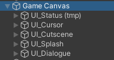
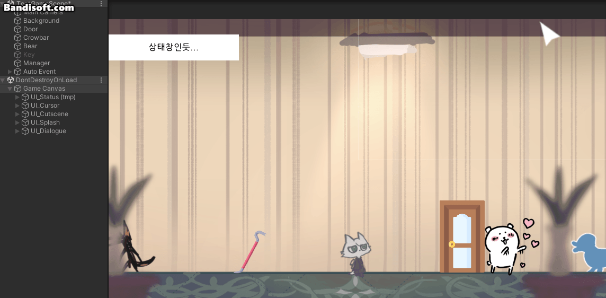
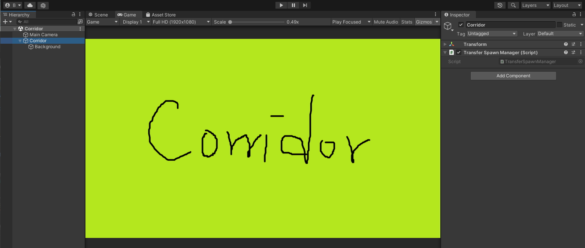
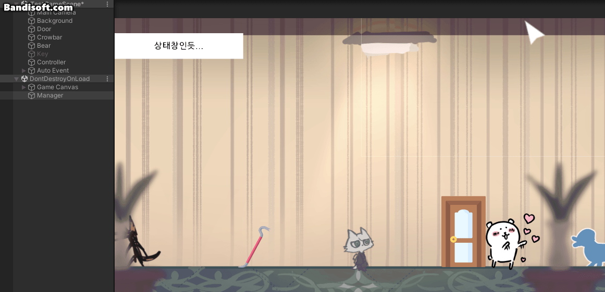
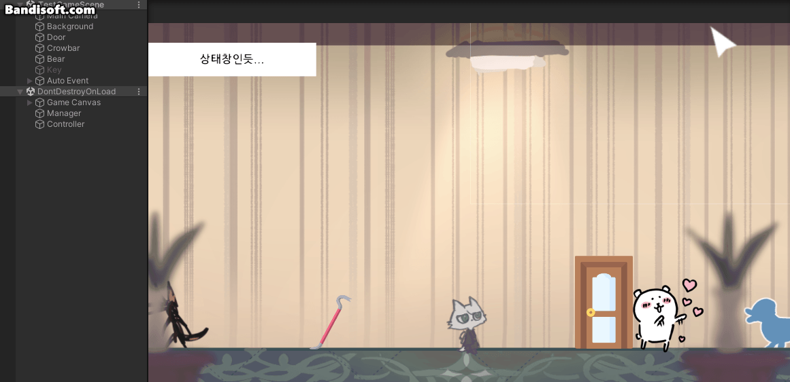

# 230308

- [[유니티 강좌] 단간론파를 유니티로 구현하기 Part 14 - 3 씬 이동 연출](https://youtu.be/RpSp-zgm5ZE?list=PLUZ5gNInsv_NG_UKZoua8goQbtseAo8Ow)
- [[유니티 강좌] 단간론파를 유니티로 구현하기 Part 14 - 2 스폰 위치 설정](https://youtu.be/z4kYoY9DWH4?list=PLUZ5gNInsv_NG_UKZoua8goQbtseAo8Ow)


## 1. 연속 이벤트 발생 시 UI 보이는 문제 해결

- 📑 **`DialogueManager.cs` 수정**

- `EndDialogue()` 코루틴 수정

  ```c#
  IEnumerator EndDialogue()
  {
      // ...
  
      // 다음 이벤트가 있으면, UI를 표시하지 않고 clickedInteractive 변수만 false로
      if (go_nextEvent != null)
      {
          InteractionController.clickedInteractive = false;
      }
  
      // 다음 이벤트가 없으면, UI를 표시하고 clickedInteractive 변수도 false로
      else
      {
          theInteractionController.SettingUI(true); // 커서, 상태창 보이기
      }
  
      SettingUI(false);   // 대사창, 이름창 숨기기
  
      // 모든 대화가 끝날 때까지 기다린 후, 다음 이벤트가 있으면 실행
      yield return new WaitUntil(() => !InteractionController.clickedInteractive);
  
      if (go_nextEvent != null)
      {
          go_nextEvent.SetActive(true);
          go_nextEvent = null;
      }
  }
  ```

  - 대화가 끝나면 `InteractionController`의 `SettingUI(true)` 함수를 무조건 호출했던 부분을 분기 처리해 준다.
    - 다음 이벤트가 있으면 UI를 표시하지 않고, `clickedInteractive`를 false로 해서, 다음 이벤트를 실행할 수 있도록 한다.
    - 다음 이벤트가 없으면 UI를 표시하고, `clickedInteractive`를 false로 되돌린다.


- 실행 결과

  


## 2. 맵 이동 연출

- 맵을 이동할 때, 페이드인/아웃 효과를 추가
- 신이 전환될 때, UI가 사라졌다가 다시 나타나는 연출을 구현해보자.
  - 어느 신으로 전환되어도 UI는 파괴되어선 X
  - UI를 파괴시키지 않는 스크립트를 작성해보자.


### 1. 신 전환 시 UI 파괴되지 않도록 구현

- Scripts 폴더에 etc 폴더를 생성하고, `DontDestroy.cs` 스크립트를 생성하였다.

- 📑 **`DontDestroy.cs` 생성**

- 변수

  ```c#
  public static DontDestroy instance;
  ```


- `Awake()` 함수 생성

  ```c#
  private void Awake()
  {
      if (instance == null)
      {
          instance = this;
          DontDestroyOnLoad(gameObject);
      }
  
      else
      {
          Destroy(gameObject);
      }
  }
  ```

  - `DontDestroy` 인스턴스(UI)가 없으면, 인스턴스에 자기 자신(UI)을 집어넣고, 자기 자신이 파괴되지 않게 한다.
  - 그렇지 않으면 중복되지 않도록 파괴한다.


- `Game Canvas` 오브젝트에 `Dont Destroy` 컴포넌트를 추가한다.

  


- 실행 결과

  

  - 맵을 이동했더니 UI가 사라지지 않았다.
  - 커서 이미지가 원래 상태로 되돌아 가지 않는 문제가 발생하였다.


### 2. 신 전환 시 페이드인/아웃 효과

- 📑 **`TransferManager.cs` 수정**

- 변수

  ```c#
  SplashManager theSplashManager; // 페이드인/아웃
  InteractionController theIC;    // UI 표시
  ```


- `Start()` 함수 생성

  ```c#
  private void Start()
  {
      theSplashManager = FindObjectOfType<SplashManager>();
      theIC = FindObjectOfType<InteractionController>();
  }
  ```


- `Transfer()` 코루틴 수정

  ```c#
  public IEnumerator Transfer(string p_sceneName, string p_locationName)
  {
      theIC.SettingUI(false); // UI 숨기기
  
      // 페이드아웃
      SplashManager.isFinished = false;
      StartCoroutine(theSplashManager.FadeOut(false, true));
      yield return new WaitUntil(() => SplashManager.isFinished);
  
      // 신 전환
      SceneManager.LoadScene(p_sceneName);
  }
  ```

  - 신이 전환될 때, UI가 사라지고 페이드아웃된다.


- `TransferDone()` 코루틴 생성

  ```c#
  // 맵 이동 완료
  public IEnumerator TransferDone()
  {
      // 페이드인
      SplashManager.isFinished = false;
      StartCoroutine(theSplashManager.FadeIn(false, true));
      yield return new WaitUntil(() => SplashManager.isFinished);
  
      theIC.SettingUI(true);	// UI 보이기
  }
  ```

  

- 그런데 이동이 완료되었을 때 호출해야 하는 `TransferDone()`를 언제 호출해야할지 모른다.

- 따라서 신 전환이 완료되었을 때를 알려주어야 한다.

- 📑 **`TransferSpawnManager.cs` 생성**

- 변수

  ```c#
  public static bool isSpawnTiming = false;	// 스폰해도 되는지 여부
  ```


- 📑 **`TransferManager.cs` 수정**

- `Transfer()` 코루틴 수정

  ```c#
  public IEnumerator Transfer(string p_sceneName, string p_locationName)
  {
      // ...
  
      // 신 전환
      TransferSpawnManager.isSpawnTiming = true;
      SceneManager.LoadScene(p_sceneName);
  }
  ```

  - `isSpawnTiming`을 true로 바꿔준 후, 신을 전환한다.


- 📑 **`TransferSpawnManager.cs` 수정**

- `Start()` 함수

  ```c#
  void Start()
  {
      if (isSpawnTiming)
      {
          TransferManager theTM = FindObjectOfType<TransferManager>();
  
          isSpawnTiming = false;
          StartCoroutine(theTM.TransferDone());
      }
  }
  ```


- `Corridor` 신에 빈 오브젝트 `Corridor`를 만들어준 후, 거기에 `Transform Spawn Manager` 컴포넌트를 추가한다.

  


### 3. 신이 전환되지 않는 오류가 발생하다...🤒🤯🤕

- 그런데 이렇게 하면 될 줄 알았으나... 페이드 효과를 넣자마자 다음 신으로 전환이 되지 않았다.
- `Transfer()` 코루틴의 `yield return new WaitUntil(() => SplashManager.isFinished);` 구문으로 넘어가지 않는 문제...
- 그래서 디버깅 해보았더니 `DialogueManager.cs`와 `MainMenu.cs`와 `InteractionEvent.cs`의 `Update()` 함수를 계속 왔다갔다 하고 있었다...
  - Game Canvas에 `Main Menu` 컴포넌트 있길래 삭제함..
- `theIC.settingUI(false);` 뒤에 yield 구문을 두었더니, 씬이 전환되지 않았다. `theIC.settingUI(false);`를 지우니 신이 전환되었다.


- `Interaction Controller`의 `SettingUI(false)`를 호출하는 것이, 신 전환이 안 되는 것과 무슨 상관이 있을까...
- `SettingUI(true)`는 또 괜찮은 걸 보면, 게임 오브젝트가 비활성화 되는 것과 연관이 있어 보인다.


### 4. 신 전환 오류 해결

- 문제 코드

  ```c#
  // TransferManager.cs
  
  public IEnumerator Transfer(string p_sceneName, string p_locationName)
  {
      theIC.SettingUI(false); // 이 부분에서 작동 ❌
  
      // ...
  }
  ```

  - `theIC.SettingUI(false);` 구문만 넣으면 다음 신으로 전환이 되지 않았다.

  - 함수 인자로 `true`를 주면 정상 작동하였다.

  - 그러면 UI를 비활성화하는 과정에서 문제가 생겼겠구나!


- 원인
  - [Load Scene with Coroutine](https://forum.unity.com/threads/load-scene-with-coroutine.702677/)
  - 여기 답변을 보고 설마...? 했는데 진짜였다...
  -  `Interaction Controller`가 `UI_Cursor` 오브젝트의 컴포넌트였기 때문에, `Transfer()` 코루틴에서 `UI_Cursor`를 비활성화하는 `theIC.SettingUI(false)`를 호출했을 때 `Interaction Controller`도 비활성화되었기 때문에 신을 전환하지 못했던 것이었다..


- 해결

  - 그래서 `Controller` 오브젝트를 만든 후, `Interaction Controller` 컴포넌트를 옮겨주었다.

    

    

  - 신이 전환되면서 `Interaction Controller`에 넣어주었던 카메라 정보가 소실되고, 오류를 일으켜서 아예 그 신의 메인 카메라를 넣어주도록 코드를 변경해주었다.

    ```c#
    void CheckObject()
    {
        // Vector2 pos = cam.ScreenToWorldPoint(Input.mousePosition);
    	Vector2 pos = Camera.main.ScreenToWorldPoint(Input.mousePosition);
        
        // ...
    }
    ```

    

  - 신이 전환되면서 `Manager` 오브젝트가 파괴되지 않도록, `TransferManager.cs`에 `Awake()` 함수를 생성한 후, 다음과 같은 코드를 작성하였다.

    ```c#
    public static TransferManager Instance;
    
    private void Awake()
    {
        if (Instance == null)
        {
            Instance = this;
            DontDestroyOnLoad(gameObject);
        }
    
        else
        {
            Destroy(gameObject);
        }
    }
    ```


- 실행 결과

  

  - 컴퓨터를 교체했더니 기존 페이드인/아웃 효과가 너무 빨리 끝나길래, `Splash Manager`의 `Fade Speed`를 0.005로, `Fade Slow Speed`를 0.001로 변경하였다.
  - UI도 잘 사라지고, 신 전환도 잘 되고, UI가 다시 나타나는 것도 잘 된다!
  - 하지만 아직 커서 이미지가 되돌아 오지 않는 문제는 그대로이다.


### 5. 커서 이미지 오류 해결

- `Controller` 오브젝트도 신이 전환될 때 파괴되면 안 된다.

- 따라서 `InteractionController.cs`에 `Awake()` 함수를 만들어, 다음과 같은 코드를 작성해 준다.

  ```c#
  public static InteractionController Instance;
  
  private void Awake()
  {
      if (Instance == null)
      {
          Instance = this;
          DontDestroyOnLoad(gameObject);
      }
  
      else
      {
          Destroy(gameObject);
      }
  }
  ```


- 실행 결과

  

  - 커서의 모습이 제대로 돌아왔다.
  - 완벽!!


## 3. 다음에 할 일

- ~~이벤트 연속으로 발생시키기~~
- ~~맵 이동 구현해보기~~
- ~~자동 이벤트 시 UI 노출되는 현상 수정~~
- 신 전환 후 자동 이벤트
- 사운드 관련 기능들 구현해보기 (효과음, 보이스, 배경 음악)
- 오브젝트 클로즈업(하면서 화면 이동)하기??
- 마우스 커서에 애니메이션? 넣기
- 마우스 커서에 이펙트 넣기
- 오브젝트 획득 및 활용
- 한 번만 발생하는 이벤트 구현
- **오브젝트 클릭 시, 강조하는 이펙트 넣기 & 코루틴으로 대사창 띄우는 시간 조정하기**


## 4. 후기

- 영상 둘 모두 어렵진 않았는데, 중간에 이상한 오류가 나서 이틀 동안 고치느라 머리가 너무 아팠다... 예전에 앱 프로그래밍 팀플했을 때 DB에 사진 넣는다고 3일 동안 고생했던 일이 생각났다.

- 이번에야말로 답이 없는 건가 생각했는데, 그래도 오류 해결에 대한 힌트를 찾아서 다행이었다. 이대로만 가자... 파이팅!!