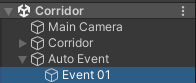

# 230311

- [[유니티 강좌] 단간론파를 유니티로 구현하기 Part 14 - 4 씬 이동 후 자동 이벤트](https://youtu.be/7FPYjY83qrY?list=PLUZ5gNInsv_NG_UKZoua8goQbtseAo8Ow)


## 1. 신 전환 후 자동 이벤트

### 1. 새로운 신에 자동 이벤트 오브젝트 생성

- `Corridor` 신에 빈 오브젝트 `Auto Event`와 `Event 01`을 생성한다.

  


- `Event 01` 오브젝트에 `Interaction Event` 컴포넌트를 추가 후, 다음과 같이 설정해 준다.

  


- 실행 결과

  

  - 자동 이벤트 객체의 `Interaction Event` 컴포넌트에, UI의 스탠딩 이미지 부분을 채워주지 않았기 때문에, `NullReferenceException`이 발생하는 문제
  - 페이드인 중인데 자동 이벤트가 실행되는 문제


### 2. 신 전환 후 스탠딩 이미지가 보이지 않는 오류😢

- 원인

  - `Interaction Event` 컴포넌트에 스탠딩 이미지를 넣고 싶지만, 새로운 신에는 UI 오브젝트를 만들지 않아서 넣을 수 없다.
  - 일단은 `TestGameScene`에서 만들었던 UI 관련 오브젝트들을 복사해서 붙여넣어 보았다.

  - 하지만, 그러면 `DontDestroy.cs`의 코드에 의해 Corridor의 UI 오브젝트들이 전부 파괴되고, 이전 신의 UI 오브젝트들로 바뀌기 때문에, 새로운 자동 이벤트에 넣어주었던 스탠딩 이미지의 Transform 정보도 파괴되어 버린다..

  - 그래서 `Standing Image` 오브젝트의 프리팹도 만들어 보았으나... 에러 문구는 뜨지 않지만 여전히 스탠딩 이미지는 보이지 않았다. (애초에 이럴 때 쓰는 게 아닌 것 같다..)


- 해결
  - 관련 코드를 모두 뜯어 고쳤다.
  - 어짜피 `Manager` 오브젝트와 UI 관련 오브젝트는 신이 전환되어도 파괴되지 않게 처리해 두었으니, `Manager` 오브젝트에서 스탠딩 이미지에 관한 Transform 정보를 받아오면 신이 전환되어도 유지되지 않을까 생각하여 다음과 같은 작업을 진행하였다.


- 📑 **`Dialogue.cs` 수정**

- `Dialogue` 클래스 수정

  ```c#
  [System.Serializable]
  public class Dialogue
  {
      // ...
  
      //[Header("스탠딩 이미지")]
      //public Transform tf_standing;
      
      // ...
  }
  ```

  - 스탠딩 이미지에 대한 Transform 정보를 저장하는 부분을 삭제하였다.

  - 아래와 같이, 유니티에서 `Interaction Event` 컴포넌트에 스탠딩 이미지의 Transform 정보를 일일이 넣어주던 부분이 없어져 있는 것을 확인할 수 있다.

    <table>
        <tr>
        	<th>Before</th>
        	<th>After</th>
        </tr>
        <tr>
        	<td></td>
            <td></td>
        </tr>
    </table>


- 📑 **`InteractionEvent.cs` 수정**

- `GetDialogue()` 함수 수정

  ```c#
  public Dialogue[] GetDialogue()
  {
      // ...
  
      for (int i = 0; i < dialogueEvent.dialogues.Length; i++)
      {
          // dialogueEvent에 넣은 Standing Image 오브젝트를 임시 변수에 넣기
          // t_dialogueEvent.dialogues[i].tf_standing = dialogueEvent.dialogues[i].tf_standing;
  
          // ...
      }
  }
  ```

  - `dialogues` 배열에는 스탠딩 이미지의 Transform 정보를 저장할 필요가 없다. (정보를 넣어주지 않으니깐)


- 📑 **`DialogueManager.cs` 수정**

- `ChangeSprite()` 함수 수정

  ```c#
  void ChangeSprite()
  {
  	// StartCoroutine(theSpriteManager.SpriteChangeCoroutine(dialogues[dialogueCnt].tf_standing, dialogues[dialogueCnt].spriteName[contextCnt]));
      StartCoroutine(theSpriteManager.SpriteChangeCoroutine(dialogues[dialogueCnt].spriteName[contextCnt]));
  }
  ```

  - 변경할 스탠딩 이미지의 Transform 정보를 인자로 넘겨주던 부분을 제거하였다.
  - 즉, 엑셀에 있던 Sprite 이미지의 이름만 인자로 넘어가게 된다.


- 📑 **`SpriteManager.cs` 수정**

- 변수

  ```c#
  [SerializeField] Transform target;  // 변경할 이미지 타겟
  ```

  - 유니티에서 `Interaction Controller` 컴포넌트에 넣었던 Transfrom 정보를, 이 Manager에서 넣기로 한다.

  - 유니티로 돌아가 보면, Transform 속성을 받는 칸이 생겨있는 것을 확인할 수 있다.

    

  

  - Target에 스탠딩 이미지 UI의 Transform 정보를 드래그해서 넣으면 된다.

    


- `SpriteChangeCoroutine()` 코루틴 수정

  ```c#
  public IEnumerator SpriteChangeCoroutine(string p_spriteName)
  {
      Image t_image = target.GetComponentInChildren<Image>();
  
      // ...
  }
  ```

  - 인자로 Transform p_target을 받아왔던 것을, 유니티에서 직접 SerializableField로 받아오는 것으로 변경하였다.
  - 인자를 제외한 나머지 코드는 동일하다.


- 실행 결과

  

  - 신이 전환되기 전이나, 전환된 후에도 스탠딩 일러스트가 잘 나오는 것을 확인할 수 있다.


### 3. 이동이 완전히 끝난 후에 이벤트 실행하기

- 📑 **`TransferManager.cs` 수정**

- 변수

  ```c#
  public static bool isFinished = true;  // 이동이 완전히 끝났는지
  ```


- `Transfer()` 코루틴 수정

  ```c#
  public IEnumerator Transfer(string p_sceneName, string p_locationName)
  {
      isFinished = false;
      // ...
  }
  ```


- `TransferDone()` 코루틴 수정

  ```c#
  public IEnumerator TransferDone()
  {
      // ...
      isFinished = true;
  }
  ```

  - yield 뒤에 추가한다.


- 📑 **`InteractionEvent.cs` 수정**

- `Update()` 함수 수정

  ```c#
  private void Update()
  {
      // 자동 이벤트이고, 데이터 파싱 후 테이블에 모두 저장되면 (오류 방지)
      // + 이동이 모두 끝났다면 (이동을 안하는 경우도 기본값이 true이므로 자동 이벤트가 있으면 내부가 실행됨)
      if (isAutoEvent && DatabaseManager.isFinish && TransferManager.isFinished)
      {
          // ...
      }
  }
  ```

  - 조건을 하나 더 추가해 준다.
  - `TransferManager`의 `isFinished`는 기본값이 true이므로, 이동을 하지 않거나 이동이 모두 끝난 경우 모두, 자동 이벤트가 있다면 그 이벤트를 실행할 것이다.


- 실행 결과

  


### 4. 신 전환 후, 이벤트 전에 UI 깜빡이는 현상 방지

- 컴퓨터가 좋아져서 그런가 나는 UI가 깜빡이지 않지만, 혹시 모르니 해당 현상을 방지하고자 한다.
- 어떻게 깜빡이는지는 영상 참고 → [[유니티 강좌] 단간론파를 유니티로 구현하기 Part 14 - 4 씬 이동 후 자동 이벤트 (2:11)](https://youtu.be/7FPYjY83qrY?list=PLUZ5gNInsv_NG_UKZoua8goQbtseAo8Ow&t=131)


- 📑 **`TransferManager.cs` 수정**

- `TransferDone()` 코루틴 수정

  ```c#
  public IEnumerator TransferDone()
  {
      // ...
  	
      yield return new WaitForSeconds(0.3f);
      if (!DialogueManager.isWaiting)
          theIC.SettingUI(true);  // UI 보이기
  }
  ```

  - 0.3초 정도 대기 후, `DialogueManager`의 `isWaiting`이 false면 대기중인 이벤트가 없다는 뜻이므로, 그때 UI를 표시한다.
  - true면 그냥 무시한다. (UI를 표시하지 않는다.)


## 2. 다음에 할 일

- ~~이벤트 연속으로 발생시키기~~
- ~~맵 이동 구현해보기~~
- ~~자동 이벤트 시 UI 노출되는 현상 수정~~
- ~~신 전환 후 자동 이벤트~~
- 오브젝트 등장 조건
- 사운드 관련 기능들 구현해보기 (효과음, 보이스, 배경 음악)
- 오브젝트 클로즈업(하면서 화면 이동)하기??
- 마우스 커서에 애니메이션? 넣기
- 마우스 커서에 이펙트 넣기
- 오브젝트 획득 및 활용
- 한 번만 발생하는 이벤트 구현
- 인벤토리 기능
- **오브젝트 클릭 시, 강조하는 이펙트 넣기 & 코루틴으로 대사창 띄우는 시간 조정하기**


## 3. 후기

- 언제나 신 전환하는 과정이 제일 어려운 것 같다. 신을 전환하면 오브젝트가 파괴되는데, 만약 A를 파괴하지 않고 다음 신으로 넘겼다고 치면 A의 컴포넌트 속성이 Missing 되어 버리거나, 새로운 신에 만들어 둔 오브젝트 B의 속성에 A에 관한 속성을 드래그해서 넣지 못할 때 제일 곤란한 것 같다.

- 오늘도 비슷한 문제였는데, 새로운 신 `Corridor`에서 자동 이벤트를 만들 때, `Interaction Event` 컴포넌트에 `Standing Image` 오브젝트의 Transform 정보를 넣어야 하는데 가져올 방법이 없었던...

  - 그렇다고 `Corridor` 신에도 미리 UI 오브젝트를 만들면 되는가? → X (만들어도 `DontDestroy` 컴포넌트 때문에 파괴된다.)
  - 그럼 게임 실행 중, `DontDestroyOnLoad`된 오브젝트에서 속성들을 가져올 수 있는가? → 구글링을 해봤으나 일단 나는 찾지 못했고, 바람직해 보이지 않았다...

  - 그래서 한 3시간 고민하다가 코드를 처음부터 뜯어고쳐 보자고 마음을 먹었고, 어떻게든 성공할 수 있었다.

- 유니티는 나에게 중요한 건 꺾이지 않는 마음이란 걸 계속 상기시켜 주는 것 같다... 하지만 그래도 나에게 오류를 좀 덜 주면 안 될까?? OTL... 🤕😢