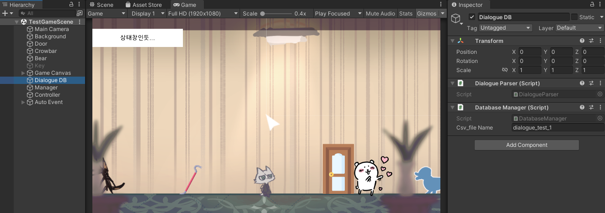
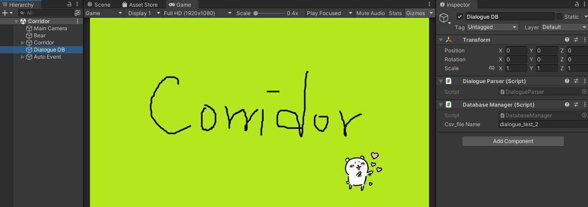
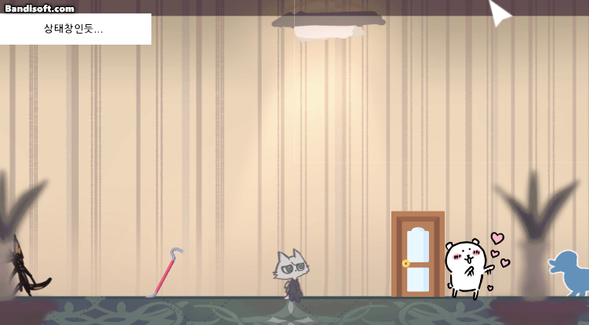
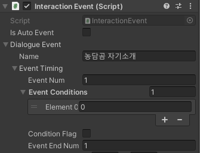
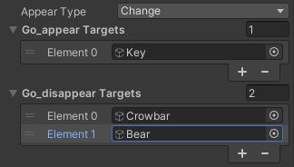
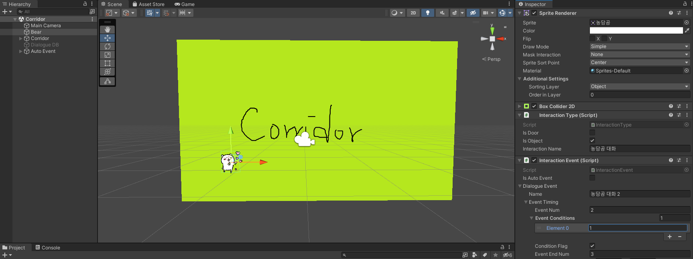
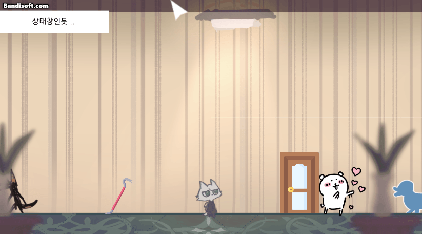
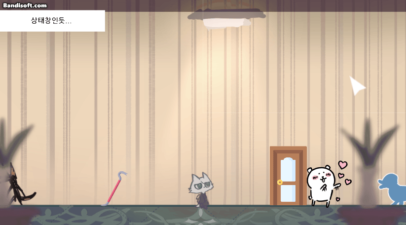

# 230325

- [[유니티 강좌] 단간론파를 유니티로 구현하기 Part 16 캐릭터 등장 조건](https://youtu.be/b0xHAtmYMhI?list=PLUZ5gNInsv_NG_UKZoua8goQbtseAo8Ow)


## 1. ❌ ~~엑셀 파일 추가~~ (기존 파일과 통합해야 함)

> 아래에서 내가 진행한 내용은 쓸데없는 일이었다.

- 우선 이벤트 별로 구분하기 편하도록, 복도 신에서 쓸 대사들을 `dialogue_test_2.csv`에 새로 작성해 주었다.

- `Manage` 오브젝트의 `Database Manager`가 csv 파일의 이름을 받아와서, `Dialogue Parser`가 파싱한 다음 DB에 저장하는데, `Manage` 오브젝트는 신이 전환되어도 파괴되지 않기 때문에, 엑셀 파일을 변경할 수 없다.

- 따라서 신마다 어떤 엑셀 데이터를 파싱할 것인지 지정하는 게 낫겠다 싶어, `Database Manager`와 `Dialogue Parser` 컴포넌트를 분리해 주기로 하였다.

- `TestGameScene`과 `Corridor` 신에 `Dialogue DB` 오브젝트를 생성하고, 거기에 `Database Manager`와 `Dialogue Parser` 컴포넌트를 추가해 주었다.

  

  


- 실행 결과

  

  - ~~신 전환 후 자동 이벤트에, 새로 작성한 대사가 출력되는 것을 확인할 수 있다.~~
  - 기존 `dialogue_test_1.csv` 파일에 이어서 적었다.


## 2. 캐릭터의 등장 & 퇴장 조건

### (1) 초기 세팅

- **📑 `DatabaseManager.cs` 스크립트 수정**

- 변수

  ```c#
  public bool[] eventFlags = new bool[100];
  ```

  - i번 이벤트가 실행되면, `eventFalgs[i]`의 값을 true로 변경한다. (`InteractionEvent`에서)
  - 따라서, 이미 본 이벤트의 정보를 알 수 있다.


- **📑 `Dialogue.cs` 스크립트 수정**

- `EventTiming` 커스텀 클래스 생성

  ```c#
  [System.Serializable]
  public class EventTiming
  {
      public int eventNum;            // 현재 이벤트의 번호
      public int[] eventConditions;   // 조건이 되는 이벤트들의 번호 리스트
      public bool conditionFlag;      // true: eventConditions 이벤트를 봤을 때 등장 / false: 안 봤을 때 등장
      public int eventEndNum;         // 이 번호의 이벤트를 보면 무조건 퇴장
  }
  ```


- `DialogueEvent` 커스텀 클래스 수정

  ```c#
  [System.Serializable]
  public class DialogueEvent
  {
      public string name;
      public EventTiming eventTiming;
  
      // ...
  }
  ```


### (2) 등장 및 퇴장 조건이 되는 이벤트 설정

- `Bear` 오브젝트의 `Interaction Event` 컴포넌트 중 `Event Timing`의 내용을 다음과 같이 설정한다.

  

  - `Event Num` = 1: 현재 대화 이벤트 번호가 1번이라는 의미이다.
  - `Event Conditions`: 1번 이벤트가 등장하기 위한 조건
    - `Size` = 1: 이 이벤트의 등장 조건이 1개라는 의미이다.
    - `Element[0]` = 0, `Condition Flag` = false: 0번째 이벤트가 false인 경우, 즉 없는 경우 1번 이벤트를 등장시킨다. (우리는 0번째 이벤트가 없기 때문에, 무조건 이 이벤트가 실행된다.)
  - `Event End Num` = 1: 하지만 무조건 등장만 시키면 안 되므로, 1번 이벤트, 즉 자기 자신이 끝나면 캐릭터가 사라지도록 한다.


- 1번 이벤트가 종료된 후 캐릭터가 사라져야 하기 때문에, `Go_disappear Targets`에 `Bear` 오브젝트를 추가한다.

  


- 즉, 0번 이벤트를 보지 않았으면 캐릭터가 등장해서, 해당 캐릭터를 클릭하면 1번 이벤트를 볼 수 있음을 뜻한다.
- 1번 이벤트를 보고 나면 캐릭터가 퇴장해서, 1번 이벤트를 볼 수 없다.


### (3) 실질적 기능 코드 작성

- **📑 `InteractionEvent.cs` 스크립트 수정**

- `GetDialogue()` 함수 수정

  ```c#
  // DatabaseManager에 저장된 실제 대사 데이터를 꺼내온다.
  public Dialogue[] GetDialogue()
  {
      DatabaseManager.instance.eventFlags[dialogueEvent.eventTiming.eventNum] = true; // 현재 이벤트의 실행 여부를 true로 설정
  	
      // ...
  }
  ```

  - `dialogueEvent.eventTiming.eventNum`은 유니티에서 설정한, 현재 실행중인 이벤트의 번호이다.
  - 현재 이벤트의 번호를 인덱스로 하여, `eventFlags[eventNum]`의 값을 true로 변경한다.
  - `eventNum`번 이벤트를 이미 보았음을 의미한다.


- `CheckEvent()` 함수 생성

  ```c#
  // 이 이벤트(캐릭터)를 등장시킬지 말지 결정하는 함수
  bool CheckEvent()
  {
      bool t_flag = true;	// true면 등장, false면 등장 X
  
      for (int i = 0; i < dialogueEvent.eventTiming.eventConditions.Length; i++)
      {
          // 1. 등장 조건과 본 이벤트가 일치하지 않으면, 캐릭터 등장 X
          // 조건 이벤트가 실행되었는지의 여부 (true, false)
          // 해당 이벤트를 보아야 등장하는지의 여부 (true, false)
          if (DatabaseManager.instance.eventFlags[dialogueEvent.eventTiming.eventConditions[i]] != dialogueEvent.eventTiming.conditionFlag)
          {
              t_flag = false;
              break;
          }
  
          // 2. 캐릭터 퇴장 조건이 되는 이벤트를 보았다면, 캐릭터 등장 X
          if (DatabaseManager.instance.eventFlags[dialogueEvent.eventTiming.eventEndNum])
          {
              t_flag = false; // 캐릭터 등장 X
          }
      }
  
      return t_flag;
  }
  ```

  - `eventConditions` 배열의 길이만큼 반복문을 돈다.
    - ① `eventConditions[i]` 값에 해당하는 번호의 **이벤트를 보았는지의 여부** (`eventFlags`)와, **그 이벤트를 보았을 때 캐릭터를 등장시키는지의 여부**(`conditionFlag`)가 같지 않으면, 캐릭터를 등장시키지 않는다. (`t_flag` = false)
      - 이게 무슨 말이냐면,
      - 만약 내가 1번 이벤트를 보았고, 3번 이벤트를 보지 않았다면, `DatabaseManager`의 `eventFlags[1]` = true, `eventFlags[3]` = false일 것이다.
      - 현재 5번 이벤트를 보기 위한 `eventConditions` = [1, 3]이라고 하자.
        - ✔️ `conditionFlag` =  false인 경우, 1번 이벤트와 3번 이벤트를 모두 보지 않아야 캐릭터가 등장하게 될 것이다.
        - 즉, `eventFlags[1]` = `eventFlags[3]` = `conditionFlag` = false인 경우 캐릭터가 등장한다.
        - 하지만, 현재 `eventFlags[1]` = true이기 때문에, `eventFlags[1]` != `conditionFlag`가 되어 캐릭터가 등장하지 않게 된다.
        - ✔️ `conditionFlag` =  true인 경우, 1번 이벤트와 3번 이벤트를 모두 보아야 캐릭터가 등장하게 될 것이다.
        - 즉, `eventFlags[1]` = `eventFlags[3]` = `conditionFlag` = true인 경우 캐릭터가 등장한다.
        - 하지만, 현재 `eventFlags[3]` = false이기 때문에, `eventFlags[3]` != `conditionFlag`가 되어 캐릭터가 등장하지 않게 된다.
    - ② **`eventEndNum`에 해당하는 이벤트**를 보았다면, 캐릭터를 퇴장시킨다. (`t_flag` = false)


- `Start()` 함수 수정

  ```c#
  private void Start()
  {
      // ...
  
      bool t_flag = CheckEvent(); // 이 이벤트(캐릭터)를 등장시킬지
      gameObject.SetActive(t_flag);
  }
  ```


### (4) 캐릭터 등장 & 퇴장

- 기존 `TestGameScene`에 있는 농담곰과 대화하면 그 맵의 농담곰이 퇴장하고, `Corridor`에 농담곰이 등장하도록 해보자.

-  `TestGameScene`에 있는 농담곰은 위에서 설정한대로 두고, `Corridor` 신에 농담곰을 하나 추가한 후 `Interaction Event` 컴포넌트를 다음과 같이 설정한다.

  

  - 이 농담곰과 대화하는 이벤트의 번호는 2번 (`Event Num` = 2)
  - 조건이 되는 이벤트는 1번 (`Event Conditions` = [1])
  - 1번 이벤트를 보아야 캐릭터가 등장한다. (`Condition Flag` = true)
  - 3번 이벤트를 보아야 캐릭터가 퇴장한다. (`Event End Num` = 3, 아직 3번 이벤트는 없음.)
  - 아 이거 1씩 늘려야겠다 (자동 이벤트를 2번으로 하고...)


- 실행 결과
  - 농담곰과 대화하지 않은 후 맵을 이동
  
    
  
  
  
  - 농담곰과 대화한 후 맵을 이동
  
    


## 3. 다음에 할 일

- ~~오브젝트 등장 조건~~
- 사운드 관련 기능들 구현해보기 (효과음, 보이스, 배경 음악)
- 오브젝트 클로즈업(하면서 화면 이동)하기??
- 마우스 커서에 애니메이션? 넣기
- 마우스 커서에 이펙트 넣기
- 오브젝트 획득 및 활용
- 한 번만 발생하는 이벤트 구현
- 인벤토리 기능
- **오브젝트 클릭 시, 강조하는 이펙트 넣기 & 코루틴으로 대사창 띄우는 시간 조정하기**


## 4. 후기

- 코드가 살짝 헷갈린다. 이벤트에 번호 붙이는 거 안 겹치도록 조심해야 할 것 같다.

- 할 일이 떠올랐는데 꽤 오래 걸릴 것 같다...ㅠㅠ
  - 복도 맵에도 문 하나 만들어서, `TestGameScene`으로 이동할 수 있도록 하기
  - 이벤트 종료 후 다시 연속으로 자동 이벤트 나올 때, 농담곰이 바로 사라지는 문제도 해결하기