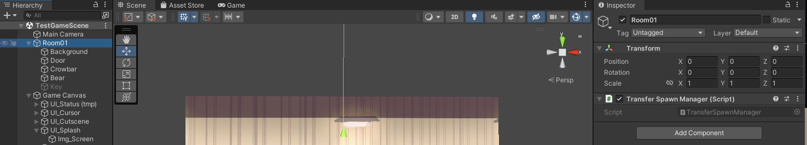
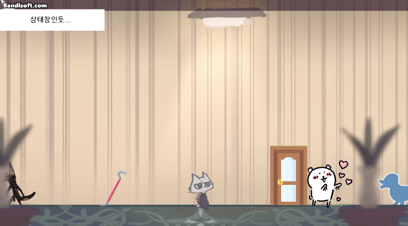
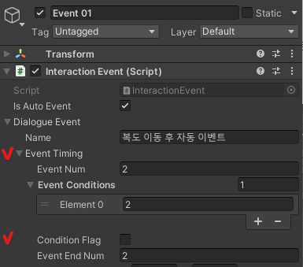

# 230328

- [[유니티 강좌] 단간론파를 유니티로 구현하기 Part 16 캐릭터 등장 조건](https://youtu.be/b0xHAtmYMhI?list=PLUZ5gNInsv_NG_UKZoua8goQbtseAo8Ow&t=478)

## 1. 복도 → 방으로 신 전환

### (1) 신 전환 구현

- 그냥 `Corridor` 신에서 문을 만들어 주고 신 이름만 넣어 주면 되는 줄 알았는데...
- 이번에도 신 이동 후 `TransferDone()` 코루틴이 작동하지 않는 오류가 발생하였다.
- 이번에는 UI를 숨기는 과정에는 문제가 없어 보였다.

- 이 문제로 2시간 동안 머리 싸맸는데 원인은 아주아주 간단했다. `TestGameScene`에 `Transfer Spawn Manager` 컴포넌트를 추가하지 않았기 때문이다...
- 그래도 구글링하다가 좋은 자료를 발견했다. [[유니티 개념] DontDestroyOnLoad](https://blog.naver.com/rnlgus1126/222296249508)

- 우선 `TestGameScene` 신에 맵 `Room01`이라는 빈 오브젝트를 만들었다.

  

  - 자식으로 맵 구성 오브젝트들을 싹 다 넣어주었다.
  - `Transfer Spawn Manager` 컴포넌트를 추가해 주었다.

- 실행 결과

  

### (2) 맵 이동 후 자동 이벤트가 여러 번 재생되는 문제

- 복도로 2번 가면 2번 자동 이벤트가 실행된다.

  

- `Corridor` 신의 `Auto Event` 오브젝트의 자식으로 있는 `Event 01`의 컴포넌트를 수정해 주었다.

- `Interaction Event`의 `Event Timing`을 다음과 같이 수정한다.

  

  - 이 이벤트의 `Event Num`을 2로 변경해 주었다.
  - 조건이 되는 이벤트는 2번 (`Event Conditions` = [2], 즉 자동 이벤트 자기 자신)
  - ❣️2번 이벤트를 **보지 않아야** 자동 이벤트가 재생된다. (`Condition Flag` = false)
  - 2번 이벤트를 보면 이벤트가 비활성화 된다. (`Event End Num` = 2, 이것만 했을 때는 별 효과가 없었다.)

- 실행 결과

  

## 2. 이벤트 종료 후 연속 이벤트가 끝나기 전, 오브젝트가 바로 사라지는 문제

- 코루틴도 만들어 보고 별 짓을 다 해보았지만, 자동 이벤트가 끝나는 것을 확인하는 방법을 찾을 수 없었다.
- A 이벤트를 본 후 B 이벤트가 자동으로 재생된다고 하자.
- `DialogueManager`의 `EndDialogue()` 코루틴은 한 이벤트마다 실행되기 때문에, B 이벤트까지 끝난 후 캐릭터를 비활성화를 하고 싶어도 A 이벤트가 끝나면 비활성화가 된다.
- 현재는 이 문제를 해결할 방도가 떠오르지 않는다. **일단은 연속 이벤트를 최대한 쓰지 않기로 했다.**

## 3. 다음에 할 일

- ~~오브젝트 등장 조건~~
- ~~복도 맵에도 문 하나 만들어서, `TestGameScene`으로 이동할 수 있도록 하기~~
- **이벤트 종료 후 다시 연속으로 자동 이벤트 나올 때, 농담곰이 바로 사라지는 문제도 해결하기** (해결 ❌)
- **한 신에서 오브젝트가 나타나고 사라진 다음, 다른 신을 들렀다 다시 오면 상태가 초기화되는 문제 해결하기**
- 사운드 관련 기능들 구현해보기 (효과음, 보이스, 배경 음악)
- 오브젝트 클로즈업(하면서 화면 이동)하기??
- 마우스 커서에 애니메이션? 넣기
- 마우스 커서에 이펙트 넣기
- 오브젝트 획득 및 활용
- 한 번만 발생하는 이벤트 구현
- 인벤토리 기능
- **오브젝트 클릭 시, 강조하는 이펙트 넣기 & 코루틴으로 대사창 띄우는 시간 조정하기**

## 4. 후기

- 오늘은 해결할 오류가 너무 많아서 힘들었다. 하나는 굉장히 간단한 오류였는데 내가 전날 술을 마셔서 그런지 바보같이 2시간이나 삽질했고, 하나도 2시간 동안 정말 이곳 저곳에 변수 선언도 해보고 코루틴도 만들어서 이벤트 종료 상황이 true 될 때 까지 기다려보기도 했는데, 아직 고치지 못했다.
- `DialogueManager.cs`에서 자동 이벤트가 있을 때, 모든 이벤트를 보고 `go_nextEvent.SetActive(true);`를 하고 `go_nextEvent = null;`를 하는 부분이 있는데, 위 두 구문이 A 이벤트가 끝난 직후 동시에 일어나다 보니 B 이벤트가 끝나는 정확한 시점을 찾기 힘들었다. 어떻게 고칠 방법이 없을까... 정 안 되면 자동 이벤트와 캐릭터 등장 퇴장을 동시에 구현하지 않는 방향으로 가야할 것 같다.
- 보다가 또 오류를 하나 발견했다. `TestGameScene`에서 농담곰과 대화하면 빠루가 사라지고 열쇠가 나타나는데, 다른 신으로 갔다가 돌아오니 다시 빠루만 보이게 되었다. 비활성화 상태를 유지할 수 있는 방법이 없을까?
- 또한, `TestGameScene`에서 농담곰과 대화하지 않아도 복도로 나갔다 들어오면, `TestGameScene`의 농담곰이 사라져 있다. 설정을 잘못한 탓일까?