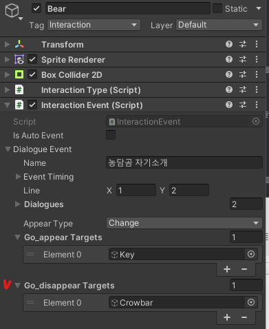
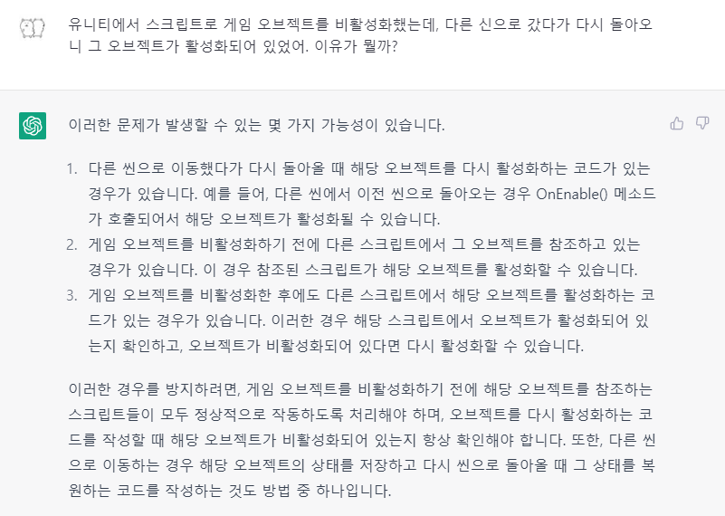
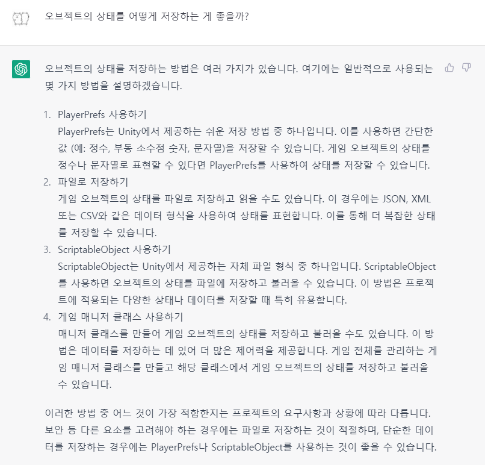
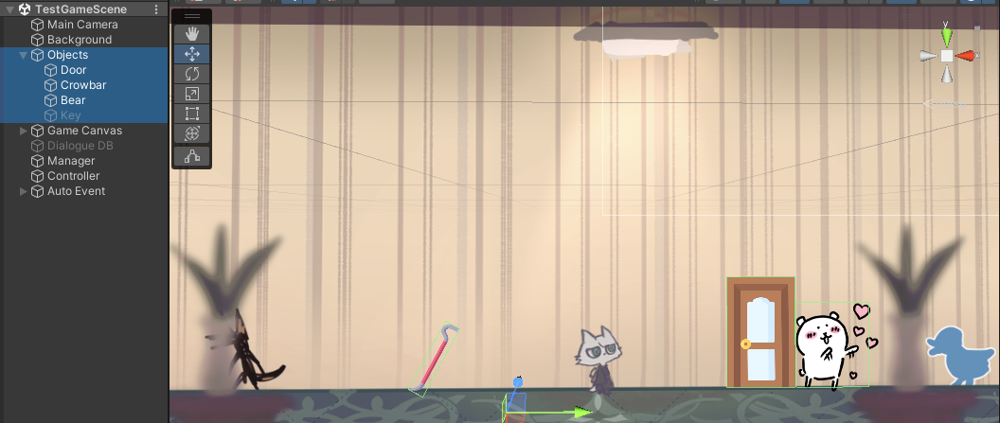
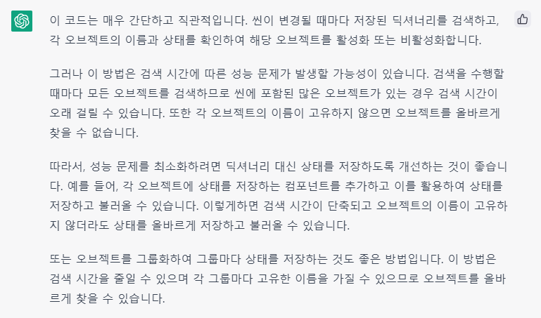

# 230330

- [[유니티 강좌] 단간론파를 유니티로 구현하기 Part 16 캐릭터 등장 조건](https://youtu.be/b0xHAtmYMhI?list=PLUZ5gNInsv_NG_UKZoua8goQbtseAo8Ow&t=478)


## 1. 오브젝트의 활성화 상태가 저장되지 않는 오류

### (1) 오류

- 대화가 끝난 후 오브젝트가 등장 혹은 퇴장이 된 경우, 신을 전환하고 다시 돌아오니 그 상태가 저장되지 않는 현상을 발견했다.

- 해당 오류

  

  - 농담곰과 대화한 후 빠루가 사라지고 열쇠가 나타나지만, 복도로 나간 뒤 다시 방으로 들어오면 빠루만 보이는 것을 확인할 수 있다.


- 이벤트가 끝나고 농담곰이 바로 사라지지 않는 이유는, 컴포넌트를 살짝 수정했기 때문이다.

- `Bear` 오브젝트의 `Interaction Event` 컴포넌트에서, `Go_disappear Targets` 배열에 넣었던 `Bear` 오브젝트 요소를 삭제하였다.

  


### (2) 해결

- 일주일 넘게 삽질만 했다...

- ChatGPT에게 물어보았다. (근데 솔직히 무슨 말인지 모르겠다.)

  

  


- 우선 상태가 바뀌는 오브젝트 배열을 `DialogueManager`에서 받아와서, 오브젝트의 이름을 Key로, 오브젝트의 마지막 상태를 Value로 하는 딕셔너리에 저장한 다음, 신을 불러올 때 해당 상태로 설정하는 코드를 작성하기로 했다. (물론 이 결론에 도달하기까지 수많은 삽질이 있었다.)


---

- 📑 **`DialogueManager.cs` 스크립트 수정**

- 변수

  ```c#
  // 이벤트가 끝나면 등장/퇴장시킬 오브젝트들
  public GameObject[] go_appearTargets;
  public GameObject[] go_disappearTargets;
  ```

  - 기존 `go_appearTargets` 배열과 `go_disappearTargets` 배열을 public으로 변경하여, 다른 스크립트에서도 참조할 수 있도록 해 주었다.

---

- 📑 **`ActivityManager.cs` 스크립트 생성**

- 변수

  ```c#
  DialogueManager theDM;
  Dictionary<string, bool> activityDict = new Dictionary<string, bool>();
  ```


- `Start()` 함수

  ```c#
  private void Start()
  {
      theDM = FindObjectOfType<DialogueManager>();
      SceneManager.sceneLoaded += LoadSceneEvent; // 이벤트 등록
  }
  ```

  - `DialogueManager`에 있는 `go_appearTargets`와 `go_disappearTargets`를 참조하기 위해, `theDM`을 받아온다.
  - 신이 전환될 때마다 호출되는 이벤트인 `LoadSceneEvent()`를 등록한다.
  - [[UNITY] 5. 씬 변경 / 씬 변경시 이벤트 호출](https://mariageunit.blogspot.com/2019/07/unity-5.html)


- `SaveActivity()` 함수

  ```c#
  void SaveActivity()
  {
      // 이벤트를 보아야 go_appearTargets나 go_disappearTargets에 오브젝트가 채워진다.
      // 이벤트를 본 후, 오브젝트 이름과 상태(appear = True, disappear = False)를 저장해준다.
  
      if (theDM.go_appearTargets != null)
      {
          for (int i = 0; i < theDM.go_appearTargets.Length; i++)
          {
              activityDict.TryAdd(theDM.go_appearTargets[i].name, true);
          }
      }
  
      if (theDM.go_disappearTargets != null)
      {
          for (int i = 0; i < theDM.go_disappearTargets.Length; i++)
          {
              activityDict.TryAdd(theDM.go_disappearTargets[i].name, false);
          }
      }
  }
  ```

  - 이벤트를 본 후 `go_appearTargets` 배열이 채워지면, 그 배열에 있는 오브젝트들의 이름을 Key로, true를 Value로 딕셔너리에 넣는다. (`TryAdd()`는 키가 중복되지 않게 넣어주는 함수이다.)
  - `go_disappearTargets` 배열이 채워지면, 그 배열에 있는 오브젝트들의 이름을 Key로, false를 Value로 딕셔너리에 넣는다.
  - ⚠️ **주의사항**: 배열에 넣어지는 오브젝트의 이름이 중복되지 않도록 잘 설정해야 한다!


- `Update()` 함수

  ```c#
  private void Update()
  {
      SaveActivity();
  }
  ```

  - 딕셔너리에 오브젝트의 활성화 정보를 저장하는 함수를 매 프레임 호출한다.


- `LoadSceneEvent()` 이벤트

  ```c#
  // 신이 바뀔 때마다 호출
  private void LoadSceneEvent(Scene scene, LoadSceneMode mode)
  {
      if (activityDict.Count > 0)
      {
          GameObject parent = GameObject.Find("Objects");     // Objects 하위에 상호작용 오브젝트 두기 (in Hierachy)
  
          foreach (KeyValuePair<string, bool> dict in activityDict)
          {
              Transform child = parent.transform.Find(dict.Key);  // 자식 오브젝트 찾기 (비활성 객체도 찾을 수 있다.)
  
              if (child != null)
              {
                  GameObject go = child.gameObject;
                  go.SetActive(dict.Value);
              }
          }
      }
  }
  ```

  - `activityDict`의 길이가 1 이상이면, 딕셔너리에 있는 오브젝트를 찾는다.
    - 'Objects'라는 이름을 가진 오브젝트를 찾아, `parent`에 저장한다. (이를 위해 유니티 하이어라키 뷰에 `Objects`라는 빈 오브젝트를 만들고, 해당 오브젝트의 자식으로 모든 오브젝트를 담는다.)
    - 딕셔너리를 돌면서, Key에 해당하는 이름을 가진 오브젝트를 찾아, `child`에 저장한다. (자식 오브젝트를 Find할 경우에는, 비활성화 객체도 찾을 수 있다.)
      - [[Unity3D] 특정 GameObject를 찾는 방법](https://m.blog.naver.com/os2dr/221556006710)
      - `child`가 null이 아니면, GameObject로 형변환해서 `go`에 저장한다.
      - `go`의 활성화 상태를 Value 값으로 설정한다.

---


- `Manager` 오브젝트에 `Activity Manager` 컴포넌트를 추가한다.

- 빈 오브젝트 `Objects`를 만들고, 상호작용 가능 오브젝트를 자식으로 넣는다.

  


- 실행 결과

  

  - 복도로 나갔다가 다시 방으로 돌아오니, 빠루가 사라지고 열쇠가 나타난 상태가 잘 저장되어 있음을 확인할 수 있다.


### (3) 최적화?

- ChatGPT에게 코드 성능이 어떨지 물어보았다.

  


- 대화할 때마다 사라지고 나타나는 오브젝트가 늘어난다면 딕셔너리의 크기도 계속 늘어날 것이고, 신이 전환될 때마다 계속 오브젝트와 커다란 딕셔너리를 비교하는 작업을 수행할테니 성능에 문제가 있긴 할 것 같다.
- chatGPT가 조언해 준 대로 한 번 코드를 다시 작성해 보아야 할 것 같다.


## 2. 다음에 할 일

- ~~오브젝트 등장 조건~~
- ~~복도 맵에도 문 하나 만들어서, `TestGameScene`으로 이동할 수 있도록 하기~~
- ~~**한 신에서 오브젝트가 나타나고 사라진 다음, 다른 신을 들렀다 다시 오면 상태가 초기화되는 문제 해결하기**~~
  - 다만 최적화가 필요할 듯
- **이벤트 종료 후 다시 연속으로 자동 이벤트 나올 때, 농담곰이 바로 사라지는 문제도 해결하기** (해결 ❌)
- **복도 맵에서 농담곰과 대화할 시 커서가 이상해지는 문제 해결하기** (Go_appear Targets에 오브젝트 넣었을 때 발생)
- 사운드 관련 기능들 구현해보기 (효과음, 보이스, 배경 음악)
- 오브젝트 클로즈업(하면서 화면 이동)하기??
- 마우스 커서에 애니메이션? 넣기
- 마우스 커서에 이펙트 넣기
- 오브젝트 획득 및 활용
- 한 번만 발생하는 이벤트 구현
- 인벤토리 기능
- **오브젝트 클릭 시, 강조하는 이펙트 넣기 & 코루틴으로 대사창 띄우는 시간 조정하기**


## 3. 후기

- 요즘 공모전 + 중간고사 때문에 이 프로젝트를 할 시간이 너무 부족한 것 같다..
- 그런데 고칠 오류는 많고... 테스트하느라 뭘 만졌는데 또 커서 이미지 오류가 생기고ㅠㅠ 이놈의 커서는 왜 자꾸 말썽인지.. 너무 힘들다.
- 파이팅......