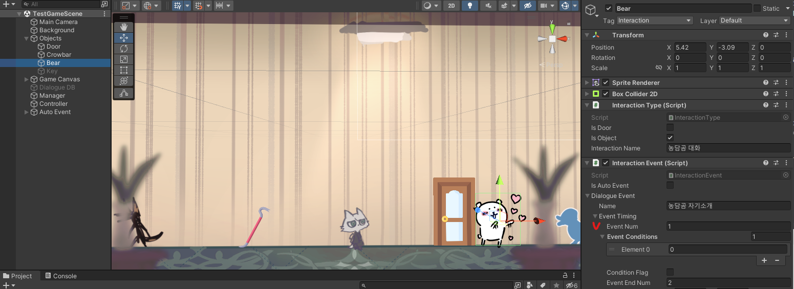
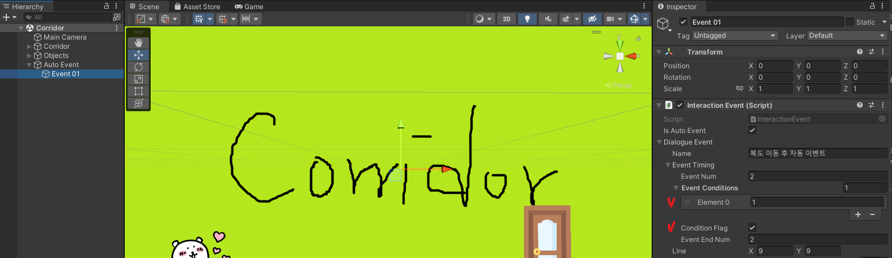
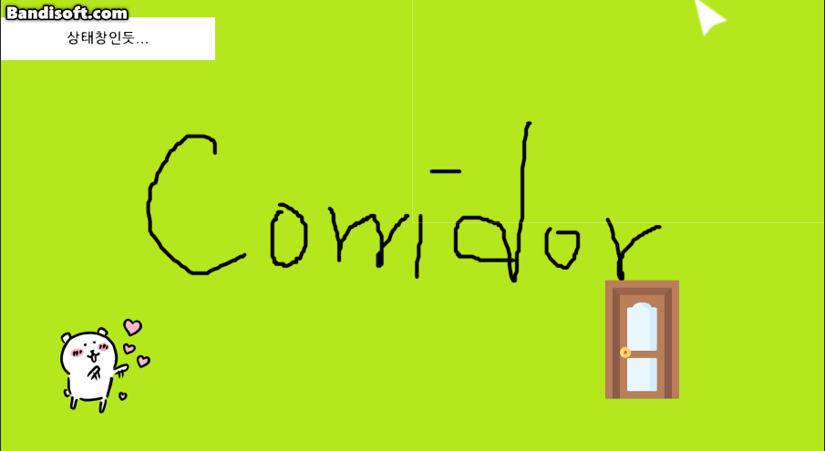
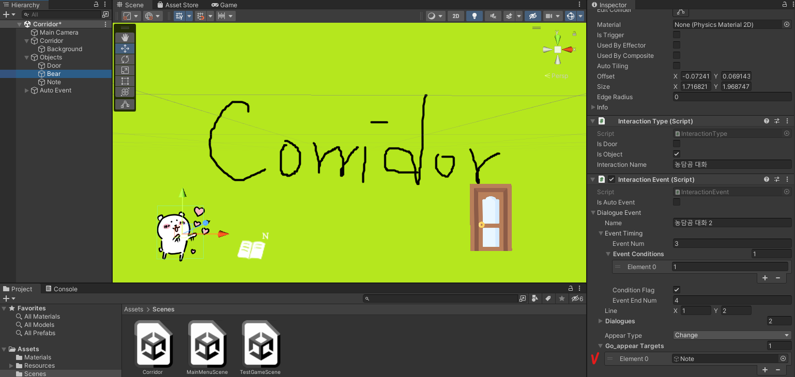
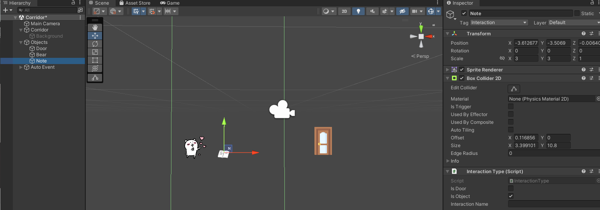
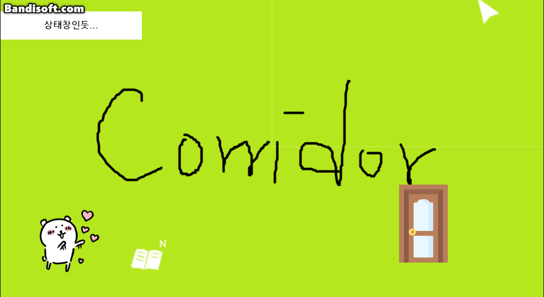
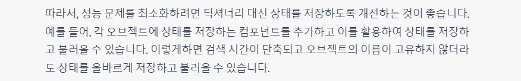
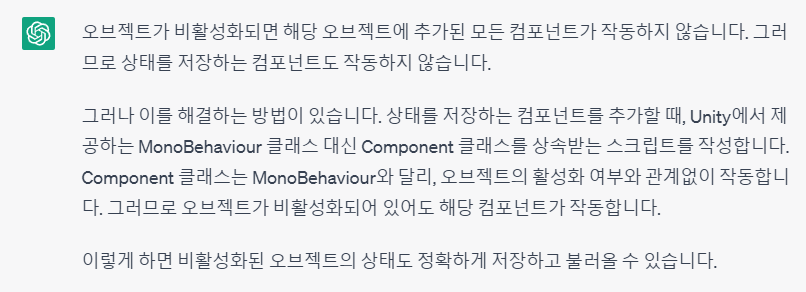

# 230422

## 1. 복도 이동 후 자동 이벤트 수정

- 지금까지는 복도로 이동할 때마다 자동 이벤트가 실행되었지만, `TestGameScene` 신에서 농담곰과 대화한 후 농담곰이 복도로 이동했을 때 자동 이벤트가 실행되도록 바꾸려 한다.

- `TestGameScene` 신에서 농담곰과 대화하는 이벤트의 번호는 **1**로 설정했다.

  

- `Corridor` 신으로 전환하자마자 실행되는 자동 이벤트의 번호는 **2**로 설정하였고, Event Conditions에서 **1번 이벤트를 봤을 경우 이 이벤트가 실행**되도록 설정하였다.

  

- 실행 결과

  

  - 농담곰과 대화하지 않은 후 복도로 이동 시, 자동 이벤트가 실행되지 않는다.
  - 농담곰과 대화한 후 복도로 이동 시, 자동 이벤트가 실행된다.

## 2. 복도에서 농담곰과 대화할 시 커서가 올바르게 표시되지 않는 오류

### (1) 오류

- 복도에서 농담곰과 대화하고 나면, 오브젝트 위에서는 돋보기 커서, 문 위에서는 이동 커서, 그 외에는 일반적인 포인터형 커서가 표시되어야 하는데, 특정 위치에서 계속 돋보기 커서만 표시되는 현상을 발견했다.

- 해당 오류

  

  - 오브젝트 위가 아닌데 돋보기 커서가 표시되고 있다.

### (2) 해결

- 해당 오류는 `Bear` 오브젝트의 `Interaction Event` 컴포넌트에서, `Go_appear Targets`에 `Note` 오브젝트를 등록했을 때만 발생하였다.

  

- 따라서 `Note` 오브젝트의 콜라이더를 확인해 보았더니..

  

  

- 적당한 크기로 콜라이더를 수정해 주고, 다시 비활성화해 두었다.

  

- 실행 결과

  

## 3. 오브젝트 활성화 상태 저장 코드 최적화에 관한 고찰

- 딕셔너리로 활성 상태를 저장했을 때의 성능에 대해 ChatGPT에게 물어봤을 때, 오브젝트의 상태를 저장하는 상태의 컴포넌트를 추가하라고 했다.

  

- 그런데 오브젝트가 비활성화됐을 때 해당 컴포넌트가 작동하지 않을텐데 어떻게 저장할 수 있을까?

- `MonoBehaviour` 클래스 대신 `Component` 클래스를 상속받으면, 오브젝트의 활성화 여부와 관계없이 작동한다고 한다.

  

- 그래서 2시간 동안 열심히 구현해보다가 깨달았다. 이렇게 했을 경우, **씬이 전환되면 결국 오브젝트가 파괴되기 때문에 컴포넌트 클래스를 적용한다 한들 소용이 없는 짓이었다.** (왜 이걸 이제 알았지?)
- 그래서 그냥 `Activity Manager` 컴포넌트를 적용한 `Manager` 객체가 파괴되지 않도록 두고, **앞으로 쓰지 않을 오브젝트를 딕셔너리에서 삭제할 수 있도록 추후에 구현해야할 것 같다.**

## 4. 다음에 할 일

- ~~오브젝트 등장 조건~~
- ~~복도 맵에도 문 하나 만들어서, `TestGameScene`으로 이동할 수 있도록 하기~~
- ~~**한 신에서 오브젝트가 나타나고 사라진 다음, 다른 신을 들렀다 다시 오면 상태가 초기화되는 문제 해결하기**~~
  - **앞으로 다시 사용하지 않을 오브젝트라면, 딕셔너리에서 삭제하여 최대한 딕셔너리의 크기를 키우지 않도록 구현할 예정**❣️
  - 아이디어: 딕셔너리에서 오브젝트 삭제하는 거는 `Interaction Event`에서 특정 이벤트를 보고난 후, 삭제할 오브젝트를 담는 배열 만들어서 `Activity Manager`에서 처리하면 어떨까?
- **이벤트 종료 후 다시 연속으로 자동 이벤트 나올 때, 농담곰이 바로 사라지는 문제도 해결하기** (해결 ❌)
- ~~복도 맵에서 농담곰과 대화할 시 커서가 이상해지는 문제 해결하기 (Go_appear Targets에 오브젝트 넣었을 때 발생)~~
- 사운드 관련 기능들 구현해보기 (효과음, 보이스, 배경 음악)
- 오브젝트 클로즈업(하면서 화면 이동)하기??
- 마우스 커서에 애니메이션? 넣기
- 마우스 커서에 이펙트 넣기
- 오브젝트 획득 및 활용
- 한 번만 발생하는 이벤트 구현
- 인벤토리 기능
- **오브젝트 클릭 시, 강조하는 이펙트 넣기 & 코루틴으로 대사창 띄우는 시간 조정하기**

## 5. 후기

- 뭔가 거창한 걸 해보려다가 실패했다. 최적화의 길이란 어렵고도 험난하구나...
- 오브젝트가 비활성화되면 컴포넌트가 적용이 안 되는 건 알았으면서, 왜 신을 전환하면 오브젝트가 파괴될 걸 나도 모르고 GPT도 몰랐을까? 바보들...
- 공모전이 3주도 채 안 남아서 많이 못 만지고 있다. 그래도 조금씩 뭔가 하는 중.. 파이팅!!
