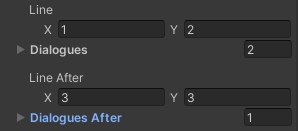

# 230429

- [[유니티 강좌] 단간론파를 유니티로 구현하기 Part 17 말 걸면 달라지는 대사](https://youtu.be/fuK5eC0L4W8?list=PLUZ5gNInsv_NG_UKZoua8goQbtseAo8Ow)


## 1. 말 걸면 달라지는 대사

### (1) 상호작용 전후 대사 구분

---

- **📑 `Dialogue.cs` 스크립트 수정**

- `DialogueEvent` 클래스 수정

  ```c#
  [System.Serializable]
  public class DialogueEvent
  {
      // ...
  
      // 상호작용 전 대사
      public Vector2 line;    // x줄부터 y줄까지의 대사를 가져온다.
      public Dialogue[] dialogues;    // 대사를 여러 명이서 하기 때문에 배열 생성
  
      // 상호작용 후 달라진 대사
      [Space]
      public Vector2 lineAfter;
      public Dialogue[] dialoguesAfter;
  
      // ...
  }
  ```

  - 상호작용 전 대사와, 상호작용 후의 달라진 대사를 구분해서 배열에 담는다.
  - `lineAfter`는 달라진 대사의 라인 번호, `dialoguesAfter`는 달라진 대사의 배열이다.


- **📑 `InteractionEvent.cs` 스크립트 수정**

- `SetDialogue()` 함수 생성

  ```c#
  // 상호작용 전후 대사를 세팅 (p_dialogue: 상호작용 전 또는 후 대사)
  Dialogue[] SetDialogue(Dialogue[] p_dialogue, int p_lineX, int p_lineY)
  {
      Dialogue[] t_dialogues = DatabaseManager.instance.GetDialogue(p_lineX, p_lineY);
  
      for (int i = 0; i < t_dialogues.Length; i++)
      {
          // dialogueEvent에 넣은 카메라 타입을 임시 변수에 넣기
          t_dialogues[i].cameraType = p_dialogue[i].cameraType;
      }
  
      return t_dialogues;
  }
  ```

  - 인자
    - `p_dialogue`: 상호작용 전 또는 후의 대사들이 담긴 배열
    - `p_lineX`, `p_lineY`: 대사의 시작과 끝 번호
  - 데이터베이스에 저장한 대사를 가져와, 임시 변수 `t_dialogues`에 저장한다.
  - 각 대사의 카메라 타입도 지정한다.
  - `t_dialogues`를 반환한다.


- `GetDialogue()` 함수 수정

  ```c#
  // DatabaseManager에 저장된 실제 대사 데이터를 꺼내온다.
  public Dialogue[] GetDialogue()
  {
      // 상호작용 전 대화
      if (!DatabaseManager.instance.eventFlags[dialogueEvent.eventTiming.eventNum])
      {
          DatabaseManager.instance.eventFlags[dialogueEvent.eventTiming.eventNum] = true; // 현재 이벤트의 실행 여부를 true로 설정
          dialogueEvent.dialogues = SetDialogue(dialogueEvent.dialogues, (int)dialogueEvent.line.x, (int)dialogueEvent.line.y);
  
          return dialogueEvent.dialogues;
      }
  
      // 상호작용 후의 대화
      else
      {
          dialogueEvent.dialoguesAfter = SetDialogue(dialogueEvent.dialoguesAfter, (int)dialogueEvent.lineAfter.x, (int)dialogueEvent.lineAfter.y);
  
          return dialogueEvent.dialoguesAfter;
      }
  }
  ```

  - 상호작용 전, 즉 해당 이벤트의 `eventFlag`가 False일 때
    - `eventFlag` = True로 변경
    - 상호작용 전의 대사 배열인 `dialogues`에 대사를 저장
    - `dialogues` 반환
  - 상호작용 후, 즉 해당 이벤트의 `eventFlag`가 True일 때
    - 상호작용 전의 대사 배열인 `dialoguesAfter`에 대사를 저장
    - `dialoguesAfter` 반환

---


- `TestGameScene`의 `Bear` 오브젝트에 상호작용 후 대사를 설정해 주었다.

  


- 실행 결과

  


### (2) 오브젝트 등장 & 퇴장 한 번만 하기

- 현재는 티가 나지 않지만 상호작용 할 때마다 오브젝트가 등장하거나 퇴장한다.
- 이를 첫 번째 상호작용이 끝난 후에만 오브젝트가 등장 또는 퇴장하도록 구현한다.


---

- **📑 `InteractionEvent.cs` 스크립트 수정**

- `GetEventNum()` 함수 생성

  ```c#
  // 해당 이벤트의 번호를 가져오는 함수
  public int GetEventNum()
  {
      return dialogueEvent.eventTiming.eventNum;
  }
  ```


- **📑 `InteractionController.cs` 스크립트 수정**

- `CallDialogue()` 함수 수정

  ```c#
  void CallDialogue(InteractionEvent p_event)
  {
      // 이벤트를 처음 보았을 때만 오브젝트 등장 & 퇴장
      if (!DatabaseManager.instance.eventFlags[p_event.GetEventNum()])
      {
          if (p_event.GetAppearType() == AppearType.Change)
          {
              dm.SetAppearObjects(p_event.GetAppearTargets(), p_event.GetDisppearTargets());
          }
      }
  
      dm.ShowDialogue(p_event.GetDialogue()); // 상호작용한 오브젝트의 대사 이벤트를 꺼내온다.
  }
  ```

  - 조건문을 추가해 주었다.

---


- 상호작용을 본 후에도 오브젝트를 또 등장 & 퇴장시키고 싶을 때, `go_appearTargetsAfter` & `go_disappearTargetsAfter`를 만들 수도 있다.
- 자동 이벤트도 `go_NextEventAfter` 이런 식으로 가능하다.
- 다양하게 커스텀 가능


### (3) 오류

- 상호작용 후 대사를 지정하지 않으면, 두 번째 상호작용을 하기 위해 클릭했을 때 `KeyNotFoundException` 발생

  


- 원인
  - `dialoguesAfter` 배열의 크기가 0인데, 한 번 이벤트를 보면 eventFlag가 true가 되어서 `InteractionEvent`의 `GetDialogue()` 함수가 계속 `dialoguesAfter` 배열을 반환하기 때문에 그런 듯 하다.


- 해결
  - `InteractionEvent`의 `GetDialogue()` 함수에서, `dialoguesAfter`의 길이가 0보다 클 때는 `dialoguesAfter` 배열을 반환하고, 그렇지 않은 경우는 그냥 `dialogues` 배열을 반환하도록 작성하였다.
  - 그런데 뭐가 됐든 이벤트 하나 끝나면 대사를 다르게 쓸 것 같긴 해서(ex. "농담곰은 더이상 할 말이 없는 듯하다." 와 같은 독백), 오류 방지용으로 코드를 살짝 수정하였다.


---

- **📑 `InteractionEvent.cs` 스크립트 수정**

- `GetDialogue()` 함수 수정

  ```c#
  // DatabaseManager에 저장된 실제 대사 데이터를 꺼내온다.
  public Dialogue[] GetDialogue()
  {
      // 상호작용 전 대화
      if (!DatabaseManager.instance.eventFlags[dialogueEvent.eventTiming.eventNum])
      {
          DatabaseManager.instance.eventFlags[dialogueEvent.eventTiming.eventNum] = true; // 현재 이벤트의 실행 여부를 true로 설정
          dialogueEvent.dialogues = SetDialogue(dialogueEvent.dialogues, (int)dialogueEvent.line.x, (int)dialogueEvent.line.y);
  
          return dialogueEvent.dialogues;
      }
  
      // 상호작용 후의 대화 (있을 경우)
      else if (dialogueEvent.dialoguesAfter.Length > 0)
      {
          dialogueEvent.dialoguesAfter = SetDialogue(dialogueEvent.dialoguesAfter, (int)dialogueEvent.lineAfter.x, (int)dialogueEvent.lineAfter.y);
  
          return dialogueEvent.dialoguesAfter;
      }
  
      // 상호작용 후의 대화가 없을 경우, 처음 대화를 계속 출력한다.
      // 근데 쓸 일은 없을 것 같긴 하다.
      return dialogueEvent.dialogues;
  }
  ```

---


## 2. 다음에 할 일

- ~~**한 신에서 오브젝트가 나타나고 사라진 다음, 다른 신을 들렀다 다시 오면 상태가 초기화되는 문제 해결하기**~~
  - **앞으로 다시 사용하지 않을 오브젝트라면, 딕셔너리에서 삭제하여 최대한 딕셔너리의 크기를 키우지 않도록 구현할 예정**❣️
  - 아이디어1: 딕셔너리에서 오브젝트 삭제하는 거는 `Interaction Event`에서 특정 이벤트를 보고난 후, 삭제할 오브젝트를 담는 배열 만들어서 `Activity Manager`에서 처리하면 어떨까?
  - 아이디어2: 아이템 DB랑 매니저 하나 만들어서 신마다 놓으면 어떨까?
  - [카트라이더 인벤토리 - 가장 간단한 DB 관리방법](https://youtu.be/GNSD1-y6SeM)
- **이벤트 종료 후 다시 연속으로 자동 이벤트 나올 때, 농담곰이 바로 사라지는 문제도 해결하기** (해결 ❌)
- 인벤토리 기능 & 아이템 획득 및 활용 (**장착 후 오브젝트 클릭해서 사용하는 방식**으로)
  - [[유니티 강좌] 2D RPG 쯔꾸르 제작하기 Part 24 : 인벤토리 시스템](https://youtu.be/hqD37JqfnKE?list=PLUZ5gNInsv_NW8RQx8__0DxiuPZn3VDzP)
  - [[유니티 강좌] 2D RPG 쯔꾸르 제작하기 Part 25 : 아이템 습득](https://youtu.be/biD0gL881dg?list=PLUZ5gNInsv_NW8RQx8__0DxiuPZn3VDzP)
  - [[유니티 강좌] 2D RPG 쯔꾸르 제작하기 Part 26 : 아이템 사용](https://youtu.be/oR5f7oKeBxo?list=PLUZ5gNInsv_NW8RQx8__0DxiuPZn3VDzP)
  - [인벤토리 첫번째 영상! UI!](https://youtu.be/iGyd54-mIiE)
  - [인벤토리 세번째 영상! 아이템획득 & 사용!](https://youtu.be/74vxsqQsFHE)
- 잠긴 문 열기
- 사운드 관련 기능들 구현해보기 (효과음, 보이스, 배경 음악)
- 오브젝트 클로즈업(하면서 화면 이동)하기??
- 마우스 커서에 애니메이션? 넣기
- 마우스 커서에 이펙트 넣기
- 한 번만 발생하는 이벤트 구현
- 오브젝트 클릭 시, 강조하는 이펙트 넣기 & 코루틴으로 대사창 띄우는 시간 조정하기


## 3. 후기

- 게임 개발 너무 어렵다.. 이런 허접한 실력으로 취직할 수 있을까
- 실력 어케 늘리는 것임 대체????????? 얼른 졸업하고 또 교육같은 거 찾아봐야 하나.. 나도 오리같은 겜 만들고 싶어 ㅠ_ㅠ